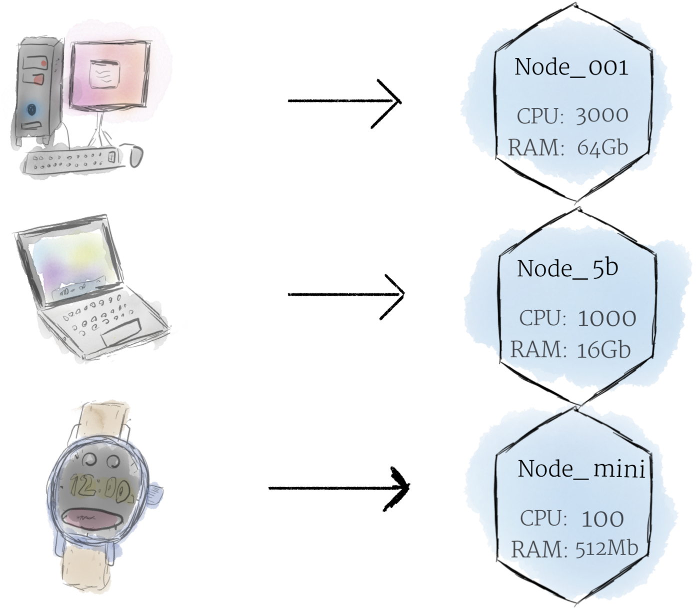
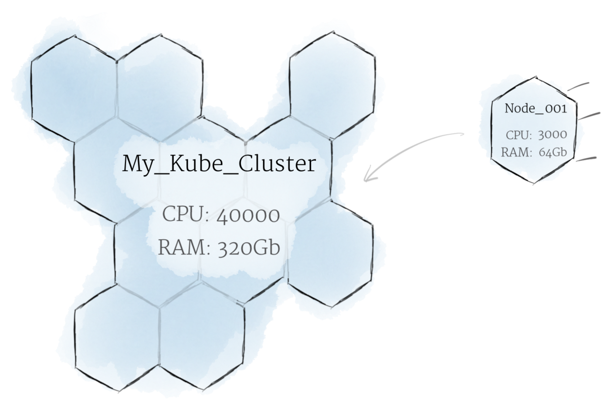
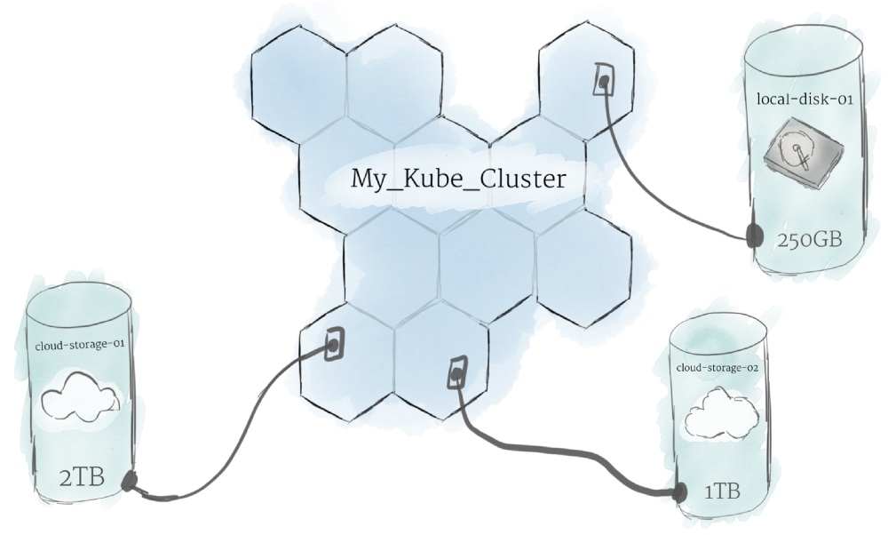
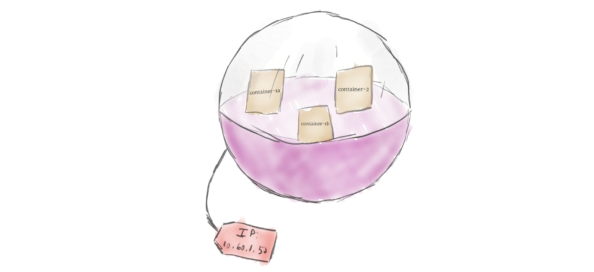
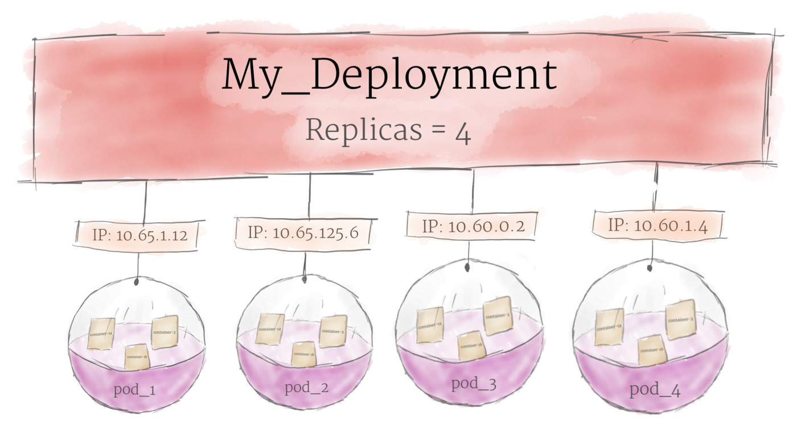
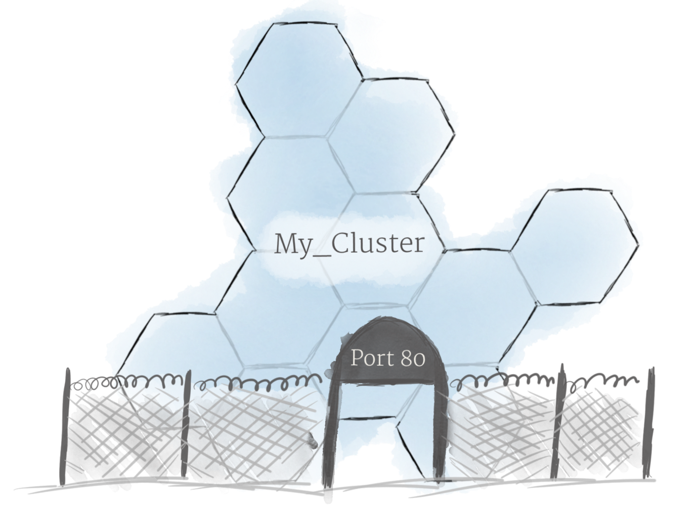
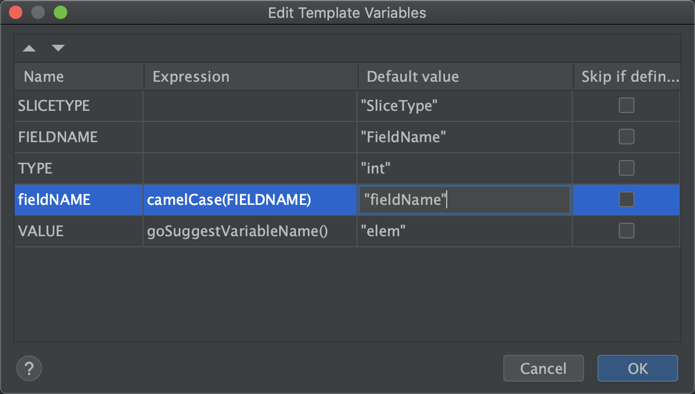

#### [翻译] [Kubernetes 101: Pods, Nodes, Containers, and Clusters][reference]
[原文][reference]

Kubernetes 正迅速成为在云中部署和管理软件的新标准, Kubernetes 的功能虽然很强大。也学习难度同样也很大，作为一个新手，如果直接去看官方的文档, 可能会觉得很难理解。 kubernetes 由许多不同的部分组成，很难判断哪些部分与您的用例相关，这篇博文将提供一个 Kubernetes 的简化视图，它将尝试站在一个比较高的角度对 kubernetes 最重要的一些组件 (components) 以及它们如何组合在一起的做一个概述。

首先，让我们看看硬件 (hardware) 是如何表示的

#### Hardware

##### nodes



Node 是 Kubernetes 中计算硬件的最小单位。 它代表集群中的一台机器。在大多数生产系统中，Node 可能是数据中心中的物理机，也可能是托管在 Google Cloud Platform 等云提供商上的虚拟机。理论上，你可以用几乎任何东西制作一个 Node。

Node 我们对机器 (machine) 的一层抽象。现在，我们不必关系任何一台机器的独特特性，可以简单地将每台机器视为一组可以利用的 CPU 和 RAM 资源。 这样,  Kubernetes 集群中的任何机器都可以被其他机器所取代。

##### The Cluster




尽管使用单个 node 可能就够了，但这不是 Kubernetes 的方式。 一般来说，您应该将 cluster 视为一个整体，而不是担心单个 node 的状态。

在 Kubernetes 中，node 将它们的资源集中在一起以形成一个更强大的机器。 当您将程序部署到 cluster上时，Kubernetes 会智能地为您将工作分配到各个 node。 如果添加或删除任何 node，cluster 将根据需要来调整工作。 对于程序或程序员来说，不需要关心代码到底在那台机器上执行。

这种类似蜂巢的系统可能会让您想起《星际迷航》中的 Borg, 事实上,  Borg 正是 Kubernetes 所基于的内部 Google 项目的名称。

#### Persistent Volumes

因为在 cluster 上运行的程序不能保证在特定 node 上运行，所以无法将数据保存到某个 node 的文件系统中。如果某个 program 尝试将数据保存到某个文件以备后用，但随后这个 program 被发配到新的 node 上去执行，则该文件将不再位于这个 program 预期的位置。为此，与 node 相关联的传统本地存储只能充当数据的临时缓存，而不能被用于持久化数据。



Kubernetes 使用 Persistent Volumes 来持久化数据。 虽然所有 node 的 CPU 和 RAM 资源都由 cluster 有效地汇集和管理，但 persistent file storage 不是。 相反，local or cloud driver 可以作为 Persistent Volume 附加到集群。 这个过程类似于将外部硬盘驱动器插入 cluster。 Persistent Volumes 提供了一个可以 mount 到 cluster 的文件系统，而无需与任何特定 node 相关联。

#### Software

##### Containers


在 Kubernetes 上运行的程序被打包为 Linux Containers。 Container 是一个被广泛接受的标准，因此已经有许多预构建的 image 可以部署在 Kubernetes 上。

Containerization (容器化) 允许您创建 self-contained 的 Linux 执行环境。 任何程序及其所有依赖项都可以捆绑到一个文件中，然后在互联网上共享。 任何人都可以下载 container 并将其部署在他们的基础设施上。并且可以通过编程的方式创建 container，从而形成强大的 CI 和 CD pipeline。

可以将多个程序添加到单个 container 中，但如果可以，最好每个 container 只执行一个进程。 有许多小的 container 比一个大的 container 要好。 如果每个 container 都有一个紧密的焦点，更新就会更容易部署，问题也更容易诊断。

##### Pods




与您过去可能使用过的其他系统不同，Kubernetes 不直接运行 container； 相反，它将一个或多个 container 包装到一个称为 pod 的更高级别的结构中。 同一个 Pod 中的任何 container 都将共享相同的 resource 和 local network。 同一 Pod 中的不同 container 可以互相通信，就像它们在同一台机器上一样，同时保持与其他容器的隔离度。

Pod 是 Kubernetes 中的 unit of replication (复制单元)。 如果您的应用程序变得太流行以至于单个 Pod 实例无法承载负载，则可以配置 Kubernetes 以根据需要将 Pod 的 replicas 部署到集群。 即使在没有高负载的情况下，在生产系统中, 也应该运行多个 pod 副本，以实现负载平衡和故障抵抗。

Pod 可以容纳多个 container ，但您应该尽可能限制自己。 由于 Pod 是动态伸缩 (scaled up and down) 的基本单元 ，因此 Pod 中的所有 container 都必须一起扩展。 这会导致资源浪费和昂贵的账单。 因此，pods 应该尽可能小，通常只包含一个主进程及其紧密耦合的辅助 containers  (这些辅助 containers 通常被称为“side-cars”)

##### Deployments




尽管 Pod 是 Kubernetes 中的基本计算单元，但它们通常不会直接在 cluster 上启动。 相反，Pod 通常由另外一层抽象来管理：Deployment。

Deployment 的主要功能是声明在同一时刻, 应该运行的 Pod 副本的数量。 当一个 Deployment 被添加到 cluster 中时，它会自动启动指定数量的 pod，然后监控它们。 如果某个 pod 挂了，Deployment 将自动重新创建一个新的 Pod。

使用 Deployment 后，就不用需要我们手动处理 Pod 了。 只需声明系统所期望的状态，Deployment 就会自动为您管理。

##### Ingress



在知道上述的概念后，就可以创建 node cluster，并将 Pod 部署到 cluster 上了。 然而，还有最后一个问题需要解决：允许外部流量进入您的应用程序。

默认情况下，Kubernetes 对 Pod 和外部世界进行了隔离。 如果要与运行在 Pod 中的服务进行通信，则必须开辟通信通道。 这被称为 Ingress。

有多种方法可以将 Ingress 添加到您的 cluster。 最常见的方法是添加 Ingress Controller 或 LoadBalancer。 这两个选项之间该如何权衡超出了本文的范围，但您必须意识到 Ingress 是您在试验 Kubernetes 之前需要处理的事情。

[reference]: https://medium.com/google-cloud/kubernetes-101-pods-nodes-containers-and-clusters-c1509e409e16

#### goland live template 牛刀小试

之前无意中接触到了 goland 的 live template 功能，感觉功能还挺强大的，在这里简单说明一下如何使用吧，更详细的使用方法可以去看[官方文档][live_template_doc_reference]

##### live template 的作用

在日常编码中，我们常常可能经常需要编写一些结构极其相似，可能只是变量的名字稍微有些不同的代码。在这种情况下，往往有两种解决方法:

1. 捏着鼻子，把相似的代码再写一遍
2. CV 大法，把之前的代码 CV 到另一个地方，然后 replace 掉有差异的地方 (例如变量名字)

当然，你可能还会想到另一种方法，写一个工具来生成代码，这个工具以差异化的地方为参数 来生成代码，特别是对于 go，本身就提供了 template 库用于生成代码，其实也蛮方便的。但是，开发一个代码生成工具总归是有点不够轻量。

这个时候，live template 就派上用场了，只要设置到模块以及对应的快捷键，之后每次触发快捷键时就能快速生成代码模板了，简直不要太方便。

##### 例子

```go
type T1 struct {
	ID int64
}

type T1Slice []*T1

func (slice T1Slice) IDs() []int64 {
	ids := make([]int64, 0, len(slice))
	for _, t1 := range slice {
		ids = append(ids, t1.ID)
	}
	return ids
}
```

有一个名为 T1 的 struct，其内有一个类型为 int64 名为 ID 的 field

之后新增了一个 T1Slice 的 struct，其实质上是一个 `*T1` 的数组，现在需要为 T1Slice 添加一个 method IDs()，它的作用是提取出每个 T1 的 ID 并以数组的形式返回。

```go
type T2 struct {
	Name string
}

type T2Slice []*T2
```

现在需要为 T2Slice 添加一个 method，该 method 的作用是取出其内每个元素的 Name field 组成数组并返回。

很容易写出下面的代码

```go
func (slice T2Slice) Names() []string {
	names := make([]string, 0, len(slice))
	for _, t2 := range slice {
		names = append(names, t2.Name)
	}
	return names
}
```

可以看出 T1Slice.IDs() 和 T2Slice.Names() 这两者的结构是非常相似的

1. 他两的 receiver 都是一个名为 XXXSlice 的 struct
2. 他两的 method name 都名为  XXXs，其中 XXX 是它们各自所返回的 field
3. 他两返回的都是一个数组 []XXX，其中 XXX 是数组的元素类型
4. 他两的实现都是先 make 出一个 slice，之后用一个 for range 来遍历，并往 slice 中添加元素最终返回。

既然找到了规律，那就可以用上 live template 了。首先来看看使用 live template 的效果


该 live template 的内容

```go
func (slice $SLICETYPE$) $FIELDNAME$s() []$TYPE$ {
	$fieldNAME$s := make([]$TYPE$, 0, len(slice))
	for _, $VALUE$ := range slice {
		$fieldNAME$s = append($fieldNAME$s, $VALUE$.$FIELDNAME$)
	}
	return $fieldNAME$s
}
```

看上去很好理解，其实 live template 就由两部分组成

+ `$$`包裹的变量
+ 没有用`$$`包裹的常量

变量需要用户手动去输入，输完一个变量后，按回车，光标会调到下一个变量处，所有的变量输入完之后，代码也就生成完毕了。当然也可以用输入变量时用 ESC 中断，则当前的代码的状态就是最终的结果了。

##### Expression

live template 真正牛逼的地方还在于可以为变量添加 Expression，就以刚刚的例子来说，为什么我仅仅输入了 $FIELDNAME$ 最终却自动生成了 $fieldNAME$s 呢？这就是 Expression 的效果



如上，可以为 fieldNAME 添加一个 Expression ，将 FIELDNAME 的值给 camelCase 就会得到 fieldNAME。

此外，在上面的例子中 for range T1Slice 时，自动生成的变量名为 t1，for range T2Slice 时，自动生成的变量名为 t2，这就是 goSuggestVariableName() 这个 Expression 的功能，它会根据当前的上下文生成一个变量名。

[Goland 所有的 Expression][predefined_functions]

##### 个人常用的 Live Template

```sh
cd ~/Library/'Application Support'/JetBrains/GoLand2021.1/templates
```

把下面的两个 xml 文件放在 template 目录下面即可

```xml
<!-- Go.xml -->
<templateSet group="Go">
  <template name="ts" value="type $NAME$Slice []*$NAME$" description="type TSlice []*T" toReformat="false" toShortenFQNames="true">
    <variable name="NAME" expression="complete()" defaultValue="&quot;Name&quot;" alwaysStopAt="true" />
    <context>
      <option name="GO_FILE" value="true" />
    </context>
  </template>
  <template name="fake" value="func fake$NAME$(opts ...func(*$NAME$)) *$NAME$ {&#10;&#9;m := &amp;$NAME${}&#10;&#9;for _, opt := range opts {&#10;&#9;&#9;opt(m)&#10;&#9;}&#10;&#9;return m&#10;}" description="fake for test" toReformat="false" toShortenFQNames="true">
    <variable name="NAME" expression="" defaultValue="&quot;Name&quot;" alwaysStopAt="true" />
    <context>
      <option name="GO_FILE" value="true" />
    </context>
  </template>
  <template name="sfms" value="func (slice $SLICETYPE$) $FIELDNAME$s() []$TYPE$ {&#10;&#9;$fieldNAME$s := make([]$TYPE$, 0, len(slice))&#10;&#9;for _, $VALUE$ := range slice {&#10;&#9;&#9;$fieldNAME$s = append($fieldNAME$s, $VALUE$.$FIELDNAME$)&#10;&#9;}&#10;&#9;return $fieldNAME$s&#10;}" description="slice field members" toReformat="false" toShortenFQNames="true">
    <variable name="SLICETYPE" expression="" defaultValue="&quot;SliceType&quot;" alwaysStopAt="true" />
    <variable name="FIELDNAME" expression="" defaultValue="&quot;FieldName&quot;" alwaysStopAt="true" />
    <variable name="TYPE" expression="" defaultValue="&quot;int&quot;" alwaysStopAt="true" />
    <variable name="fieldNAME" expression="camelCase(FIELDNAME)" defaultValue="&quot;fieldName&quot;" alwaysStopAt="true" />
    <variable name="VALUE" expression="goSuggestVariableName()" defaultValue="&quot;elem&quot;" alwaysStopAt="true" />
    <context>
      <option name="GO_FILE" value="true" />
    </context>
  </template>
  <template name="sgbf" value="func (slice $TYPE$Slice) GroupBy$FIELDNAME$() map[$KEYTYPE$]*$TYPE$ {&#10;&#9;groupBy$FIELDNAME$ := make(map[$KEYTYPE$]*$TYPE$)&#10;&#9;for _, $VALUE$ := range slice {&#10;&#9;&#9;groupBy$FIELDNAME$[$VALUE$.$FIELDNAME$]=$VALUE$&#10;&#9;}&#10;&#9;return groupBy$FIELDNAME$&#10;}" description="slice group by field" toReformat="false" toShortenFQNames="true">
    <variable name="FIELDNAME" expression="" defaultValue="" alwaysStopAt="true" />
    <variable name="TYPE" expression="" defaultValue="" alwaysStopAt="true" />
    <variable name="KEYTYPE" expression="" defaultValue="" alwaysStopAt="true" />
    <variable name="VALUE" expression="goSuggestVariableName()" defaultValue="&quot;elem&quot;" alwaysStopAt="true" />
    <context>
      <option name="GO" value="true" />
    </context>
  </template>
  <template name="trav" value="// TraverseTable$TYPE$ 流式遍历表。 从 id 等于 idFrom 开始取数，间隔 interval 执行一次，每次获取 limit 条数据，直到表中的数据都被遍历一遍&#10;func TraverseTable$TYPE$(engine *xorm.Engine, idFrom uint64, limit int, interval time.Duration) chan *model.$TYPE$ {&#10;&#9;result := make(chan *model.$TYPE$, limit)&#10;&#9;go func() {&#10;&#9;&#9;defer close(result)&#10;&#9;&#9;var err error&#10;&#9;&#9;for {&#10;&#9;&#9;&#9;items := make([]*model.$TYPE$, 0, limit)&#10;&#9;&#9;&#9;// TODO: 此处的 id，可以替换为其他的自增ID&#10;&#9;&#9;&#9;if err = engine.Where(&quot;id &gt;= ?&quot;, idFrom).Asc(&quot;id&quot;).Limit(limit).Find(&amp;items); err != nil {&#10;&#9;&#9;&#9;&#9;panic(err)&#10;&#9;&#9;&#9;}&#10;&#9;&#9;&#9;for _, item := range items {&#10;&#9;&#9;&#9;&#9;result &lt;- item&#10;&#9;&#9;&#9;}&#10;&#9;&#9;&#9;if len(items) == 0 {&#10;&#9;&#9;&#9;&#9;break&#10;&#9;&#9;&#9;}&#10;&#9;&#9;&#9;// TODO: 如果在 Where 中不使用 ID 则此处需要进行相应处理&#10;&#9;&#9;&#9;idFrom = items[len(items)-1].ID + 1&#10;&#9;&#9;&#9;time.Sleep(interval)&#10;&#9;&#9;}&#10;&#9;}()&#10;&#9;return result&#10;}" description="" toReformat="false" toShortenFQNames="true">
    <variable name="TYPE" expression="complete()" defaultValue="&quot;type&quot;" alwaysStopAt="true" />
    <context>
      <option name="GO" value="true" />
    </context>
  </template>
  <template name="vdm" value="func $TYPE$Validate(m *$PKG$.$TYPE$) error {&#10;&#9;var err error&#10;&#9;err = valid.Validate(m, valid.NotNil)&#10;&#9;if err != nil {&#10;&#9;&#9;return err&#10;&#9;}&#10;&#9;err = valid.ValidateStruct(m,&#10;&#9;    // todo&#10;&#9;&#9;valid.Field(&amp;m.filedName, valid.Required),&#10;&#9;)&#10;&#9;if err != nil {&#10;&#9;&#9;return err&#10;&#9;}&#10;&#9;return nil&#10;}&#10;" description="validate model" toReformat="false" toShortenFQNames="true">
    <variable name="PKG" expression="complete()" defaultValue="&quot;pkg&quot;" alwaysStopAt="true" />
    <variable name="TYPE" expression="" defaultValue="" alwaysStopAt="true" />
    <context>
      <option name="GO" value="true" />
    </context>
  </template>
</templateSet>
```

```xml
<!-- Go Struct Tags.xml -->
<templateSet group="Go Struct Tags">
  <template name="`env" value="`env:&quot;$FIELD_NAME$&quot;$END$" description="`env:&quot;&quot;`" toReformat="true" toShortenFQNames="true">
    <variable name="FIELD_NAME" expression="capitalizeAndUnderscore(fieldName())" defaultValue="" alwaysStopAt="true" />
    <context>
      <option name="GO_TAG" value="true" />
      <option name="GO_TAG_LITERAL" value="true" />
    </context>
  </template>
  <template name="env" value="env:&quot;$FIELD_NAME$&quot;$END$" description="env:&quot;&quot;" toReformat="false" toShortenFQNames="true">
    <variable name="FIELD_NAME" expression="capitalizeAndUnderscore(fieldName())" defaultValue="" alwaysStopAt="true" />
    <context>
      <option name="GO_TAG_LITERAL" value="true" />
    </context>
  </template>
</templateSet>
```


[predefined_functions]: https://www.jetbrains.com/help/go/template-variables.html#predefined_functions
[live_template_doc_reference]: https://www.jetbrains.com/help/go/settings-live-templates.html

