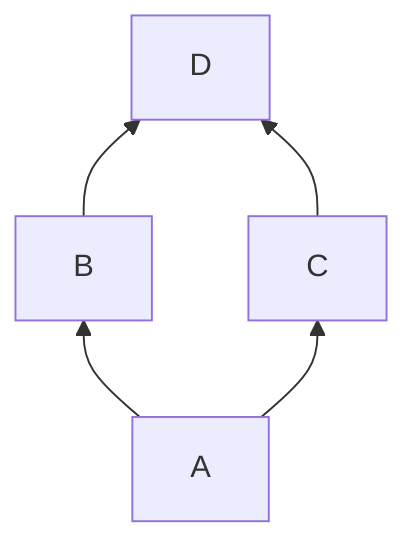

### 利用 uber-go/dig 库管理依赖
[github 地址][dig_repo_address]

[官方文档][dig_doc]

#### 介绍

dig 库是一个为 go 提供依赖注入 (dependency injection) 的工具包，基于 reflection 实现的。

在项目中会涉及到很多对象，它们之间的依赖关系可能是这样的



对象 D 的创建依赖于对象 B 和 对象 C

对象 B 和对象 C 的创建依赖于对象 A

```go
func NewD(b *B,c *C) *D{}
func NewB(a *A)*B{}
func NewC(a *A)*C{}
func NewA() *A{}
```

如果在很多地方都需要用户 D 对象，有两个方法

1. 从别的地方传一个 D 对象过来
2. 利用 NewD 重新生成一个新的 D 对象

在 Package 之间进行传递对象，可能会造成 Package 间的耦合，因此一般情况下我们会采取第二种方法。

但现在问题来了，D 对象的生成依赖于 B 对象和 C 对象，要想得到 B 对象和 C 对象，就需要调用 NewB 和 NewC 去生成，而 NewB 和 NewC 需要以 A 为参数，这就需要调用 NewA 来生成 A。项目中不可避免地会出现大量的 NewXXx() 这种方法的调用。dig 库由此而生，按照官方的说法，它就是用来管理这种 对象图 的。

> Resolving the object graph during process startup

#### 基本的使用方法

使用方法总结起来就三步:

1. 使用 dig.New() 创建 digObj
2. 调用 digObj.Provide() 提供依赖
3. 调用 digObj.Invoke() 生成目标

```go
type A struct{}
type B struct{}
type C struct{}
type D struct{}

func NewD(b *B, c *C) *D {
	fmt.Println("NewD()")
	return new(D)
}
func NewB(a *A) *B {
	fmt.Println("NewB()")
	return new(B)
}
func NewC(a *A) *C {
	fmt.Println("NewC()")
	return new(C)
}
func NewA() *A {
	fmt.Println("NewA()")
	return new(A)
}

func main() {
	// 创建 dig 对象
	digObj := dig.New()
	// 利用 Provide 注入依赖
	digObj.Provide(NewA)
	digObj.Provide(NewC)
	digObj.Provide(NewB)
	digObj.Provide(NewD)
	var d *D
	assignD := func(argD *D) {
		fmt.Println("assignD()")
		d = argD
	}
	fmt.Println("before invoke")
	// 根据提前注入的依赖来生成对象
	if err := digObj.Invoke(assignD); err != nil {
		panic(err)
	}
}
```

```
output:
before invoke
NewA()
NewB()
NewC()
NewD()
assignD()
```

##### Privide

```go
func (c *Container) Provide(constructor interface{}, opts ...ProvideOption) error
```

我们可以把对象的构造想象成一个流水线车间，只要提供了原材料，以及原材料每一步的生成步骤，就可以生成最终的产品。例如在上面的对象图中，原材料就是 A，生成步骤是 NewB,NewC,NewD ，最终得到的产物是 D。

Provide 就是用来提供依赖的，我们利用 Privode 提供<u>生成步骤</u>，Privode 接收一个 <u>constructor</u> ，construct 必须是一个 function obj，不能是一个普通的 Obj，否则 Invoke 时将会失败

```go
func main() {
	// 创建 dig 对象
	digObj := dig.New()
  a := new(A) 	// 这里
	// 利用 Provide 注入依赖
	digObj.Provide(a)
	digObj.Provide(NewC)
	digObj.Provide(NewB)
	digObj.Provide(NewD)
	var d *D
	assignD := func(argD *D) {
		fmt.Println("assignD()")
		d = argD
	}
	fmt.Println("before invoke")
	// 根据提前注入的依赖来生成对象
	if err := digObj.Invoke(assignD); err != nil {
    // panic: missing type: *main.A
		panic(err)
	}
}
```

所以你仅仅想通过一个普通的 obj，请用一个 function 把它给包起来，并将这个 function 作为 constructor 传入 Privode() 中。

**另一个视角：上面的对象图也可以从另一个角度去理解，原材料是空气，生成步骤是 NewA,NewB,NewC,NewD，其中 NewA 描述了如何利用空气来生成一个 A 对象**

**函数式编程的视角：一切对象都是函数，就拿 var a int 中的变量 a 来说，从某种意义上，也可以将它视为一个不接受任何参数并返回 a 本身的一个函数 **

##### Invoke

```go
func (c *Container) Invoke(function interface{}, opts ...InvokeOption) error
```

invoke 会利用之前注入的依赖完成对 `function` 这个参数的调用，参数 `function `同样必须是一个 function obj，如果你希望利用 Invoke 来生成一个对象，就像这个对象提前生成，并在 `function` 中进行赋值。

Invoke 会返回 error，这个 error 是必须要处理的。

在调用 Invoke 方法时，才会真正执行 Provide 中提供的 constructor，且每个 constuctor 只有被调用一次。

```go
type A struct {
}

func NewA() *A {
	fmt.Println("NewA()")
	return new(A)
}

func main() {
	digObj := dig.New()
	digObj.Provide(NewA)
	fmt.Println("before invoke")
	if err := digObj.Invoke(func(*A) {
		fmt.Println("hello")
	}); err != nil {
		panic(err)
	}
	if err := digObj.Invoke(func(*A) {
		fmt.Println("world")
	}); err != nil {
		panic(err)
	}
}
```

```
output:
before invoke
NewA()
hello
world
```


##### dig.In

有时候某个 struct 可能有很多依赖，这个 struct 的 constructor 可能会过长

```go
func ConstructorA(*B,*C,*C,*E,*F){...}
```

这时可以将 dig.In 嵌入到 struct 内部，例如

```go
type D struct {
	dig.In
	*B
	*C
}
```

效果与

```go
// 注意这里返回的是 D 而非 *D
func NewD(b *B, c *C) D {
	fmt.Println("NewD()")
	return new(D)
}
```

相同

```go
type A struct{}
type B struct{}
type C struct{}
type D struct {
	dig.In
	*B
	*C
}

// here!!!
// func NewD(b *B, c *C) *D {
// 	fmt.Println("NewD()")
// 	return new(D)
// }

func NewB(a *A) *B {
	fmt.Println("NewB()")
	return new(B)
}
func NewC(a *A) *C {
	fmt.Println("NewC()")
	return new(C)
}
func NewA() *A {
	fmt.Println("NewA()")
	return new(A)
}

func main() {
	// 创建 dig 对象
	digObj := dig.New()
	// 利用 Provide 注入依赖
	digObj.Provide(NewA)
	digObj.Provide(NewC)
	digObj.Provide(NewB)
	// digObj.Provide(NewD) here!!!
	var d D	// not a pointer here!!!
	assignD := func(argD D) { // not a pointer here!!!
		fmt.Println("assignD()")
		d = argD
	}
	fmt.Println("before invoke")
	// 根据提前注入的依赖来生成对象
	if err := digObj.Invoke(assignD); err != nil {
		// panic missing type: *main.A
		panic(err)
	}
}
```

##### dig.Out

dig.Out 和 dig.In 是对称的

+ dig.In 表示这个 struct 需要哪些依赖
+ dig.Out 表示这个 struct 可以提供哪些依赖

```go
type BC struct {
	dig.Out
	*B
	*C
}
```

效果和

```go
// 注意 argument bc 不是指针
func f(bc BC) (*B, *C) {
	return bc.B, bc.C
}
```

相同

```go
type A struct{}
type B struct{}
type C struct{}
type D struct {
	dig.In
	*B
	*C
}

type BC struct {
	dig.Out
	*B
	*C
}

func NewBC(a *A) BC {
	return BC{}
}

func NewA() *A {
	fmt.Println("NewA()")
	return new(A)
}

func main() {
	// 创建 dig 对象
	digObj := dig.New()
	// 利用 Provide 注入依赖
	digObj.Provide(NewA)
	digObj.Provide(NewBC) // here
	var d D               // not a pointer here!!!
	assignD := func(argD D) { // not a pointer here!!!
		fmt.Println("assignD()")
		d = argD
	}
	fmt.Println("before invoke")
	// 根据提前注入的依赖来生成对象
	if err := digObj.Invoke(assignD); err != nil {
		// panic missing type: *main.A
		panic(err)
	}
}
```

#### 一些实验

注意 Provide 中 `constructor`  和 Invoke 中 `function`，他两的参数和返回值必须要注意

1. pointer 和 non-pointer 是不能混用的
2. interface 和 inplement 也不能混用

##### case1: Proivde pointer, Invoke non-pointer

```go
func main() {
	digObj := dig.New()
	digObj.Provide(func() *A {
		return new(A)
	})
	err := digObj.Invoke(func(A) {
		fmt.Println("hello")
	})
	if err != nil {
    // panic: missing dependencies for function "main".main.func2 
		panic(err)
	}
}
```

##### case2: Provide non-pointer, Invoke pointer

```go
func main() {
	digObj := dig.New()
	digObj.Provide(func() A {
		return A{}
	})
	err := digObj.Invoke(func(*A) {
		fmt.Println("hello")
	})
	if err != nil {
    // panic: missing dependencies for function "main".main.func2
		panic(err)
	}
}
```

##### case3: Provide Implement, Invoke interface

```go
type InterfaceA interface {
	Hello()
}

type ImplementA struct {
}

func (i ImplementA) Hello() {
	fmt.Println("hello A")
}

func main() {
	digObj := dig.New()
	digObj.Provide(func() ImplementA {
		return ImplementA{}
	})
	err := digObj.Invoke(func(a InterfaceA) {
		a.Hello()
	})
	if err != nil {
		// panic: missing dependencies for function "main".main.func2 
		panic(err)
	}
}
```

[dig_repo_address]: https://github.com/uber-go/dig
[dig_doc]: https://pkg.go.dev/go.uber.org/dig


