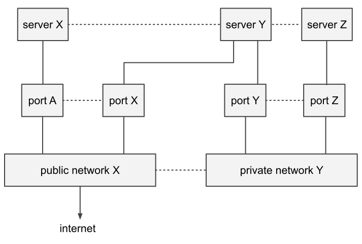

# OPA 入门
## Introduction

The Open Policy Agent (OPA，发音为“OH-PA”）是一个开源的通用策略引擎，OPA 提供了一种 high-level 的声明式语言，可以通过代码和一些简单的 api 来表示策略，从而将 policy decision 的逻辑解耦出来。你可以利用 OPA 在微服务, K8S,  CI/CD 管线, API 网关等里面执行策略。

## Overview

OPA 将 policy 的 decision 与 policy 的 enforcement 解耦。

policy decision (策略决议) : 判断某个角色是否有权限执行 policy。

policy enforcement (策略执行): 执行 policy 的具体内容。

当你的软件需要做 policy decision 时，可以携带一些 structured data (例如 JSON ) 去查询 OPA，OPA 接收任意的 structured data。


<center>Policy Decoupling</center>

OPA 将会结合 `Query`, `Policy`, `Data` 进行评估并生成最终的 Policy Decision。OPA 和 Rego 是 domain-agnostic (领域无关的) 。所以你可以在 Policy 中描述几乎任何类型的 invariant (不变性)。例如: 

- Which users can access which resources.
- Which subnets egress traffic is allowed to.
- Which clusters a workload must be deployed to.
- Which registries binaries can be downloaded from.
- Which OS capabilities a container can execute with.
- Which times of day the system can be accessed at.

## Example

假设您为一个具有以下系统的组织工作



<center>Example System</center>

在这个系统中有三个组件

- Servers expose zero or more protocols (e.g., `http`, `ssh`, etc.)
- Networks connect servers and can be public or private. Public networks are connected to the Internet.
- Ports attach servers to networks.

所有的 servers, networks, and ports 都通过一个脚本配置. 脚本接收一个可以表示这个系统的  JSON 对象作为输入。

如下，就是一个可以用来表示当前系统的 JSON

```json
{
    "servers": [
        {"id": "app", "protocols": ["https", "ssh"], "ports": ["p1", "p2", "p3"]},
        {"id": "db", "protocols": ["mysql"], "ports": ["p3"]},
        {"id": "cache", "protocols": ["memcache"], "ports": ["p3"]},
        {"id": "ci", "protocols": ["http"], "ports": ["p1", "p2"]},
        {"id": "busybox", "protocols": ["telnet"], "ports": ["p1"]}
    ],
    "networks": [
        {"id": "net1", "public": false},
        {"id": "net2", "public": false},
        {"id": "net3", "public": true},
        {"id": "net4", "public": true}
    ],
    "ports": [
        {"id": "p1", "network": "net1"},
        {"id": "p2", "network": "net3"},
        {"id": "p3", "network": "net2"}
    ]
}
```

某一天早上，你的老板给你介绍了最新的安全策略，并要求你去执行它。

```
1. Servers reachable from the Internet must not expose the insecure 'http' protocol.
2. Servers are not allowed to expose the 'telnet' protocol.
```

每当需要配置 servers, networks, and ports 时都需要执行这个策略，并且安全团队会定期对系统进行审核，找到违背了安全规则的 Server。

你的老板让你来决定是否使用 OPA 来实现这个 policy。

> PS: 这里就是一个典型的 policy decision 与 policy enforcement 混合的情况。
>
> policy enforcement 是由脚本去执行的，最初脚本会对所有的配置文件都持欢迎态度。但现在世代变了，有些不合法的配置文件不应该被执行。
>
> 而判断配置是否合法，则就是 policy decision 的任务的。当没有 OPA 时，脚本每次接收输入时，都必须自己判断该配置是否合法。但现在可以由 OPA 去判断配置合法与否了。即 policy decision 和 policy enforcement 解耦了。policy decision 由 OPA 负责，policy enforcement 则依旧由原来的脚本负责。

## Rego

Rego 是一种用来的表示OPA策略的高级声明语言。

### References

输入的数据将会被绑定到一个名为 `input` 的变量上。可以通过 `.`来因为输入的数据。

例如

```
input.servers
input.servers[0].protocols[0]
```

如果你引用的值不存在， OPA 将会返回 *undefined*. Undefined 意味着 OPA 无法找到任何结果

### Variables

可以利用 `:=` 给变量赋值	

```
s := input.servers[0]
s.id == "app"
p := s.protocols[0]
p == "https"
```

是 `some` 来声明一下变量

```
some i
```

### Rules

Rego 允许您使用 rule 封装并重新使用逻辑。rule 只是 if-then 逻辑语句。rule 分为两种，分别是 complete 和 partial

rule 的结构如下

```
variable = value {
	condition1
  condition2
}
```

表示将 `{}`里面的 condition 都满足时，variable 的值将会是 value。

`{}` 里面的多个 condition 之间是 && 关系。

`variable = value` 称为 head, `{}`的内容称为 body

`= value` 	部分可以省略, 会被视为 `= true` 来处理

```
variable {                  
	condition1               
  condition2                  
}                   
```

`{}`亦可以被忽略，会被视为`{}`的条件都是满足的

```
variable = value
```

#### Complete Rules

Complete Rules 是if-then-then 的语句，它仅将单个值赋值给变量。例如：

```
package example.rules

any_public_networks = true {  # is true if...
    net := input.networks[_]  # some network exists and..
    net.public                # it is public.
}
```

所有由 rule 的值都可以通过一个全局的变量 `data` 来引用

```
data.example.rules.any_public_networks
```

> 💡 You can query the value of any rule loaded into OPA by referring to it with an absolute path. The path of a rule is always: `data.<package-path>.<rule-name>`.

如果 OPA 找不到可以满足 rule body 的变量，rule 的值将会是 undefined 的。

#### Partial Rules

Partial rules 同样是 if-then 语言，不过它会将多个值赋值给变量。例如

```
package example.rules

public_network[net.id] {      # net.id is in the public_network set if...
    net := input.networks[_]  # some network exists and...
    net.public                # it is public.
}
```

```
public_network

[
  "net3",
  "net4"
]
```

#### Logical OR

 要在Rego中表示 Logical OR，需要定义多个具有相同名称的 rule。

```
package example.logical_or

default shell_accessible = false

shell_accessible = true {
    input.servers[_].protocols[_] == "telnet"
}

shell_accessible = true {
    input.servers[_].protocols[_] == "ssh"
}
```

> 💡 The `default` keyword tells OPA to assign a value to the variable if all of the other rules with the same name are undefined.

### Putting It Together

上面就是 Rego 所有的核心思想了。回顾一下之前的目标，让我们把上面的知识结合到一起来实现它。

```
1. Servers reachable from the Internet must not expose the insecure 'http' protocol.
2. Servers are not allowed to expose the 'telnet' protocol.
```

```
package example

allow = true {                                      # allow is true if...
    count(violation) == 0                           # there are zero violations.
}

violation[server.id] {                              # a server is in the violation set if...
    some server
    public_server[server]                           # it exists in the 'public_server' set and...
    server.protocols[_] == "http"                   # it contains the insecure "http" protocol.
}

violation[server.id] {                              # a server is in the violation set if...
    server := input.servers[_]                      # it exists in the input.servers collection and...
    server.protocols[_] == "telnet"                 # it contains the "telnet" protocol.
}

public_server[server] {                             # a server exists in the public_server set if...
    some i, j
    server := input.servers[_]                      # it exists in the input.servers collection and...
    server.ports[_] == input.ports[i].id            # it references a port in the input.ports collection and...
    input.ports[i].network == input.networks[j].id  # the port references a network in the input.networks collection and...
    input.networks[j].public                        # the network is public.
}
```

```
some x; violation[x]

+-----------+--------------+
|     x     | violation[x] |
+-----------+--------------+
| "ci"      | "ci"         |
| "busybox" | "busybox"    |
+-----------+--------------+
```

### Built-in Functions

https://www.openpolicyagent.org/docs/latest/policy-reference/#built-in-functions

## 安装教程

https://www.openpolicyagent.org/docs/latest/#running-opa

## 参考链接

https://www.openpolicyagent.org/docs/latest/

