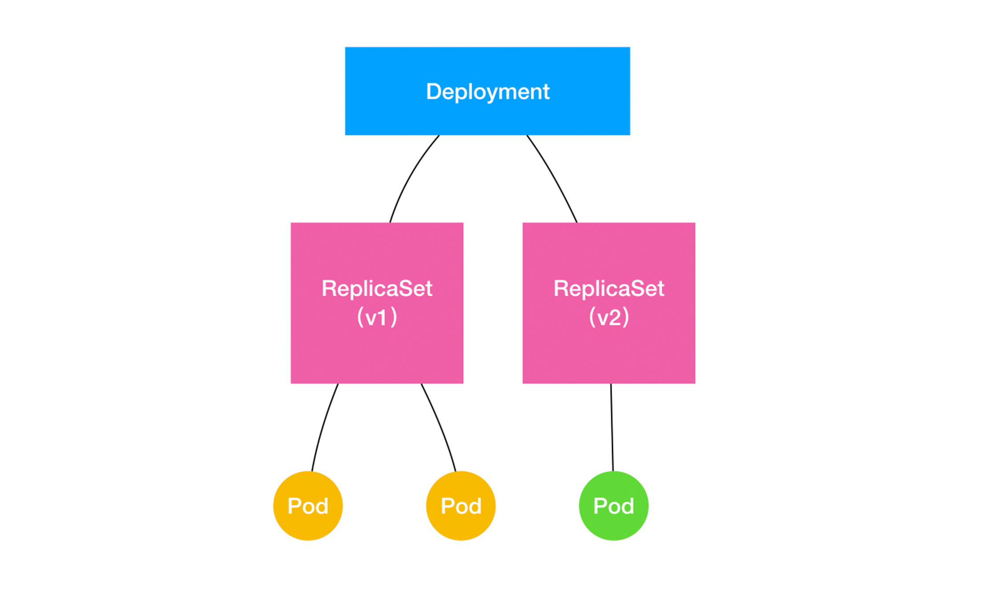
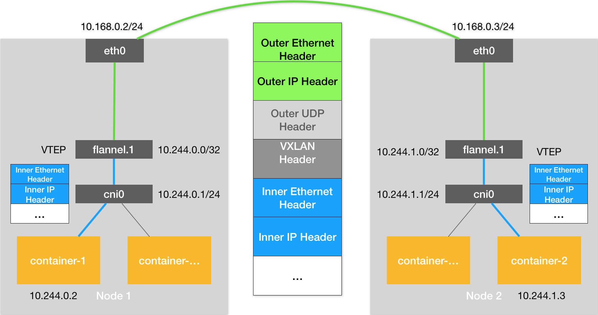
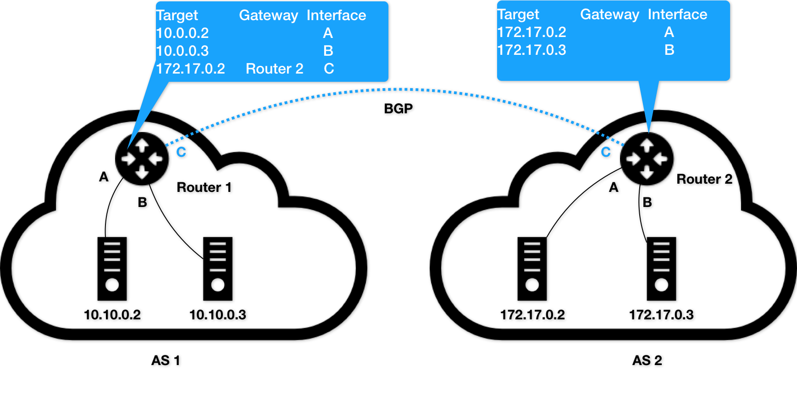

# 白话容器基础（一）：从进程说开去

容器技术的核心功能，就是通过约束和修改进程的动态表现，从而为其创造出一个“边界”

对于 Docker 等大多数 Linux 容器来说，Cgroups 技术是用来制造约束的主要手段，而 Namespace 技术则是用来修改进程视图的主要方法。

```shell
$ docker run -it busybox /bin/sh
/ #
```

而 -it 参数告诉了 Docker 项目在启动容器后，需要给我们分配一个文本输入 / 输出环境，也就是 TTY，跟容器的标准输入相关联，这样我们就可以和这个 Docker 容器进行交互了。而 /bin/sh 就是我们要在 Docker 容器里运行的程序

所以，上面这条指令翻译成人类的语言就是：请帮我启动一个容器，在容器里执行 /bin/sh，并且给我分配一个命令行终端跟这个容器交互

```
/ # ps
PID   USER     TIME  COMMAND
    1 root      0:00 /bin/sh
    6 root      0:00 ps
```

可以看到，我们在 Docker 里最开始执行的 /bin/sh，就是这个容器内部的第 1 号进程（PID=1），而这个容器里一共只有两个进程在运行。这就意味着，前面执行的 /bin/sh，以及我们刚刚执行的 ps，已经被 Docker 隔离在了一个跟宿主机完全不同的世界当中。

###### Namespace

Namespace 的使用方式也非常有意思：它其实只是 Linux 创建新进程的一个可选参数。我们知道，在 Linux 系统中创建进程的系统调用是 clone()，比如：

```
int pid = clone(main_function, stack_size, SIGCHLD, NULL); 
```

这个系统调用就会为我们创建一个新的进程，并且返回它的进程号 pid。

而当我们用 clone() 系统调用创建一个新进程时，就可以在参数中指定 CLONE_NEWPID 参数，比如：int pid = clone(main_function, stack_size, CLONE_NEWPID | SIGCHLD, NULL); 这时，新创建的这个进程将会“看到”一个全新的进程空间，在这个进程空间里，它的 PID 是 1。之所以说“看到”，是因为这只是一个“障眼法”，在宿主机真实的进程空间里，这个进程的 PID 还是真实的数值，比如 100。

当然，我们还可以多次执行上面的 clone() 调用，这样就会创建多个 PID Namespace，而每个 Namespace 里的应用进程，都会认为自己是当前容器里的第 1 号进程，它们既看不到宿主机里真正的进程空间，也看不到其他 PID Namespace 里的具体情况。而除了我们刚刚用到的 PID Namespace，Linux 操作系统还提供了 Mount、UTS、IPC、Network 和 User 这些 Namespace，用来对各种不同的进程上下文进行“障眼法”操作。比如，Mount Namespace，用于让被隔离进程只看到当前 Namespace 里的挂载点信息；Network Namespace，用于让被隔离进程看到当前 Namespace 里的网络设备和配置。

Docker 容器这个听起来玄而又玄的概念，实际上是在创建容器进程时，指定了这个进程所需要启用的一组 Namespace 参数。这样，容器就只能“看”到当前 Namespace 所限定的资源、文件、设备、状态，或者配置。而对于宿主机以及其他不相关的程序，它就完全看不到了。所以说，容器，其实是一种特殊的进程而已。

# 白话容器基础（二）：隔离与限制

，不应该把 Docker Engine 或者任何容器管理工具放在跟 Hypervisor 相同的位置，因为它们并不像 Hypervisor 那样对应用进程的隔离环境负责，也不会创建任何实体的“容器”，真正对隔离环境负责的是宿主机操作系统本身：


所以，在这个对比图里，我们应该把 Docker 画在跟应用同级别并且靠边的位置。这意味着，用户运行在容器里的应用进程，跟宿主机上的其他进程一样，都由宿主机操作系统统一管理，只不过这些被隔离的进程拥有额外设置过的 Namespace 参数。而 Docker 项目在这里扮演的角色，更多的是旁路式的辅助和管理工作。

##### docker 优点

根据实验，一个运行着 CentOS 的 KVM 虚拟机启动后，在不做优化的情况下，虚拟机自己就需要占用 100~200 MB 内存。此外，用户应用运行在虚拟机里面，它对宿主机操作系统的调用就不可避免地要经过虚拟化软件的拦截和处理，这本身又是一层性能损耗，尤其对计算资源、网络和磁盘 I/O 的损耗非常大。

“敏捷”和“高性能”是容器相较于虚拟机最大的优势，也是它能够在 PaaS 这种更细粒度的资源管理平台上大行其道的重要原因。

##### docker 缺点

不过，有利就有弊，基于 Linux Namespace 的隔离机制相比于虚拟化技术也有很多不足之处，其中最主要的问题就是：隔离得不彻底。首先，既然容器只是运行在宿主机上的一种特殊的进程，那么多个容器之间使用的就还是同一个宿主机的操作系统内核。

尽管你可以在容器里通过 Mount Namespace 单独挂载其他不同版本的操作系统文件，比如 CentOS 或者 Ubuntu，但这并不能改变共享宿主机内核的事实。这意味着，如果你要在 Windows 宿主机上运行 Linux 容器，或者在低版本的 Linux 宿主机上运行高版本的 Linux 容器，都是行不通的。

其次，在 Linux 内核中，有很多资源和对象是不能被 Namespace 化的。

最典型的例子就是：时间。这就意味着，如果你的容器中的程序使用 settimeofday(2) 系统调用修改了时间，整个宿主机的时间都会被随之修改，这显然不符合用户的预期。相比于在虚拟机里面可以随便折腾的自由度，在容器里部署应用的时候，“什么能做，什么不能做”，就是用户必须考虑的一个问题。

##### Cgroups

Linux Cgroups 就是 Linux 内核中用来为进程设置资源限制的一个重要功能。

Linux Cgroups 的全称是 Linux Control Group。它最主要的作用，就是限制一个进程组能够使用的资源上限，包括 CPU、内存、磁盘、网络带宽等等。

在 Linux 中，Cgroups 给用户暴露出来的操作接口是文件系统，即它以文件和目录的方式组织在操作系统的 /sys/fs/cgroup 路径下

```
levy@levy-PC:~$ mount -t cgroup
cgroup on /sys/fs/cgroup/systemd type cgroup (rw,nosuid,nodev,noexec,relatime,xattr,name=systemd)
cgroup on /sys/fs/cgroup/blkio type cgroup (rw,nosuid,nodev,noexec,relatime,blkio)
cgroup on /sys/fs/cgroup/hugetlb type cgroup (rw,nosuid,nodev,noexec,relatime,hugetlb)
cgroup on /sys/fs/cgroup/pids type cgroup (rw,nosuid,nodev,noexec,relatime,pids)
cgroup on /sys/fs/cgroup/rdma type cgroup (rw,nosuid,nodev,noexec,relatime,rdma)
cgroup on /sys/fs/cgroup/net_cls,net_prio type cgroup (rw,nosuid,nodev,noexec,relatime,net_cls,net_prio)
cgroup on /sys/fs/cgroup/cpu,cpuacct type cgroup (rw,nosuid,nodev,noexec,relatime,cpu,cpuacct)
cgroup on /sys/fs/cgroup/devices type cgroup (rw,nosuid,nodev,noexec,relatime,devices)
cgroup on /sys/fs/cgroup/freezer type cgroup (rw,nosuid,nodev,noexec,relatime,freezer)
cgroup on /sys/fs/cgroup/memory type cgroup (rw,nosuid,nodev,noexec,relatime,memory)
cgroup on /sys/fs/cgroup/perf_event type cgroup (rw,nosuid,nodev,noexec,relatime,perf_event)
cgroup on /sys/fs/cgroup/cpuset type cgroup (rw,nosuid,nodev,noexec,relatime,cpuset)
```

可以看到，在 /sys/fs/cgroup 下面有很多诸如 cpuset、cpu、 memory 这样的子目录，也叫子系统。这些都是我这台机器当前可以被 Cgroups 进行限制的资源种类。而在子系统对应的资源种类下，你就可以看到该类资源具体可以被限制的方法。比如，对 CPU 子系统来说，我们就可以看到如下几个配置文件，这个指令是：

```

levy@levy-PC:~$ ls /sys/fs/cgroup/cpu
cgroup.clone_children  cpuacct.stat       cpuacct.usage_percpu       cpuacct.usage_sys   cpu.cfs_quota_us  docker             release_agent  user.slice
cgroup.procs           cpuacct.usage      cpuacct.usage_percpu_sys   cpuacct.usage_user  cpu.shares        init.scope         system.slice
cgroup.sane_behavior   cpuacct.usage_all  cpuacct.usage_percpu_user  cpu.cfs_period_us   cpu.stat          notify_on_release  tasks
```

##### Cgroups 的实验

在对应的子系统下面创建一个目录，比如，我们现在进入 /sys/fs/cgroup/cpu 目录下：

```
root@ubuntu:/sys/fs/cgroup/cpu$ mkdir container
root@ubuntu:/sys/fs/cgroup/cpu$ ls container/
cgroup.clone_children cpu.cfs_period_us cpu.rt_period_us  cpu.shares notify_on_release
cgroup.procs      cpu.cfs_quota_us  cpu.rt_runtime_us cpu.stat  tasks
```

这个目录就称为一个“控制组”。你会发现，操作系统会在你新创建的 container 目录下，自动生成该子系统对应的资源限制文件。

```
$ while : ; do : ; done &
[1] 226
```

我们可以用 top 指令来确认一下 CPU 有没有被打满：

```
$ top
%Cpu0 :100.0 us, 0.0 sy, 0.0 ni, 0.0 id, 0.0 wa, 0.0 hi, 0.0 si, 0.0 st
```

top 之后按 1 , 可以看到每个 cpu 的占用

而此时，我们可以通过查看 container 目录下的文件，看到 container 控制组里的 CPU quota 还没有任何限制（即：-1），CPU period 则是默认的 100 ms（100000 us）：

```
$ cat /sys/fs/cgroup/cpu/container/cpu.cfs_quota_us 
-1
$ cat /sys/fs/cgroup/cpu/container/cpu.cfs_period_us 
100000
```

接下来，我们可以通过修改这些文件的内容来设置限制。比如，向 container 组里的 cfs_quota 文件写入 20 ms（20000 us）:

```
$ echo 20000 > /sys/fs/cgroup/cpu/container/cpu.cfs_quota_us
```

结合前面的介绍，你应该能明白这个操作的含义，它意味着在每 100 ms 的时间里，被该控制组限制的进程只能使用 20 ms 的 CPU 时间，也就是说这个进程只能使用到 20% 的 CPU 带宽。

接下来，我们把被限制的进程的 PID 写入 container 组里的 tasks 文件，上面的设置就会对该进程生效了：

```
$ echo 226 > /sys/fs/cgroup/cpu/container/tasks 
```

我们可以用 top 指令查看一下：

```
$ top
%Cpu0 : 20.3 us, 0.0 sy, 0.0 ni, 79.7 id, 0.0 wa, 0.0 hi, 0.0 si, 0.0 st
```

Linux Cgroups 的设计还是比较易用的，简单粗暴地理解呢，它就是一个子系统目录加上一组资源限制文件的组合。而对于 Docker 等 Linux 容器项目来说，它们只需要在每个子系统下面，为每个容器创建一个控制组（即创建一个新目录），然后在启动容器进程之后，把这个进程的 PID 填写到对应控制组的 tasks 文件中就可以了。而至于在这些控制组下面的资源文件里填上什么值，就靠用户执行 docker run 时的参数指定了，比如这样一条命令：

```
$ docker run -it --cpu-period=100000 --cpu-quota=20000 ubuntu /bin/bash
```

在启动这个容器后，我们可以通过查看 Cgroups 文件系统下，CPU 子系统中，“docker”这个控制组里的资源限制文件的内容来确认：

```
$ cat /sys/fs/cgroup/cpu/docker/5d5c9f67d/cpu.cfs_period_us 
100000
$ cat /sys/fs/cgroup/cpu/docker/5d5c9f67d/cpu.cfs_quota_us 
20000
```

这就意味着这个 Docker 容器，只能使用到 20% 的 CPU 带宽。

在上面的代码中 `5d5c9f67d` 就是容器 id

# 白话容器基础（三）：深入理解容器镜像

```c
// ns.c
#define _GNU_SOURCE
#include <sys/types.h>
#include <sys/wait.h>
#include <stdio.h>
#include <sched.h>
#include <signal.h>
#include <unistd.h>

/* 定义一个给 clone 用的栈，栈大小1M */
#define STACK_SIZE (1024 * 1024)
static char container_stack[STACK_SIZE];

char* const container_args[] = {
    "/bin/bash",
    NULL
};

int container_main(void* arg)
{
    printf("Container - inside the container!\n");
    /* 直接执行一个shell，以便我们观察这个进程空间里的资源是否被隔离了 */
    execv(container_args[0], container_args);
    printf("Something's wrong!\n");
    return 1;
}

int main()
{
    printf("Parent - start a container!\n");
    /* 调用clone函数，其中传出一个函数，还有一个栈空间的（为什么传尾指针，因为栈是反着的） */
    int container_pid = clone(container_main, container_stack+STACK_SIZE, SIGCHLD, NULL);
    /* 等待子进程结束 */
    waitpid(container_pid, NULL, 0);
    printf("Parent - container stopped!\n");
    return 0;
}
```

```
gcc ns.c -o ns
./ns
ctrl + d 退出容器
```

这段代码的功能非常简单：在 main 函数里，我们通过 clone() 系统调用创建了一个新的子进程 container_main，并且声明要为它启用 Mount Namespace（即：CLONE_NEWNS 标志）。而这个子进程执行的，是一个“/bin/bash”程序，也就是一个 shell。所以这个 shell 就运行在了 Mount Namespace 的隔离环境中。

这样，我们就进入了这个“容器”当中。可是，如果在“容器”里执行一下 ls 指令的话，我们就会发现一个有趣的现象： /tmp 目录下的内容跟宿主机的内容是一样的。

也就是说：即使开启了 Mount Namespace，容器进程看到的文件系统也跟宿主机完全一样。

```
CLONE_NEWNS (since Linux 2.4.19)
    If CLONE_NEWNS is set, the cloned child is started in a
    new mount namespace, initialized with a copy of the
    namespace of the parent.  If CLONE_NEWNS is not set, the
    child lives in the same mount namespace as the parent.
```

###### 路线图


# 为什么我们需要Pod？

容器，就是未来云计算系统中的进程；容器镜像就是这个系统里的“.exe”安装包。那么 Kubernetes 呢？你应该也能立刻回答上来：Kubernetes 就是操作系统！

Pod 只是一个逻辑概念。

Pod，其实是一组共享了某些资源的容器

Pod 里的所有容器，共享的是同一个 Network Namespace，并且可以声明共享同一个 Volume。

一个有 A、B 两个容器的 Pod，不就是等同于一个容器（容器 A）共享另外一个容器（容器 B）的网络和 Volume 的玩儿法么？这好像通过 docker run --net --volumes-from 这样的命令就能实现嘛，比如：

```
$ docker run --net=B --volumes-from=B --name=A image-A ...
```

但是，你有没有考虑过，如果真这样做的话，容器 B 就必须比容器 A 先启动，这样一个 Pod 里的多个容器就不是对等关系，而是拓扑关系了。

###### infra 容器

所以，在 Kubernetes 项目里，Pod 的实现需要使用一个中间容器，这个容器叫作 Infra 容器。在这个 Pod 中，Infra 容器永远都是第一个被创建的容器，而其他用户定义的容器，则通过 Join Network Namespace 的方式，与 Infra 容器关联在一起。这样的组织关系，可以用下面这样一个示意图来表达：


这也就意味着，对于 Pod 里的容器 A 和容器 B 来说

+ 它们可以直接使用 localhost 进行通信；

+ 它们看到的网络设备跟 Infra 容器看到的完全一样；

+ 一个 Pod 只有一个 IP 地址，也就是这个 Pod 的 Network Namespace 对应的 IP 地址；

+ ß当然，其他的所有网络资源，都是一个 Pod 一份，并且被该 Pod 中的所有容器共享；

+ Pod 的生命周期只跟 Infra 容器一致，而与容器 A 和 B 无关

而对于同一个 Pod 里面的所有用户容器来说，它们的进出流量，也可以认为都是通过 Infra 容器完成的。这一点很重要，因为将来如果你要为 Kubernetes 开发一个网络插件时，应该重点考虑的是如何配置这个 Pod 的 Network Namespace，而不是每一个用户容器如何使用你的网络配置，这是没有意义的。

这就意味着，如果你的网络插件需要在容器里安装某些包或者配置才能完成的话，是不可取的：Infra 容器镜像的 rootfs 里几乎什么都没有，没有你随意发挥的空间。当然，这同时也意味着你的网络插件完全不必关心用户容器的启动与否，而只需要关注如何配置 Pod，也就是 Infra 容器的 Network Namespace 即可。

有了这个设计之后，共享 Volume 就简单多了：Kubernetes 项目只要把所有 Volume 的定义都设计在 Pod 层级即可。

```yaml
apiVersion: v1
kind: Pod
metadata:
  name: two-containers
spec:
  restartPolicy: Never
  volumes:
  - name: shared-data
    hostPath:      
      path: /data
  containers:
  - name: nginx-container
    image: nginx
    volumeMounts:
    - name: shared-data
      mountPath: /usr/share/nginx/html
  - name: debian-container
    image: debian
    volumeMounts:
    - name: shared-data
      mountPath: /pod-data
    command: ["/bin/sh"]
    args: ["-c", "echo Hello from the debian container > /pod-data/index.html"]
```

在这个例子中，debian-container 和 nginx-container 都声明挂载了 shared-data 这个 Volume。而 shared-data 是 hostPath 类型。所以，它对应在宿主机上的目录就是：/data。而这个目录，其实就被同时绑定挂载进了上述两个容器当中。这就是为什么，nginx-container 可以从它的 /usr/share/nginx/html 目录中，读取到 debian-container 生成的 index.html 文件的原因。

##### 容器设计模式

google 小论文: https://www.usenix.org/conference/hotcloud16/workshop-program/presentation/burns

当用户想在一个容器里跑多个功能并不相关的应用时，应该优先考虑它们是不是更应该被描述成一个 Pod 里的多个容器。

###### 第一个最典型的例子是：WAR 包与 Web 服务器

我们现在有一个 Java Web 应用的 WAR 包，它需要被放在 Tomcat 的 webapps 目录下运行起来。假如，你现在只能用 Docker 来做这件事情，那该如何处理这个组合关系呢？

+ 一种方法是，把 WAR 包直接放在 Tomcat 镜像的 webapps 目录下，做成一个新的镜像运行起来。可是，这时候，如果你要更新 WAR 包的内容，或者要升级 Tomcat 镜像，就要重新制作一个新的发布镜像，非常麻烦。
+ 另一种方法是，你压根儿不管 WAR 包，永远只发布一个 Tomcat 容器。不过，这个容器的 webapps 目录，就必须声明一个 hostPath 类型的 Volume，从而把宿主机上的 WAR 包挂载进 Tomcat 容器当中运行起来。不过，这样你就必须要解决一个问题，即：如何让每一台宿主机，都预先准备好这个存储有 WAR 包的目录呢？这样来看，你只能独立维护一套分布式存储系统了。

**最优的解决方法**

我们可以把 WAR 包和 Tomcat 分别做成镜像，然后把它们作为一个 Pod 里的两个容器“组合”在一起。这个 Pod 的配置文件如下所示：

```yaml
apiVersion: v1
kind: Pod
metadata:
  name: javaweb-2
spec:
  initContainers:
  - image: geektime/sample:v2
    name: war
    command: ["cp", "/sample.war", "/app"]
    volumeMounts:
    - mountPath: /app
      name: app-volume
  containers:
  - image: geektime/tomcat:7.0
    name: tomcat
    command: ["sh","-c","/root/apache-tomcat-7.0.42-v2/bin/start.sh"]
    volumeMounts:
    - mountPath: /root/apache-tomcat-7.0.42-v2/webapps
      name: app-volume
    ports:
    - containerPort: 8080
      hostPort: 8001 
  volumes:
  - name: app-volume
    emptyDir: {}
```

###### Init Container 容器

在 Pod 中，所有 Init Container 定义的容器，都会比 spec.containers 定义的用户容器先启动。并且，Init Container 容器会按顺序逐一启动，而直到它们都启动并且退出了，用户容器才会启动。

所以，等 Tomcat 容器启动时，它的 webapps 目录下就一定会存在 sample.war 文件：这个文件正是 WAR 包容器启动时拷贝到这个 Volume 里面的，而这个 Volume 是被这两个容器共享的。

###### sidecar

像这样，我们就用一种“组合”方式，解决了 WAR 包与 Tomcat 容器之间耦合关系的问题。

实际上，这个所谓的“组合”操作，正是容器设计模式里最常用的一种模式，它的名字叫：sidecar。

顾名思义，sidecar 指的就是我们可以在一个 Pod 中，启动一个辅助容器，来完成一些独立于主进程（主容器）之外的工作。

###### 第二个例子，则是容器的日志收集

需要将容器的日志收集到 ELK 里面，该怎么做？

同样利用 sidecar 的思想，新增一个日志收集容器，该日志收集容器与 main 容器共享一个 volumn，不停从 shared volumn 中读取日志信息然后发送到 elk 中即可。

###### Pod 的本质

Pod，实际上是在扮演传统基础设施里“虚拟机”的角色；而容器，则是这个虚拟机里运行的用户程序。

# 深入解析Pod对象（一）：基本概念

##### 到底哪些属性属于 Pod 对象，而又有哪些属性属于 Container 呢？

现在，你已经非常清楚：Pod，而不是容器，才是 Kubernetes 项目中的最小编排单位。将这个设计落实到 API 对象上，容器（Container）就成了 Pod 属性里的一个普通的字段。

**Pod 扮演的是传统部署环境里“虚拟机”的角色。**

而如果你能把 Pod 看成传统环境里的“机器”、把容器看作是运行在这个“机器”里的“用户程序”，那么很多关于 Pod 对象的设计就非常容易理解了。

###### 凡是调度、网络、存储，以及安全相关的属性，基本上是 Pod 级别的

这些属性的共同特征是，它们描述的是“机器”这个整体，而不是里面运行的“程序”。比如，配置这个“机器”的网卡（即：Pod 的网络定义），配置这个“机器”的磁盘（即：Pod 的存储定义），配置这个“机器”的防火墙（即：Pod 的安全定义）。更不用说，这台“机器”运行在哪个服务器之上（即：Pod 的调度）。

###### 凡是跟容器的 Linux Namespace 相关的属性，也一定是 Pod 级别的

这个原因也很容易理解：Pod 的设计，就是要让它里面的容器尽可能多地共享 Linux Namespace，仅保留必要的隔离和限制能力。这样，Pod 模拟出的效果，就跟虚拟机里程序间的关系非常类似了。

###### 凡是 Pod 中的容器要共享宿主机的 Namespace，也一定是 Pod 级别的定义

```yaml
apiVersion: v1
kind: Pod
metadata:
  name: nginx
spec:
  hostNetwork: true
  hostIPC: true
  hostPID: true
  containers:
  - name: nginx
    image: nginx
  - name: shell
    image: busybox
    stdin: true
    tty: true
```

在这个 Pod 中，我定义了共享宿主机的 Network、IPC 和 PID Namespace。这就意味着，这个 Pod 里的所有容器，会直接使用宿主机的网络、直接与宿主机进行 IPC 通信、看到宿主机里正在运行的所有进程。


##### NodeSelector：是一个供用户将 Pod 与 Node 进行绑定的字段

```yaml
apiVersion: v1
kind: Pod
...
spec:
 nodeSelector:
   disktype: ssd
```

**验证**

```yaml
# kind 的配置文件
kind: Cluster
apiVersion: kind.x-k8s.io/v1alpha4
nodes:
- role: control-plane
```

```yaml
# pod 的配置文件
apiVersion: v1
kind: Pod
metadata:
  name: hello
spec:
  restartPolicy: Never
  containers:
  - name: helloworld
    image: hello-world
```

```
➜  tests kb get pods
NAME    READY   STATUS      RESTARTS   AGE
hello   0/1     Completed   0          28s
➜  tests kb logs hello

Hello from Docker!
This message shows that your installation appears to be working correctly.

To generate this message, Docker took the following steps:
 1. The Docker client contacted the Docker daemon.
 2. The Docker daemon pulled the "hello-world" image from the Docker Hub.
    (amd64)
 3. The Docker daemon created a new container from that image which runs the
    executable that produces the output you are currently reading.
 4. The Docker daemon streamed that output to the Docker client, which sent it
    to your terminal.

To try something more ambitious, you can run an Ubuntu container with:
 $ docker run -it ubuntu bash

Share images, automate workflows, and more with a free Docker ID:
 https://hub.docker.com/

For more examples and ideas, visit:
 https://docs.docker.com/get-started/
```

apply nodeSelector

```yaml
# pod 的配置文件
apiVersion: v1
kind: Pod
metadata:
  name: hello
spec:
  nodeSelector: 
    disktype: ssd
  restartPolicy: Never
  containers:
  - name: helloworld
    image: hello-world
```

```
➜  tests kb get pods --watch
NAME    READY   STATUS    RESTARTS   AGE
hello   0/1     Pending   0          8s
```

```
➜  tests kb describe  pod/hello

Events:
  Type     Reason            Age                From               Message
  ----     ------            ----               ----               -------
  Warning  FailedScheduling  31s (x2 over 32s)  default-scheduler  0/1 nodes are available: 1 node(s) didn't match Pod's node affinity/selector.
```

```yaml
kind: Cluster
apiVersion: kind.x-k8s.io/v1alpha4
nodes:
- role: control-plane
  kubeadmConfigPatches:
  - |
    kind: InitConfiguration
    nodeRegistration:
      kubeletExtraArgs:
        node-labels: "disktype=ssd"
```

```
➜  tests kb get pods --watch
NAME    READY   STATUS              RESTARTS   AGE
hello   0/1     ContainerCreating   0          5s
hello   0/1     Completed           0          10s
```

##### NodeName [暂未用到]

一旦 Pod 的这个字段被赋值，Kubernetes 项目就会被认为这个 Pod 已经经过了调度，调度的结果就是赋值的节点名字。所以，这个字段一般由调度器负责设置，但用户也可以设置它来“骗过”调度器，当然这个做法一般是在测试或者调试的时候才会用到。

##### HostAliases

定义了 Pod 的 hosts 文件（比如 /etc/hosts）里的内容，用法如下：

```yaml
apiVersion: v1
kind: Pod
...
spec:
  hostAliases:
  - ip: "10.1.2.3"
    hostnames:
    - "foo.remote"
    - "bar.remote"
...
```

在这个 Pod 的 YAML 文件中，我设置了一组 IP 和 hostname 的数据。这样，这个 Pod 启动后，/etc/hosts 文件的内容将如下所示：

```yaml
cat /etc/hosts
# Kubernetes-managed hosts file.
127.0.0.1 localhost
...
10.244.135.10 hostaliases-pod
10.1.2.3 foo.remote
10.1.2.3 bar.remote
```

<u>在 Kubernetes 项目中，如果要设置 hosts 文件里的内容，一定要通过这种方法</u>。否则，如果直接修改了 hosts 文件的话，在 Pod 被删除重建之后，kubelet 会自动覆盖掉被修改的内容。

##### kubectl attach

在下面这个 Pod 的 YAML 文件中，我定义了 shareProcessNamespace=true

```yaml
apiVersion: v1
kind: Pod
metadata:
  name: nginx
spec:
  shareProcessNamespace: true
  containers:
  - name: nginx
    image: nginx
  - name: shell
    image: busybox
    stdin: true
    tty: true
```

这就意味着这个 Pod 里的容器要共享 PID Namespace

而在这个 YAML 文件中，我还定义了两个容器：一个是 nginx 容器，一个是开启了 tty 和 stdin 的 shell 容器。我在前面介绍容器基础时，曾经讲解过什么是 tty 和 stdin。而在 Pod 的 YAML 文件里声明开启它们俩，其实等同于设置了 docker run 里的 -it（-i 即 stdin，-t 即 tty）参数。如果你还是不太理解它们俩的作用的话，可以直接认为 tty 就是 Linux 给用户提供的一个常驻小程序，用于接收用户的标准输入，返回操作系统的标准输出。当然，为了能够在 tty 中输入信息，你还需要同时开启 stdin（标准输入流）。于是，这个 Pod 被创建后，你就可以使用 shell 容器的 tty 跟这个容器进行交互了。

```
$ kubectl attach -it nginx -c shell
/ # ps ax
PID   USER     TIME  COMMAND
    1 root      0:00 /pause
    8 root      0:00 nginx: master process nginx -g daemon off;
   14 101       0:00 nginx: worker process
   15 root      0:00 sh
   21 root      0:00 ps ax
```

在这个容器里，我们不仅可以看到它本身的 ps ax 指令，还可以看到 nginx 容器的进程，以及 Infra 容器的 /pause 进程。这就意味着，整个 Pod 里的每个容器的进程，对于所有容器来说都是可见的：它们共享了同一个 PID Namespace。

##### Containers/Init Containers

除了这些属性，Pod 里最重要的字段当属“Containers”了

Kubernetes 项目中对 Container 的定义，和 Docker 相比并没有什么太大区别。我在前面的容器技术概念入门系列文章中，和你分享的 Image（镜像）、Command（启动命令）、workingDir（容器的工作目录）、Ports（容器要开发的端口），以及 volumeMounts（容器要挂载的 Volume）都是构成 Kubernetes 项目中 Container 的主要字段。不过在这里，还有这么几个属性值得你额外关注。

###### ImagePullPolicy

它定义了镜像拉取的策略。而它之所以是一个 Container 级别的属性，是因为容器镜像本来就是 Container 定义中的一部分。

ImagePullPolicy 的值默认是 Always，即每次创建 Pod 都重新拉取一次镜像。另外，当容器的镜像是类似于 nginx 或者 nginx:latest 这样的名字时，ImagePullPolicy 也会被认为 Always。而如果它的值被定义为 Never 或者 IfNotPresent，则意味着 Pod 永远不会主动拉取这个镜像，或者只在宿主机上不存在这个镜像时才拉取。

###### Lifecycle

它定义的是 Container Lifecycle Hooks。顾名思义，Container Lifecycle Hooks 的作用，是在容器状态发生变化时触发一系列“钩子”。我们来看这样一个例子：

```yaml
apiVersion: v1
kind: Pod
metadata:
  name: lifecycle-demo
spec:
  containers:
  - name: lifecycle-demo-container
    image: nginx
    lifecycle:
      postStart:
        exec:
          command: ["/bin/sh", "-c", "echo Hello from the postStart handler > /usr/share/message"]
      preStop:
        exec:
          command: ["/usr/sbin/nginx","-s","quit"]
```

postStart: 它指的是，在容器启动后，立刻执行一个指定的操作。需要明确的是，postStart 定义的操作，虽然是在 Docker 容器 ENTRYPOINT 执行之后，但它并不严格保证顺序。也就是说，在 postStart 启动时，ENTRYPOINT 有可能还没有结束。如果 postStart 执行超时或者错误，Kubernetes 会在该 Pod 的 Events 中报出该容器启动失败的错误信息，导致 Pod 也处于失败的状态。

preStop : 容器被杀死之前（比如，收到了 SIGKILL 信号）。而需要明确的是，preStop 操作的执行，是同步的。所以，它会阻塞当前的容器杀死流程，直到这个 Hook 定义操作完成之后，才允许容器被杀死，这跟 postStart 不一样。

##### Pod 对象在 Kubernetes 中的生命周期

Pod 生命周期的变化，主要体现在 Pod API 对象的 Status 部分，这是它除了 Metadata 和 Spec 之外的第三个重要字段。其中，pod.status.phase，就是 Pod 的当前状态，它有如下几种可能的情况：

**Pending**。这个状态意味着，Pod 的 YAML 文件已经提交给了 Kubernetes，API 对象已经被创建并保存在 Etcd 当中。但是，这个 Pod 里有些容器因为某种原因而不能被顺利创建。比如，调度不成功。

**Running**。这个状态下，Pod 已经调度成功，跟一个具体的节点绑定。它包含的容器都已经创建成功，并且至少有一个正在运行中。

**Succeeded**。这个状态意味着，Pod 里的所有容器都正常运行完毕，并且已经退出了。这种情况在运行一次性任务时最为常见。

> ps: kb get pods 好像只见过 Completed 没见过 Succeeded

**Failed**。这个状态下，Pod 里至少有一个容器以不正常的状态（非 0 的返回码）退出。这个状态的出现，意味着你得想办法 Debug 这个容器的应用，比如查看 Pod 的 Events 和日志。

**Unknown**。这是一个异常状态，意味着 Pod 的状态不能持续地被 kubelet 汇报给 kube-apiserver，这很有可能是主从节点（Master 和 Kubelet）间的通信出现了问题。

# 深入解析Pod对象（二）：使用进阶

#### Projected Volume

在 Kubernetes 中，有几种特殊的 Volume，它们存在的意义不是为了存放容器里的数据，也不是用来进行容器和宿主机之间的数据交换。这些特殊 Volume 的作用，是为容器提供预先定义好的数据。所以，从容器的角度来看，这些 Volume 里的信息就是仿佛是被 Kubernetes“投射”（Project）进入容器当中的。这正是 Projected Volume 的含义。

到目前为止，Kubernetes 支持的 Projected Volume 一共有四种：

+ Secret；

+ ConfigMap；

+ Downward API；

+ ServiceAccountToken。

##### Secret

它的作用，是帮你把 Pod 想要访问的加密数据，存放到 Etcd 中。然后，你就可以通过在 Pod 的容器里挂载 Volume 的方式，访问到这些 Secret 里保存的信息了。

```
➜  tests echo 'admin' > username.txt
➜  tests echo 'c1oudc0w' > password.txt
➜  tests kb create secret generic user --from-file=./username.txt
secret/user created
➜  tests kb create secret generic pass --from-file=./password.txt
secret/pass created
➜  tests kb get secret
NAME                  TYPE                                  DATA   AGE
default-token-z8mm2   kubernetes.io/service-account-token   3      28h
pass                  Opaque                                1      4s
user                  Opaque                                1      22s
➜  tests kb describe secret/pass
Name:         pass
Namespace:    default
Labels:       <none>
Annotations:  <none>

Type:  Opaque

Data
====
password.txt:  9 bytes
```

```
➜  tests kb get secret user -o yaml
apiVersion: v1
data:
  username.txt: YWRtaW4K
kind: Secret
metadata:
  creationTimestamp: "2021-11-07T14:16:50Z"
  name: user
  namespace: default
  resourceVersion: "88147"
  uid: f3ee3330-0578-42fc-b032-24da839a22c1
type: Opaque
➜  tests kb get secret pass -o yaml
apiVersion: v1
data:
  password.txt: YzFvdWRjMHcK
kind: Secret
metadata:
  creationTimestamp: "2021-11-07T14:16:56Z"
  name: pass
  namespace: default
  resourceVersion: "88160"
  uid: 1630263c-a738-4bf1-9279-f68f8d7cd8d0
type: Opaque
```


通过编写 YAML 文件的方式来创建这个 Secret 对象，比如：

```yaml
apiVersion: v1
kind: Secret
metadata:
  name: mysecret
type: Opaque
data:
  user: YWRtaW4=
  pass: MWYyZDFlMmU2N2Rm
```

通过编写 YAML 文件创建出来的 Secret 对象只有一个。但它的 data 字段，却以 Key-Value 的格式保存了两份 Secret 数据。其中，“user”就是第一份数据的 Key，“pass”是第二份数据的 Key。

```yaml
# test-projected-volume.yaml
apiVersion: v1
kind: Pod
metadata:
  name: test-projected-volume 
spec:
  containers:
  - name: test-secret-volume
    image: busybox
    args:
    - sleep
    - "86400"
    volumeMounts:
    - name: mysql-cred
      mountPath: "/projected-volume"
      readOnly: true
  volumes:
  - name: mysql-cred
    projected:
      sources:
      - secret:
          name: user
      - secret:
          name: pass
```

利用 api 命令创建 secret 对象

```
$ kubectl create -f test-projected-volume.yaml
```

```
$ kubectl exec -it test-projected-volume -- /bin/sh
/ # ls /projected-volume/
password.txt  username.txt
/ # cat /projected-volume/password.txt
c1oudc0w
/ # cat /projected-volume/username.txt
admin
```

>diffence between docker exec and docker attach
>
>https://stackoverflow.com/questions/30960686/difference-between-docker-attach-and-docker-exec
>
>When a container is started using /bin/bash then it becomes the containers **PID 1** and docker attach is used to get inside PID 1 of a container. So **docker attach < container-id >** will take you inside the bash terminal as it's PID 1 as we mentioned while starting the container. Exiting out from the container will stop the container.
>
>Whereas in **docker exec** command you can specify which shell you want to enter into. It will not take you to PID 1 of the container. It will create a new process for bash. **docker exec -it < container-id > bash**. Exiting out from the container will not stop the container.
>
>You can also use **nsenter** to enter inside containers. **nsenter -m -u -n -p -i -t < pid of container >** You can find PID of container using: docker inspect < container-id > | grep PID
>
>**Note:** If you have started your container with -d flag then exiting out of container will not stop the container,whether you use attach or exec to get inside.

##### ConfigMap

它与 Secret 的区别在于，ConfigMap 保存的是不需要加密的、应用所需的配置信息。而 ConfigMap 的用法几乎与 Secret 完全相同：你可以使用 kubectl create configmap 从文件或者目录创建 ConfigMap，也可以直接编写 ConfigMap 对象的 YAML 文件。

```yaml
# .properties文件的内容
$ cat ui.properties
color.good=purple
color.bad=yellow
allow.textmode=true
how.nice.to.look=fairlyNice

# 从.properties文件创建ConfigMap
$ kubectl create configmap ui-config --from-file=ui.properties

# 查看这个ConfigMap里保存的信息(data)
$ kubectl get configmaps ui-config -o yaml
apiVersion: v1
data:
  ui.properties: |
    color.good=purple
    color.bad=yellow
    allow.textmode=true
    how.nice.to.look=fairlyNice
kind: ConfigMap
metadata:
  creationTimestamp: "2021-11-07T14:15:10Z"
  name: ui-config
  namespace: default
  resourceVersion: "87977"
  uid: 57e45bcc-b470-4fb6-b899-a8eec40f89a2
```

##### Downward API

它的作用是：让 Pod 里的容器能够直接获取到这个 Pod API 对象本身的信息。

```yaml
# dapi-volume.yaml
apiVersion: v1
kind: Pod
metadata:
  name: test-downwardapi-volume
  labels:
    zone: us-est-coast
    cluster: test-cluster1
    rack: rack-22
spec:
  containers:
    - name: client-container
      image: busybox
      command: ["sh", "-c"]
      args:
      - while true; do
          if [[ -e /etc/podinfo/labels ]]; then
            echo -en '\n\n'; cat /etc/podinfo/labels; fi;
          sleep 5;
        done;
      volumeMounts:
        - name: podinfo
          mountPath: /etc/podinfo
          readOnly: false
  volumes:
    - name: podinfo
      projected:
        sources:
        - downwardAPI:
            items:
              - path: "labels"
                fieldRef:
                  fieldPath: metadata.labels
```

在这个 Pod 的 YAML 文件中，我定义了一个简单的容器，声明了一个 projected 类型的 Volume。只不过这次 Volume 的数据来源，变成了 Downward API。而这个 Downward API Volume，则声明了要暴露 Pod 的 **metadata.labels** 信息给容器。

通过这样的声明方式，当前 Pod 的 Labels 字段的值，就会被 Kubernetes 自动挂载成为容器里的 /etc/podinfo/labels 文件。

而这个容器的启动命令，则是不断打印出 /etc/podinfo/labels 里的内容。所以，当我创建了这个 Pod 之后，就可以通过 kubectl logs 指令，查看到这些 Labels 字段被打印出来，如下所示：

```
➜  tests kubectl create -f dapi-volume.yaml
➜  tests kb logs test-downwardapi-volume -f


cluster="test-cluster1"
rack="rack-22"
zone="us-est-coast"

cluster="test-cluster1"
rack="rack-22"
zone="us-est-coast"
```

Downward API 能够获取到的信息，一定是 Pod 里的容器进程启动之前就能够确定下来的信息。而如果你想要获取 Pod 容器运行后才会出现的信息，比如，容器进程的 PID，那就肯定不能使用 Downward API 了，而应该考虑在 Pod 里定义一个 sidecar 容器

Secret、ConfigMap，以及 Downward API 这三种 Projected Volume 定义的信息，大多还可以通过环境变量的方式出现在容器里。但是，通过环境变量获取这些信息的方式，不具备自动更新的能力。所以，一般情况下，我都建议你使用 Volume 文件的方式获取这些信息。

##### ServiceAccount

Service Account 对象的作用，就是 Kubernetes 系统内置的一种“服务账户”，它是 Kubernetes 进行权限分配的对象。

比如，Service Account A，可以只被允许对 Kubernetes API 进行 GET 操作，而 Service Account B，则可以有 Kubernetes API 的所有操作权限。

像这样的 Service Account 的授权信息和文件，实际上保存在它所绑定的一个特殊的 Secret 对象里的。这个特殊的 Secret 对象，就叫作 ServiceAccountToken。任何运行在 Kubernetes 集群上的应用，都必须使用这个 ServiceAccountToken 里保存的授权信息，也就是 Token，才可以合法地访问 API Server。

```yaml
➜  tests kb get serviceaccount
NAME      SECRETS   AGE
default   1         29h
➜  tests kb get serviceaccount -o yaml
apiVersion: v1
items:
- apiVersion: v1
  kind: ServiceAccount
  metadata:
    creationTimestamp: "2021-11-06T09:29:13Z"
    name: default
    namespace: default
    resourceVersion: "427"
    uid: 00522327-53ea-42c9-b36b-06dc5cf65853
  secrets:
  - name: default-token-z8mm2
kind: List
metadata:
  resourceVersion: ""
  selfLink: ""
```

```
➜  tests kb get secret
NAME                  TYPE                                  DATA   AGE
default-token-z8mm2   kubernetes.io/service-account-token   3      29h
```

```
➜  tests kb get secret default-token-z8mm2 -o yaml
apiVersion: v1
data:
  ca.crt: LS0tLS1CRUdJTiBDRVJUSUZJQ0FURS0tLS0tCk1JSUM1ekNDQWMrZ0F3SUJBZ0lCQURBTkJna3Foa2lHOXcwQkFRc0ZBREFWTVJNd0VRWURWUVFERXdwcmRXSmwKY201bGRHVnpNQjRYRFRJeE1URXdOakE1TWpnek0xb1hEVE14TVRFd05EQTVNamd6TTFvd0ZURVRNQkVHQTFVRQpBeE1LYTNWaVpYSnVaWFJsY3pDQ0FTSXdEUVlKS29aSWh2Y05BUUVCQlFBRGdnRVBBRENDQVFvQ2dnRUJBS2hpCldoS0VEeXlLRmt3dG1ycTk0V3o4dUl3REc1b0M4a215K1k5aERlMmRMb3ZHNHMrMkZ3OW5oWWVFanhrY3M4cWsKUnF6VVA5UkZZMGwzSnRpTG5jT29XMnNGSnU5TjhmUk9NTHlZYkJMNVorb2hBSkJsRXNWUmptWCt2ZFd5YlZoagp2YUZyaGFDYlF1cEt0cWQ1OGd2cHFXUXVPZVRMdGRZK0hpNVVGYXZndnIxSXpOcVM4ZHR2dVl1cFBnRS9EVjl1ClhJT2hvT1lVWXJiZzcybWhWZnVaTmd3aXFJdTdJejluZ2VRRGcwTGRYWUk4T1hDTXAyUU50enZ2dWFiK01BRTIKQWtiUnB0Kzl0dTJlbjhqL2xVV2JVQnFUTytuNDlUdDUrVWVhenlWZ0dVS0Y3a0Q4WHZ0N2tYQVluQlMyM3Y0QQpkYVRRditQNnl1V3U3R2pBUzVVQ0F3RUFBYU5DTUVBd0RnWURWUjBQQVFIL0JBUURBZ0trTUE4R0ExVWRFd0VCCi93UUZNQU1CQWY4d0hRWURWUjBPQkJZRUZQUzRabVdhV2NORkFXQ2QwK3BPdStTZTVNbkpNQTBHQ1NxR1NJYjMKRFFFQkN3VUFBNElCQVFBWC9BTElsSzhBWUVsRTBUYVQrRWw0bG9EV2JPNkxnaFdDTDZaRXVVb3ZXUk50aFVEZApaREUzVE0wcUpNVGRhckc0OHk3Wkh2eVQxeGU3Rk14R3pNUE0yZmxzdXplTVpwN3lBVkMyMFFCTDBncm1TMGxmCnRNclVTWkowa1paYXUxcWcyY1Eyc21YbitGdi9mRldqcEJYWTB6RnFJR0ZnTi9UaXdDSXk1VjV1UzFRcHNyc20KRDJkejFxTmJwVjlsazdZczR4d041L1M0ZlUvcWZEVm14NmJLZGo1eGpBMmE2eDRJTUk5dFE2RVRteCtWZElUagpzZnlaNWlhbXhEL2Y2NE1ZbGpzNithLy9kR3JvSVRGdjVsUHRrSWFsKzJSbHZTZ2RtMnFYMSt3Z09yYXNvUm10ClE2Y2FPL0ZVUzRTdVg1bHc2NGN1cVlycklFR0ErcXdMUzRwZAotLS0tLUVORCBDRVJUSUZJQ0FURS0tLS0tCg==
  namespace: ZGVmYXVsdA==
  token: ZXlKaGJHY2lPaUpTVXpJMU5pSXNJbXRwWkNJNklqSXdXV04xVUU4ME0xVjJRVU5XVFd0TmVWVmxlR2hSTlhka2VuWjRSRTlEYUZsNGRtb3pjMmh4UkhNaWZRLmV5SnBjM01pT2lKcmRXSmxjbTVsZEdWekwzTmxjblpwWTJWaFkyTnZkVzUwSWl3aWEzVmlaWEp1WlhSbGN5NXBieTl6WlhKMmFXTmxZV05qYjNWdWRDOXVZVzFsYzNCaFkyVWlPaUprWldaaGRXeDBJaXdpYTNWaVpYSnVaWFJsY3k1cGJ5OXpaWEoyYVdObFlXTmpiM1Z1ZEM5elpXTnlaWFF1Ym1GdFpTSTZJbVJsWm1GMWJIUXRkRzlyWlc0dGVqaHRiVElpTENKcmRXSmxjbTVsZEdWekxtbHZMM05sY25acFkyVmhZMk52ZFc1MEwzTmxjblpwWTJVdFlXTmpiM1Z1ZEM1dVlXMWxJam9pWkdWbVlYVnNkQ0lzSW10MVltVnlibVYwWlhNdWFXOHZjMlZ5ZG1salpXRmpZMjkxYm5RdmMyVnlkbWxqWlMxaFkyTnZkVzUwTG5WcFpDSTZJakF3TlRJeU16STNMVFV6WldFdE5ESmpPUzFpTXpaaUxUQTJaR00xWTJZMk5UZzFNeUlzSW5OMVlpSTZJbk41YzNSbGJUcHpaWEoyYVdObFlXTmpiM1Z1ZERwa1pXWmhkV3gwT21SbFptRjFiSFFpZlEuUmQ1U0lVb0dIbmpWT3lTcFc5VlU2eWxLYWdWcVA3RVNyQW0wYUwwOC12b05xQ3A4NGxTUWVrUnlfNDc4WV9NanZ5SDZZekJnODQ5eUlaTmtfWW1ocTh0T25sYzEybEJ1cWkzUGthQTZzYXNULTlYUEI0bFZDUGJMRURkS0NCcVVfZnNhbk9Vb2U3Q1RocjVraE1SSlkyYW4taVBkX0xLOGoxdVpQVzF2enBFZ2hoMTN2Z2ctWFctTFRmc0tZbi1HMmJjQnN2aUNMM2tlcXpsb0RzNG5SSXVERDBtMWlkb3NOYzNCdlpyaG9mWGo1MG1nWmtwdjlpeEV0Y3A3TjZNOGVVZ05oWnp2dXZIVHhNaGUwWkpJNlpJeUhBZ2w5LWV2Y2p0MUl0d0F3V2plNC1KZmNWU2NuSFI2U0FzWktIN3YtSEN4cExMVG41NzFDdGw1aHhJbnZn
kind: Secret
metadata:
  annotations:
    kubernetes.io/service-account.name: default
    kubernetes.io/service-account.uid: 00522327-53ea-42c9-b36b-06dc5cf65853
  creationTimestamp: "2021-11-06T09:29:13Z"
  name: default-token-z8mm2
  namespace: default
  resourceVersion: "424"
  uid: ad29d511-9f27-44da-a2b9-ec4220f6177f
type: kubernetes.io/service-account-token
```

>ps: 在 ~/.kube/config 中也能看到上面相近的内容

另外，为了方便使用，Kubernetes 已经为你提供了一个默认“服务账户”（default Service Account）。并且，任何一个运行在 Kubernetes 里的 Pod，都可以直接使用这个默认的 Service Account，而无需显示地声明挂载它。例如: 

```yaml
➜  tests kbd pod/nginx
Name:         nginx
Namespace:    default
Containers:
  nginx:
    Container ID:   containerd://95200b7c9e4f93229403a7654f742be5356fe8622b82890f6f2b5b68dda063fb
    Image:          nginx
    Mounts:
      /var/run/secrets/kubernetes.io/serviceaccount from kube-api-access-r98rn (ro)
  shell:
    Container ID:   containerd://aa680b400ee64ccdd08efe069ee05de352633ab98987cae5fd4c1c04e6297bb2
    Image:          busybox
    Mounts:
      /var/run/secrets/kubernetes.io/serviceaccount from kube-api-access-r98rn (ro)
Conditions:
  Type              Status
  Initialized       True
  Ready             True
  ContainersReady   True
  PodScheduled      True
Volumes:
  kube-api-access-r98rn:
    Type:                    Projected (a volume that contains injected data from multiple sources)
    TokenExpirationSeconds:  3607
    ConfigMapName:           kube-root-ca.crt
    ConfigMapOptional:       <nil>
    DownwardAPI:             true
```

```yaml
➜  tests kb get configmap kube-root-ca.crt -o yaml
apiVersion: v1
data:
  ca.crt: |
    -----BEGIN CERTIFICATE-----
    MIIC5zCCAc+gAwIBAgIBADANBgkqhkiG9w0BAQsFADAVMRMwEQYDVQQDEwprdWJl
    cm5ldGVzMB4XDTIxMTEwNjA5MjgzM1oXDTMxMTEwNDA5MjgzM1owFTETMBEGA1UE
    AxMKa3ViZXJuZXRlczCCASIwDQYJKoZIhvcNAQEBBQADggEPADCCAQoCggEBAKhi
    WhKEDyyKFkwtmrq94Wz8uIwDG5oC8kmy+Y9hDe2dLovG4s+2Fw9nhYeEjxkcs8qk
    RqzUP9RFY0l3JtiLncOoW2sFJu9N8fROMLyYbBL5Z+ohAJBlEsVRjmX+vdWybVhj
    vaFrhaCbQupKtqd58gvpqWQuOeTLtdY+Hi5UFavgvr1IzNqS8dtvuYupPgE/DV9u
    XIOhoOYUYrbg72mhVfuZNgwiqIu7Iz9ngeQDg0LdXYI8OXCMp2QNtzvvuab+MAE2
    AkbRpt+9tu2en8j/lUWbUBqTO+n49Tt5+UeazyVgGUKF7kD8Xvt7kXAYnBS23v4A
    daTQv+P6yuWu7GjAS5UCAwEAAaNCMEAwDgYDVR0PAQH/BAQDAgKkMA8GA1UdEwEB
    /wQFMAMBAf8wHQYDVR0OBBYEFPS4ZmWaWcNFAWCd0+pOu+Se5MnJMA0GCSqGSIb3
    DQEBCwUAA4IBAQAX/ALIlK8AYElE0TaT+El4loDWbO6LghWCL6ZEuUovWRNthUDd
    ZDE3TM0qJMTdarG48y7ZHvyT1xe7FMxGzMPM2flsuzeMZp7yAVC20QBL0grmS0lf
    tMrUSZJ0kZZau1qg2cQ2smXn+Fv/fFWjpBXY0zFqIGFgN/TiwCIy5V5uS1Qpsrsm
    D2dz1qNbpV9lk7Ys4xwN5/S4fU/qfDVmx6bKdj5xjA2a6x4IMI9tQ6ETmx+VdITj
    sfyZ5iamxD/f64MYljs6+a//dGroITFv5lPtkIal+2RlvSgdm2qX1+wgOrasoRmt
    Q6caO/FUS4SuX5lw64cuqYrrIEGA+qwLS4pd
    -----END CERTIFICATE-----
kind: ConfigMap
metadata:
  creationTimestamp: "2021-11-06T09:29:13Z"
  name: kube-root-ca.crt
  namespace: default
  resourceVersion: "432"
  uid: 7ed625aa-b62d-4741-bcc7-261cf348caf4
```

###### inClusterConfig

一旦 Pod 创建完成，容器里的应用就可以直接从这个默认 ServiceAccountToken 的挂载目录里访问到授权信息和文件。这个容器内的路径在 Kubernetes 里是固定的，即：/var/run/secrets/kubernetes.io/serviceaccount 

所以，你的应用程序只要直接加载这些授权文件，就可以访问并操作 Kubernetes API 了。而且，如果你使用的是 Kubernetes 官方的 Client 包（k8s.io/client-go）的话，它还可以自动加载这个目录下的文件，你不需要做任何配置或者编码操作。

这种把 Kubernetes 客户端以容器的方式运行在集群里，然后使用 default Service Account 自动授权的方式，被称作“InClusterConfig”，也是我最推荐的进行 Kubernetes API 编程的授权方式。

#### 容器健康检查和恢复机制

##### livenessProbe

在 Kubernetes 中，你可以为 Pod 里的容器定义一个健康检查“探针”（Probe）。这样，kubelet 就会根据这个 Probe 的返回值决定这个容器的状态，而不是直接以容器镜像是否运行（来自 Docker 返回的信息）作为依据。这种机制，是生产环境中保证应用健康存活的重要手段。

```yaml
# test-liveness-exec.yaml
apiVersion: v1
kind: Pod
metadata:
  labels:
    test: liveness
  name: test-liveness-exec
spec:
  containers:
  - name: liveness
    image: busybox
    args:
    - /bin/sh
    - -c
    - touch /tmp/healthy; sleep 30; rm -rf /tmp/healthy; sleep 600
    livenessProbe:
      exec:
        command:
        - cat
        - /tmp/healthy
      initialDelaySeconds: 5
      periodSeconds: 5
```

我们定义了一个有趣的容器。它在启动之后做的第一件事，就是在 /tmp 目录下创建了一个 healthy 文件，以此作为自己已经正常运行的标志。而 30 s 过后，它会把这个文件删除掉。

与此同时，我们定义了一个这样的 livenessProbe（健康检查）。它的类型是 exec，这意味着，它会在容器启动后，在容器里面执行一条我们指定的命令，比如：“cat /tmp/healthy”。这时，如果这个文件存在，这条命令的返回值就是 0，Pod 就会认为这个容器不仅已经启动，而且是健康的。这个健康检查，在容器启动 5 s 后开始执行（initialDelaySeconds: 5），每 5 s 执行一次（periodSeconds: 5）。

```yaml
➜  tests kbd pod test-liveness-exec
Events:
  Type     Reason     Age                   From               Message
  ----     ------     ----                  ----               -------
  Warning  Unhealthy  109s (x9 over 4m29s)  kubelet            Liveness probe failed: cat: can't open '/tmp/healthy': No such file or directory
```

显然，这个健康检查探查到 /tmp/healthy 已经不存在了，所以它报告容器是不健康的。那么接下来会发生什么呢？我们不妨再次查看一下这个 Pod 的状态：

```yaml
➜  tests kbgp
NAME                      READY   STATUS      RESTARTS   AGE
test-liveness-exec        1/1     Running     4          6m12s
```

RESTARTS 字段非 0 了，因为这个异常的容器已经被 Kubernetes 重启了。在这个过程中，Pod 保持 Running 状态不变。虽然是 Restart（重启），但实际却是重新创建了容器。

##### restartPolicy

它是 Pod 的 Spec 部分的一个标准字段（pod.spec.restartPolicy），

默认值是 Always，即：任何时候这个容器发生了异常，它一定会被重新创建。

Pod 的恢复过程，永远都是发生在当前节点上，而不会跑到别的节点上去。

事实上，一旦一个 Pod 与一个节点（Node）绑定，除非这个绑定发生了变化（pod.spec.node 字段被修改），否则它永远都不会离开这个节点。这也就意味着，如果这个宿主机宕机了，这个 Pod 也不会主动迁移到其他节点上去。

而如果你想让 Pod 出现在其他的可用节点上，就必须使用 Deployment 这样的“控制器”来管理 Pod，

###### Always && OnFailure && Never

Always：在任何情况下，只要容器不在运行状态，就自动重启容器；

OnFailure: 只在容器 异常时才自动重启容器；

Never: 从来不重启容器。

###### restartPolicy && Pod 里容器的状态 &&  Pod 状态

只要 Pod 的 restartPolicy 指定的策略允许重启异常的容器（比如：Always），那么这个 Pod 就会保持 Running 状态，并进行容器重启。否则，Pod 就会进入 Failed 状态 。

> ps: 这个规律好像不存在了，因为刚刚碰到了一个这个
>
> ```
> $ kubectl get pod test-liveness-exec
> NAME           READY     STATUS    RESTARTS   AGE
> test-liveness-exec        0/1     CrashLoopBackOff   5          10m
> ```

对于包含多个容器的 Pod，只有它里面所有的容器都进入异常状态后，Pod 才会进入 Failed 状态。在此之前，Pod 都是 Running 状态。此时，Pod 的 READY 字段会显示正常容器的个数，比如：

```
$ kubectl get pod test-liveness-exec
NAME           READY     STATUS    RESTARTS   AGE
liveness-exec   0/1       Running   1          1m
```

##### PodPreset

开发人员只需要提交一个基本的、非常简单的 Pod YAML，Kubernetes 就可以自动给对应的 Pod 对象加上其他必要的信息，比如 labels，annotations，volumes 等等。而这些信息，可以是运维人员事先定义好的。

```yaml
# pod.yaml
apiVersion: v1
kind: Pod
metadata:
  name: website
  labels:
    app: website
    role: frontend
spec:
  containers:
    - name: website
      image: nginx
      ports:
        - containerPort: 80
```

```yaml
# preset.yaml
apiVersion: settings.k8s.io/v1alpha1
kind: PodPreset
metadata:
  name: allow-database
spec:
  selector:
    matchLabels:
      role: frontend
  env:
    - name: DB_PORT
      value: "6379"
  volumeMounts:
    - mountPath: /cache
      name: cache-volume
  volumes:
    - name: cache-volume
      emptyDir: {}
```

在这个 PodPreset 的定义中，首先是一个 selector。这就意味着后面这些追加的定义，只会作用于 selector 所定义的、带有“role: frontend”标签的 Pod 对象，这就可以防止“误伤”。

```yaml
apiVersion: settings.k8s.io/v1alpha1
kind: PodPreset
metadata:
  name: allow-database
spec:
  selector:
    matchLabels:
      role: frontend
  env:
    - name: DB_PORT
      value: "6379"
  volumeMounts:
    - mountPath: /cache
      name: cache-volume
  volumes:
    - name: cache-volume
      emptyDir: {}
```

> ps: 原本想实验一下，结果发现版本不支持
>
> ```
> ➜  tests kubectl create -f preset.yaml
> error: unable to recognize "preset.yaml": no matches for kind "PodPreset" in version "settings.k8s.io/v1alpha1"
> ```
>
> 貌似要在启动 cluster 时添加一个 参数
>
> https://v1-18.docs.kubernetes.io/docs/concepts/workloads/pods/podpreset/

# 编排其实很简单：谈谈“控制器”模型

一个基本的 deployment manifest

```yaml
apiVersion: apps/v1
kind: Deployment
metadata:
  name: nginx-deployment
spec:
  selector:
    matchLabels:
      app: nginx
  replicas: 2
  template:
    metadata:
      labels:
        app: nginx
    spec:
      containers:
      - name: nginx
        image: nginx:1.7.9
        ports:
        - containerPort: 80
```


如上图所示，类似 Deployment 这样的一个控制器，实际上都是由上半部分的控制器定义（包括期望状态），加上下半部分的被控制对象的模板组成的。

#### kube-controller-manager

这个组件，就是一系列控制器的集合。我们可以查看一下 Kubernetes 项目的 pkg/controller 目录：

```
$ cd kubernetes/pkg/controller/
$ ls -d */              
deployment/             job/                    podautoscaler/          
cloud/                  disruption/             namespace/              
replicaset/             serviceaccount/         volume/
cronjob/                garbagecollector/       nodelifecycle/          replication/            statefulset/            daemon/
...
```

实际上，这些控制器之所以被统一放在 pkg/controller 目录下，就是因为它们都遵循 Kubernetes 项目中的一个通用编排模式，即：控制循环（control loop）。

可以看到

deployment, job, cronjob 都是 controller 

##### control loop

比如，现在有一种待编排的对象 X，它有一个对应的控制器。那么，我就可以用一段 Go 语言风格的伪代码，为你描述这个控制循环：

```
for {
  实际状态 := 获取集群中对象X的实际状态（Actual State）
  期望状态 := 获取集群中对象X的期望状态（Desired State）
  if 实际状态 == 期望状态{
    什么都不做
  } else {
    执行编排动作，将实际状态调整为期望状态
  }
}
```

在具体实现中，实际状态往往来自于 Kubernetes 集群本身。比如，kubelet 通过心跳汇报的容器状态和节点状态，或者监控系统中保存的应用监控数据，或者控制器主动收集的它自己感兴趣的信息，这些都是常见的实际状态的来源。

而期望状态，一般来自于用户提交的 YAML 文件。

# 经典PaaS的记忆：作业副本与水平扩展

#### ReplicaSet

一个基本的 ReplicaSet 的 manifest

```yaml
apiVersion: apps/v1
kind: ReplicaSet
metadata:
  name: nginx-set
  labels:
    app: nginx
spec:
  replicas: 3
  selector:
    matchLabels:
      app: nginx
  template:
    metadata:
      labels:
        app: nginx
    spec:
      containers:
      - name: nginx
        image: nginx:1.7.9
```

可以看到，一个 ReplicaSet 对象，其实就是由副本数目的定义和一个 Pod 模板组成的。不难发现，它的定义其实是 Deployment 的一个子集。

更重要的是，Deployment 控制器实际操纵的，正是这样的 ReplicaSet 对象，而不是 Pod 对象。

#### ownerReference

在所有 API 对象的 Metadata 里，都有一个字段叫作 ownerReference，用于保存当前这个 API 对象的拥有者（Owner）的信息。

对于一个 Deployment 所管理的 Pod，它的 ownerReference 是谁？是 ReplicaSet。

#### Deployment, ReplicaSet 和 Pod 之间的关系


中，ReplicaSet 负责通过“控制器模式”，保证系统中 Pod 的个数永远等于指定的个数（比如，3 个）。这也正是 Deployment 只允许容器的 restartPolicy=Always 的主要原因：只有在容器能保证自己始终是 Running 状态的前提下，ReplicaSet 调整 Pod 的个数才有意义。

而在此基础上，Deployment 同样通过“控制器模式”，来操作 ReplicaSet 的个数和属性，进而实现“水平扩展 / 收缩”和“滚动更新”这两个编排动作。

> PS: 实现 水平扩展 / 收缩, Deployment 实现 滚动更新

#### kubectl scale

```
$ kubectl scale deployment nginx-deployment --replicas=4
deployment.apps/nginx-deployment scaled
```

#### 滚动更新的过程

```yaml
# nginx-deployment.yaml
apiVersion: apps/v1
kind: Deployment
metadata:
  name: nginx-deployment
  labels:
    app: nginx
spec:
  replicas: 3
  selector:
    matchLabels:
      app: nginx
  template:
    metadata:
      labels:
        app: nginx
    spec:
      containers:
      - name: nginx
        image: nginx:1.7.9
        ports:
        - containerPort: 80
```

```
kubectl create -f nginx-deployment.yaml --record
```

```
$ kubectl get deployments
NAME               DESIRED   CURRENT   UP-TO-DATE   AVAILABLE   AGE
nginx-deployment   3         0         0            0           1s
```

```
NAME               READY   UP-TO-DATE   AVAILABLE   AGE
nginx-deployment   0/3     3            0           11s
```

DESIRED：用户期望的 Pod 副本个数（spec.replicas 的值）；

CURRENT：当前处于 Running 状态的 Pod 的个数；

UP-TO-DATE：当前处于最新版本的 Pod 的个数，所谓最新版本指的是 Pod 的 Spec 部分与 Deployment 里 Pod 模板里定义的完全一致；

AVAILABLE：当前已经可用的 Pod 的个数，即：既是 Running 状态，又是最新版本，并且已经处于 Ready（健康检查正确）状态的 Pod 的个数。

```
➜  tests kb get rs
NAME                          DESIRED   CURRENT   READY   AGE
nginx-deployment-5d59d67564   3         3         3       110s
```

在用户提交了一个 Deployment 对象后，Deployment Controller 就会立即创建一个 Pod 副本个数为 3 的 ReplicaSet。这个 ReplicaSet 的名字，则是由 Deployment 的名字和一个随机字符串共同组成。

而 ReplicaSet 的 DESIRED、CURRENT 和 READY 字段的含义，和 Deployment 中是一致的。所以，**相比之下，Deployment 只是在 ReplicaSet 的基础上，添加了 UP-TO-DATE 这个跟版本有关的状态字段。**

###### kubectl rollout status

可以实时查看 Deployment 对象的状态变化。

```
$ kubectl rollout status deployment/nginx-deployment
Waiting for rollout to finish: 2 out of 3 new replicas have been updated...
deployment.apps/nginx-deployment successfully rolled out
```

在这个返回结果中，“2 out of 3 new replicas have been updated”意味着已经有 2 个 Pod 进入了 UP-TO-DATE 状态

###### kubectl edit 

使用 kubectl edit 指令编辑 Etcd 里的 API 对象，kubectl edit 指令，会帮你直接打开 nginx-deployment 的 API 对象。然后，你就可以修改这里的 Pod 模板部分了。kubectl edit 并不神秘，它不过是把 API 对象的内容下载到了本地文件，让你修改完成后再提交上去。

```
$ kubectl edit deployment/nginx-deployment
... 
    spec:
      containers:
      - name: nginx
        image: nginx:1.9.1 # 1.7.9 -> 1.9.1
        ports:
        - containerPort: 80
...
deployment.extensions/nginx-deployment edited
```


```
➜  tests kubectl rollout status deployment/nginx-deployment
Waiting for deployment "nginx-deployment" rollout to finish: 1 out of 3 new replicas have been updated...
Waiting for deployment "nginx-deployment" rollout to finish: 1 out of 3 new replicas have been updated...
Waiting for deployment "nginx-deployment" rollout to finish: 1 out of 3 new replicas have been updated...
Waiting for deployment "nginx-deployment" rollout to finish: 2 out of 3 new replicas have been updated...
Waiting for deployment "nginx-deployment" rollout to finish: 2 out of 3 new replicas have been updated...
Waiting for deployment "nginx-deployment" rollout to finish: 2 out of 3 new replicas have been updated...
Waiting for deployment "nginx-deployment" rollout to finish: 1 old replicas are pending termination...
Waiting for deployment "nginx-deployment" rollout to finish: 1 old replicas are pending termination...
```

```
➜  tests kbd deployment/nginx-deployment
Events:
  Type    Reason             Age    From                   Message
  ----    ------             ----   ----                   -------
  Normal  ScalingReplicaSet  4m39s  deployment-controller  Scaled up replica set nginx-deployment-5d59d67564 to 3
  Normal  ScalingReplicaSet  41s    deployment-controller  Scaled up replica set nginx-deployment-69c44dfb78 to 1
  Normal  ScalingReplicaSet  14s    deployment-controller  Scaled down replica set nginx-deployment-5d59d67564 to 2
  Normal  ScalingReplicaSet  14s    deployment-controller  Scaled up replica set nginx-deployment-69c44dfb78 to 2
  Normal  ScalingReplicaSet  13s    deployment-controller  Scaled down replica set nginx-deployment-5d59d67564 to 1
  Normal  ScalingReplicaSet  13s    deployment-controller  Scaled up replica set nginx-deployment-69c44dfb78 to 3
  Normal  ScalingReplicaSet  12s    deployment-controller  Scaled down replica set nginx-deployment-5d59d67564 to 0
```

Deployment Controller 会使用这个修改后的 Pod 模板，创建一个新的 ReplicaSet（hash=69c44dfb78），这个新的 ReplicaSet 的初始 Pod 副本数是：0。

之后旧的减少，新的增加，实现滚动更新

##### RollingUpdateStrategy

是 Deployment 对象的一个字段，滚动更新的策略

```
apiVersion: apps/v1
kind: Deployment
metadata:
  name: nginx-deployment
  labels:
    app: nginx
spec:
...
  strategy:
    type: RollingUpdate
    rollingUpdate:
      maxSurge: 1
      maxUnavailable: 1
```

在上面这个 RollingUpdateStrategy 的配置中，maxSurge 指定的是除了 DESIRED 数量之外，在一次“滚动”中，Deployment 控制器还可以创建多少个新 Pod；而 maxUnavailable 指的是，在一次“滚动”中，Deployment 控制器可以删除多少个旧 Pod。

同时，这两个配置还可以用前面我们介绍的百分比形式来表示，比如：maxUnavailable=50%，指的是我们最多可以一次删除“50%*DESIRED 数量”个 Pod。

##### Deployment、ReplicaSet 和 Pod 的关系图 V2



##### kubectl set image

直接修改 nginx-deployment 所使用的镜像。这个命令的好处就是，你可以不用像 kubectl edit 那样需要打开编辑器

把这个镜像名字修改成为了一个错误的名字，比如：nginx:1.91

```
$ kubectl set image deployment/nginx-deployment nginx=nginx:1.91
deployment.extensions/nginx-deployment image updated
```

```
➜  tests kb get rs
NAME                          DESIRED   CURRENT   READY   AGE
nginx-deployment-5d59d67564   0         0         0       15m
nginx-deployment-69c44dfb78   3         3         3       11m
nginx-deployment-d645d84b6    1         1         0       2m49s
➜  tests kb get pods
NAME                                READY   STATUS             RESTARTS   AGE
nginx-deployment-69c44dfb78-ggm74   1/1     Running            0          11m
nginx-deployment-69c44dfb78-jbjzc   1/1     Running            0          10m
nginx-deployment-69c44dfb78-vh2tv   1/1     Running            0          10m
nginx-deployment-d645d84b6-6gpl4    0/1     ImagePullBackOff   0          2m51s
```

##### kubectl rollout undo 回退

```
$ kubectl rollout undo deployment/nginx-deployment
deployment.extensions/nginx-deployment
```

##### kubectl rollout history 回退到更早的版本

```
➜  tests kubectl rollout history deployment/nginx-deployment
deployment.apps/nginx-deployment
REVISION  CHANGE-CAUSE
1         <none>
3         <none>
4         <none>
```

CHANGE-CAUSE 是空白的，可能是因为没有开启 record 的缘故

开启 record 之后的样子

```
$ kubectl rollout history deployment/nginx-deployment
deployments "nginx-deployment"
REVISION    CHANGE-CAUSE
1           kubectl create -f nginx-deployment.yaml --record
2           kubectl edit deployment/nginx-deployment
3           kubectl set image deployment/nginx-deployment nginx=nginx:1.91
```

在 kubectl rollout undo 命令行最后，加上要回滚到的指定版本的版本号，就可以回滚到指定版本了

```
$ kubectl rollout undo deployment/nginx-deployment --to-revision=2
deployment.extensions/nginx-deployment
```

##### 清除多余的 ReplicaSet 对象

我们对 Deployment 进行的每一次更新操作，都会生成一个新的 ReplicaSet 对象，是不是有些多余，甚至浪费资源呢

Deployment 对象有一个字段，叫作 spec.revisionHistoryLimit，就是 Kubernetes 为 Deployment 保留的“历史版本”个数。所以，如果把它设置为 0，你就再也不能做回滚操作了。

> PS k8s 的回滚必须依赖旧的 rs？

# 深入理解StatefulSet（一）：拓扑状态

#### StatefulSet

StatefulSet 的设计其实非常容易理解。它把真实世界里的应用状态，抽象为了两种情况：

拓扑状态。这种情况意味着，应用的多个实例之间不是完全对等的关系。这些应用实例，必须按照某些顺序启动，比如应用的主节点 A 要先于从节点 B 启动。而如果你把 A 和 B 两个 Pod 删除掉，它们再次被创建出来时也必须严格按照这个顺序才行。并且，新创建出来的 Pod，必须和原来 Pod 的网络标识一样，这样原先的访问者才能使用同样的方法，访问到这个新 Pod。

存储状态。这种情况意味着，应用的多个实例分别绑定了不同的存储数据。对于这些应用实例来说，Pod A 第一次读取到的数据，和隔了十分钟之后再次读取到的数据，应该是同一份，哪怕在此期间 Pod A 被重新创建过。这种情况最典型的例子，就是一个数据库应用的多个存储实例。

**StatefulSet 的核心功能，就是通过某种方式记录这些状态，然后在 Pod 被重新创建时，能够为新 Pod 恢复这些状态。**

#### Service

Service 是 Kubernetes 项目中用来将一组 Pod 暴露给外界访问的一种机制。比如，一个 Deployment 有 3 个 Pod，那么我就可以定义一个 Service。然后，用户只要能访问到这个 Service，它就能访问到某个具体的 Pod。

##### 如何访问到 Service

##### 第一种方式: 以 Service 的 VIP（Virtual IP，即：虚拟 IP）方式

比如：当我访问 10.0.23.1 这个 Service 的 IP 地址时，10.0.23.1 其实就是一个 VIP，它会把请求转发到该 Service 所代理的某一个 Pod 上。这里的具体原理，我会在后续的 Service 章节中进行详细介绍。

##### 第二种方式: 就是以 Service 的 DNS 方式

比如：这时候，只要我访问“my-svc.my-namespace.svc.cluster.local”这条 DNS 记录，就可以访问到名叫 my-svc 的 Service 所代理的某一个 Pod

具体还可以分为两种处理方法

###### Normal Service

这种情况下，你访问“my-svc.my-namespace.svc.cluster.local”解析到的，正是 my-svc 这个 Service 的 VIP，后面的流程就跟 VIP 方式一致了

###### Headless Service

这种情况下，你访问“my-svc.my-namespace.svc.cluster.local”解析到的，直接就是 my-svc 代理的某一个 Pod 的 IP 地址。可以看到，这里的区别在于，Headless Service 不需要分配一个 VIP，而是可以直接以 DNS 记录的方式解析出被代理 Pod 的 IP 地址

Headless Service 的 manifest

```yaml
# svc.yaml
apiVersion: v1
kind: Service
metadata:
  name: nginx
  labels:
    app: nginx
spec:
  ports:
  - port: 80
    name: web
  clusterIP: None
  selector:
    app: nginx
```

所谓的 Headless Service，其实仍是一个标准 Service 的 YAML 文件。只不过，它的 clusterIP 字段的值是：None，即：这个 Service，没有一个 VIP 作为“头”。这也就是 Headless 的含义。所以，这个 Service 被创建后并不会被分配一个 VIP，而是会以 DNS 记录的方式暴露出它所代理的 Pod

所有携带了 app=nginx 标签的 Pod 都会被这个 Service 代理起来

当你按照这样的方式创建了一个 Headless Service 之后，它所代理的所有 Pod 的 IP 地址，都会被绑定一个这样格式的 DNS 记录，如下所示

```
<pod-name>.<svc-name>.<namespace>.svc.cluster.local
```

这个 DNS 记录，正是 Kubernetes 项目为 Pod 分配的唯一的“可解析身份”（Resolvable Identity）。有了这个“可解析身份”，只要你知道了一个 Pod 的名字，以及它对应的 Service 的名字，你就可以非常确定地通过这条 DNS 记录访问到 Pod 的 IP 地址。

#### 实验: StatefulSet 又是如何使用这个 DNS 记录来维持 Pod 的拓扑状态的呢

StatefulSet 的 YAML 文件

```yaml
# statefulset.yaml
apiVersion: apps/v1
kind: StatefulSet
metadata:
  name: web
spec:
  serviceName: "nginx"
  replicas: 2
  selector:
    matchLabels:
      app: nginx
  template:
    metadata:
      labels:
        app: nginx
    spec:
      containers:
      - name: nginx
        image: nginx:1.9.1
        ports:
        - containerPort: 80
          name: web
```

这个 YAML 文件，和我们在前面文章中用到的 nginx-deployment 的唯一区别，就是多了一个 serviceName=nginx 字段。这个字段的作用，就是告诉 StatefulSet 控制器，

就是告诉 StatefulSet 控制器，在执行控制循环（Control Loop）的时候，请使用 nginx 这个 Headless Service 来保证 Pod 的“可解析身份”

```
➜ tests kubectl apply -f svc.yaml
➜ tests kubectl apply -f statefulset.yaml
➜ tests kubectl get pod -w -l app=nginx
NAME    READY   STATUS              RESTARTS   AGE
web-0   1/1     Running             0          1s
web-1   0/1     ContainerCreating   0          0s
web-1   1/1     Running             0          1s
```

+ 可以看到 web-0 总是比 web-1 先启动
+ StatefulSet 给它所管理的所有 Pod 的名字，进行了编号，编号规则是`<statefulset name> - <ordinal index>`,些 Pod 的创建，也是严格按照编号顺序进行的。比如，在 web-0 进入到 Running 状态、并且细分状态（Conditions）成为 Ready 之前，web-1 会一直处于 Pending 状态。

> PS: age 指的应该是相对于 pod 诞生之后的时间

kubectl exec 命令进入到容器中查看它们的 hostname

```
$ kubectl exec web-0 -- sh -c 'hostname'
web-0
$ kubectl exec web-1 -- sh -c 'hostname'
web-1
```

```
$ kubectl run -i --tty --image busybox:1.28.4 dns-test --restart=Never --rm /bin/sh
```

启动了一个一次性的 Pod，因为 --rm 意味着 Pod 退出后就会被删除掉。然后，在这个 Pod 的容器里面，我们尝试用 nslookup 命令，解析一下 Pod 对应的 Headless Service：

```
$ kubectl run -i --tty --image busybox:1.28.4 dns-test --restart=Never --rm /bin/sh
/ # nslookup web-0.nginx
Server:    10.96.0.10
Address 1: 10.96.0.10 kube-dns.kube-system.svc.cluster.local

Name:      web-0.nginx
Address 1: 10.244.0.30 web-0.nginx.default.svc.cluster.local
/ # nslookup web-1.nginx
Server:    10.96.0.10
Address 1: 10.96.0.10 kube-dns.kube-system.svc.cluster.local

Name:      web-1.nginx
Address 1: 10.244.0.31 web-1.nginx.default.svc.cluster.local
```

从 nslookup 命令的输出结果中，我们可以看到，在访问 web-0.nginx 的时候，最后解析到的，正是 web-0 这个 Pod 的 IP 地址；而当访问 web-1.nginx 的时候，解析到的则是 web-1 的 IP 地址。

把 Pod 删掉之后观察状态变化

```
➜  tests kubectl delete pod -l app=nginx
pod "web-0" deleted
pod "web-1" deleted

➜  tests kubectl get pod -w -l app=nginx
NAME    READY   STATUS        RESTARTS   AGE
web-0   0/1     Terminating   0          38m
web-1   0/1     Terminating   0          38m
web-0   0/1     Terminating   0          38m
web-0   0/1     Terminating   0          38m
web-1   0/1     Terminating   0          38m
web-1   0/1     Terminating   0          38m
web-0   0/1     Pending       0          0s
web-0   0/1     Pending       0          0s
web-0   0/1     ContainerCreating   0          0s
web-0   1/1     Running             0          1s
web-1   0/1     Pending             0          0s
web-1   0/1     Pending             0          0s
web-1   0/1     ContainerCreating   0          0s
web-1   1/1     Running             0          1s
```

可以看到，当我们把这两个 Pod 删除之后，Kubernetes 会按照原先编号的顺序，创建出了两个新的 Pod。并且，Kubernetes 依然为它们分配了与原来相同的“网络身份”：web-0.nginx 和 web-1.nginx。

通过这种严格的对应规则，StatefulSet 就保证了 Pod 网络标识的稳定性。

通过这种方法，Kubernetes 就成功地将 Pod 的拓扑状态（比如：哪个节点先启动，哪个节点后启动），按照 Pod 的“名字 + 编号”的方式固定了下来。

此外，Kubernetes 还为每一个 Pod 提供了一个固定并且唯一的访问入口，即：这个 Pod 对应的 DNS 记录。这些状态，在 StatefulSet 的整个生命周期里都会保持不变，绝不会因为对应 Pod 的删除或者重新创建而失效。

不过，相信你也已经注意到了，尽管 web-0.nginx 这条记录本身不会变，但它解析到的 Pod 的 IP 地址，并不是固定的。这就意味着，对于“有状态应用”实例的访问，你必须使用 DNS 记录或者 hostname 的方式，而绝不应该直接访问这些 Pod 的 IP 地址。

StatefulSet 这个控制器的主要作用之一，就是使用 Pod 模板创建 Pod 的时候，对它们进行编号，并且按照编号顺序逐一完成创建工作。而当 StatefulSet 的“控制循环”发现 Pod 的“实际状态”与“期望状态”不一致，需要新建或者删除 Pod 进行“调谐”的时候，它会严格按照这些 Pod 编号的顺序，逐一完成这些操作。

##### 测试: 仅仅删掉 web-0

```
➜  tests kubectl delete pod web-0
pod "web-0" deleted
^C
➜  tests kubectl get pod -w -l app=nginx
NAME    READY   STATUS        RESTARTS   AGE
web-0   0/1     Terminating   0          22s
web-1   1/1     Running       0          4m1s
web-0   0/1     Terminating   0          29s
web-0   0/1     Terminating   0          29s
web-0   0/1     Pending       0          0s
web-0   0/1     Pending       0          0s
web-0   0/1     ContainerCreating   0          1s
web-0   1/1     Running             0          1s
```

> PS: 好像仅仅只会删掉 web-0 哦，并不会删掉 web-1 之后，再重新创建 web-0 和 web-1

# 深入理解StatefulSet（二）：存储状态

### Persistent Volume Claim（PVC）&& Persistent Volume（PV）

有了 PVC 之后，一个开发人员想要使用一个 Volume，只需要简单的两步即可

###### 第一步：定义一个 PVC，声明想要的 Volume 的属性

```yaml
kind: PersistentVolumeClaim
apiVersion: v1
metadata:
  name: pv-claim
spec:
  accessModes:
  - ReadWriteOnce
  resources:
    requests:
      storage: 1Gi
```

在这个 PVC 对象里，不需要任何关于 Volume 细节的字段，只有描述性的属性和定义。比如:

storage: 1Gi，表示我想要的 Volume 大小至少是 1 GiB；

accessModes: ReadWriteOnce，表示这个 Volume 的挂载方式是可读写，并且只能被挂载在一个节点上而非被多个节点共享

###### 第二步：在应用的 Pod 中，声明使用这个 PVC

```yaml
apiVersion: v1
kind: Pod
metadata:
  name: pv-pod
spec:
  containers:
    - name: pv-container
      image: nginx
      ports:
        - containerPort: 80
          name: "http-server"
      volumeMounts:
        - mountPath: "/usr/share/nginx/html"
          name: pv-storage
  volumes:
    - name: pv-storage
      persistentVolumeClaim:
        claimName: pv-claim
```

这个 Pod 的 Volumes 定义中，我们只需要声明它的类型是 persistentVolumeClaim，然后指定 PVC 的名字，而完全不必关心 Volume 本身的定义。这时候，只要我们创建这个 PVC 对象，Kubernetes 就会自动为它绑定一个符合条件的 Volume。可是，这些符合条件的 Volume 又是从哪里来的呢？答案是，它们来自于由运维人员维护的 PV（Persistent Volume）对象。接下来，我们一起看一个常见的 PV 对象的 YAML 文件：

```yaml
kind: PersistentVolume
apiVersion: v1
metadata:
  name: pv-volume
  labels:
    type: local
spec:
  capacity:
    storage: 10Gi
  accessModes:
    - ReadWriteOnce
  rbd:
    monitors:
    # 使用 kubectl get pods -n rook-ceph 查看 rook-ceph-mon- 开头的 POD IP 即可得下面的列表
    - '10.16.154.78:6789'
    - '10.16.154.82:6789'
    - '10.16.154.83:6789'
    pool: kube
    image: foo
    fsType: ext4
    readOnly: true
    user: admin
    keyring: /etc/ceph/keyring
```

```yaml
# statefulset.yaml
apiVersion: apps/v1
kind: StatefulSet
metadata:
  name: web
spec:
  serviceName: "nginx"
  replicas: 2
  selector:
    matchLabels:
      app: nginx
  template:
    metadata:
      labels:
        app: nginx
    spec:
      containers:
        - name: nginx
          image: nginx:1.9.0
          ports:
            - containerPort: 80
              name: web
          volumeMounts:
            - name: www
              mountPath: /usr/share/nginx/html
        - name: shell
          image: yauritux/busybox-curl
          stdin: true
          tty: true
  volumeClaimTemplates:
    - metadata:
        name: www
      spec:
        accessModes:
          - ReadWriteOnce
        resources:
          requests:
            storage: 1Gi
```

```
➜  tests kbaf statefulset.yaml
statefulset.apps/web created
➜  tests kb get pvc
NAME        STATUS   VOLUME                                     CAPACITY   ACCESS MODES   STORAGECLASS   AGE
www-web-0   Bound    pvc-5f89e04a-c14a-4d9e-8c77-f80a5d2d64d0   1Gi        RWO            standard       108s
www-web-1   Bound    pvc-19b8961d-68e5-4391-b7e9-6a89007e8a67   1Gi        RWO            standard       31s
```

>PS: KinD 里好像默认有一个 PV

可以看到，这些 PVC，都以“--< 编号 >”的方式命名，并且处于 Bound 状态。

我们前面已经讲到过，这个 StatefulSet 创建出来的所有 Pod，都会声明使用编号的 PVC。比如，在名叫 web-0 的 Pod 的 volumes 字段，它会声明使用名叫 www-web-0 的 PVC，从而挂载到这个 PVC 所绑定的 PV

```
➜  tests for i in 0 1; do kubectl exec web-$i -c nginx -- sh -c 'echo hello $(hostname) > /usr/share/nginx/html/index.html'; done
➜  tests for i in 0 1; do kubectl exec web-$i -c shell -- wget -qO- localhost; done
hello web-0
hello web-1
```

删除 Pod，看 Volumn 的内容会不会丢失

```
➜  tests kb delete pod web-0
pod "web-0" deleted
^C
➜  tests kb delete pod web-1
pod "web-1" deleted
^C
➜  tests for i in 0 1; do kubectl exec web-$i -c shell -- wget -qO- localhost; done
hello web-0
hello web-1
```

就会发现，这个请求依然会返回：hello web-0。也就是说，原先与名叫 web-0 的 Pod 绑定的 PV，在这个 Pod 被重新创建之后，依然同新的名叫 web-0 的 Pod 绑定在了一起。对于 Pod web-1 来说，也是完全一样的情况。

###### 原理

首先，当你把一个 Pod，比如 web-0，删除之后，这个 Pod 对应的 PVC 和 PV，并不会被删除，而这个 Volume 里已经写入的数据，也依然会保存在远程存储服务里（比如，我们在这个例子里用到的 Ceph 服务器）。

此时，StatefulSet 控制器发现，一个名叫 web-0 的 Pod 消失了。所以，控制器就会重新创建一个新的、名字还是叫作 web-0 的 Pod 来，“纠正”这个不一致的情况。

需要注意的是，在这个新的 Pod 对象的定义里，它声明使用的 PVC 的名字，还是叫作：www-web-0。这个 PVC 的定义，还是来自于 PVC 模板（volumeClaimTemplates），这是 StatefulSet 创建 Pod 的标准流程。

所以，在这个新的 web-0 Pod 被创建出来之后，Kubernetes 为它查找名叫 www-web-0 的 PVC 时，就会直接找到旧 Pod 遗留下来的同名的 PVC，进而找到跟这个 PVC 绑定在一起的 PV。

这样，新的 Pod 就可以挂载到旧 Pod 对应的那个 Volume，并且获取到保存在 Volume 里的数据

### StatefulSet 的本质

**首先，StatefulSet 的控制器直接管理的是 Pod**。这是因为，StatefulSet 里的不同 Pod 实例，不再像 ReplicaSet 中那样都是完全一样的，而是有了细微区别的。比如，每个 Pod 的 hostname、名字等都是不同的、携带了编号的。而 StatefulSet 区分这些实例的方式，就是通过在 Pod 的名字里加上事先约定好的编号。

> PS: Deploymnet 直接管理的是 Replica

**其次，Kubernetes 通过 Headless Service，为这些有编号的 Pod，在 DNS 服务器中生成带有同样编号的 DNS 记录。**只要 StatefulSet 能够保证这些 Pod 名字里的编号不变，那么 Service 里类似于 web-0.nginx.default.svc.cluster.local 这样的 DNS 记录也就不会变，而这条记录解析出来的 Pod 的 IP 地址，则会随着后端 Pod 的删除和再创建而自动更新。这当然是 Service 机制本身的能力，不需要 StatefulSet 操心。

**最后，StatefulSet 还为每一个 Pod 分配并创建一个同样编号的 PVC。**这样，Kubernetes 就可以通过 Persistent Volume 机制为这个 PVC 绑定上对应的 PV，从而保证了每一个 Pod 都拥有一个独立的 Volume。

在这种情况下，即使 Pod 被删除，它所对应的 PVC 和 PV 依然会保留下来。所以当这个 Pod 被重新创建出来之后，Kubernetes 会为它找到同样编号的 PVC，挂载这个 PVC 对应的 Volume，从而获取到以前保存在 Volume 里的数据。

**<u>StatefulSet 的设计思想：StatefulSet 其实就是一种特殊的 Deployment，而其独特之处在于，它的每个 Pod 都被编号了。</u>**

# 深入理解StatefulSet（三）：有状态应用实践

###### 目的

首先，用自然语言来描述一下我们想要部署的“有状态应用”。

是一个“主从复制”（Maser-Slave Replication）的 MySQL 集群；

有 1 个主节点（Master）；

有多个从节点（Slave）；

从节点需要能水平扩展；

所有的写操作，只能在主节点上执行；

读操作可以在所有节点上执行。


###### 难点

如何让从节点能够拥有主节点的数据，即：如何配置主（Master）从（Slave）节点的复制与同步。

##### https://kubernetes.io/docs/tasks/run-application/run-replicated-stateful-application/#statefulset

```yaml
      ...
      # template.spec.initContainers
      - name: clone-mysql
        image: gcr.io/google-samples/xtrabackup:1.0
        command:
        - bash
        - "-c"
        - |
          set -ex
          # 拷贝操作只需要在第一次启动时进行，所以如果数据已经存在，跳过
          [[ -d /var/lib/mysql/mysql ]] && exit 0
          # Master节点(序号为0)不需要做这个操作
          [[ `hostname` =~ -([0-9]+)$ ]] || exit 1
          ordinal=${BASH_REMATCH[1]}
          [[ $ordinal -eq 0 ]] && exit 0
          # 使用ncat指令，远程地从前一个节点拷贝数据到本地
          ncat --recv-only mysql-$(($ordinal-1)).mysql 3307 | xbstream -x -C /var/lib/mysql
          # 执行--prepare，这样拷贝来的数据就可以用作恢复了
          xtrabackup --prepare --target-dir=/var/lib/mysql
        volumeMounts:
        - name: data
          mountPath: /var/lib/mysql
          subPath: mysql
        - name: conf
          mountPath: /etc/mysql/conf.d
```

> PS: 对上面的操作进行解释:
>
> set -ex 代表后面只有有一行代码不返回 0 ，就立马返回
>
> -d 代表路径是否存在
>
> \`hostname\` 代表执行 hostname 命令得到的值
>
> =- 用户判断前面的字符串是否符合后面的正则表达式 pattern
>
> ${BASH_REMATCH[1]} 的意思是取出之前正则表达式匹配到的 pattern

```yaml
# mysql-configmap.yaml 
apiVersion: v1
kind: ConfigMap
metadata:
  name: mysql
  labels:
    app: mysql
data:
  primary.cnf: |
    # Apply this config only on the primary.
    [mysqld]
    log-bin    
  replica.cnf: |
    # Apply this config only on replicas.
    [mysqld]
    super-read-only    

```

```yaml
# mysql-services.yaml
# Headless service for stable DNS entries of StatefulSet members.
apiVersion: v1
kind: Service
metadata:
  name: mysql
  labels:
    app: mysql
spec:
  ports:
  - name: mysql
    port: 3306
  clusterIP: None
  selector:
    app: mysql
---
# Client service for connecting to any MySQL instance for reads.
# For writes, you must instead connect to the primary: mysql-0.mysql.
apiVersion: v1
kind: Service
metadata:
  name: mysql-read
  labels:
    app: mysql
spec:
  ports:
  - name: mysql
    port: 3306
  selector:
    app: mysql
```

```yaml
# mysql-statefulset.yaml
apiVersion: apps/v1
kind: StatefulSet
metadata:
  name: mysql
spec:
  selector:
    matchLabels:
      app: mysql
  serviceName: mysql
  replicas: 3
  template:
    metadata:
      labels:
        app: mysql
    spec:
      initContainers:
      - name: init-mysql
        image: mysql:5.7
        command:
        - bash
        - "-c"
        - |
          set -ex
          # Generate mysql server-id from pod ordinal index.
          [[ `hostname` =~ -([0-9]+)$ ]] || exit 1
          ordinal=${BASH_REMATCH[1]}
          echo [mysqld] > /mnt/conf.d/server-id.cnf
          # Add an offset to avoid reserved server-id=0 value.
          echo server-id=$((100 + $ordinal)) >> /mnt/conf.d/server-id.cnf
          # Copy appropriate conf.d files from config-map to emptyDir.
          if [[ $ordinal -eq 0 ]]; then
            cp /mnt/config-map/primary.cnf /mnt/conf.d/
          else
            cp /mnt/config-map/replica.cnf /mnt/conf.d/
          fi          
        volumeMounts:
        - name: conf
          mountPath: /mnt/conf.d
        - name: config-map
          mountPath: /mnt/config-map
      - name: clone-mysql
        image: gcr.io/google-samples/xtrabackup:1.0
        command:
        - bash
        - "-c"
        - |
          set -ex
          # Skip the clone if data already exists.
          [[ -d /var/lib/mysql/mysql ]] && exit 0
          # Skip the clone on primary (ordinal index 0).
          [[ `hostname` =~ -([0-9]+)$ ]] || exit 1
          ordinal=${BASH_REMATCH[1]}
          [[ $ordinal -eq 0 ]] && exit 0
          # Clone data from previous peer.
          ncat --recv-only mysql-$(($ordinal-1)).mysql 3307 | xbstream -x -C /var/lib/mysql
          # Prepare the backup.
          xtrabackup --prepare --target-dir=/var/lib/mysql          
        volumeMounts:
        - name: data
          mountPath: /var/lib/mysql
          subPath: mysql
        - name: conf
          mountPath: /etc/mysql/conf.d
      containers:
      - name: mysql
        image: mysql:5.7
        env:
        - name: MYSQL_ALLOW_EMPTY_PASSWORD
          value: "1"
        ports:
        - name: mysql
          containerPort: 3306
        volumeMounts:
        - name: data
          mountPath: /var/lib/mysql
          subPath: mysql
        - name: conf
          mountPath: /etc/mysql/conf.d
        resources:
          requests:
            cpu: 500m
            memory: 1Gi
        livenessProbe:
          exec:
            command: ["mysqladmin", "ping"]
          initialDelaySeconds: 30
          periodSeconds: 10
          timeoutSeconds: 5
        readinessProbe:
          exec:
            # Check we can execute queries over TCP (skip-networking is off).
            command: ["mysql", "-h", "127.0.0.1", "-e", "SELECT 1"]
          initialDelaySeconds: 5
          periodSeconds: 2
          timeoutSeconds: 1
      - name: xtrabackup
        image: gcr.io/google-samples/xtrabackup:1.0
        ports:
        - name: xtrabackup
          containerPort: 3307
        command:
        - bash
        - "-c"
        - |
          set -ex
          cd /var/lib/mysql

          # Determine binlog position of cloned data, if any.
          if [[ -f xtrabackup_slave_info && "x$(<xtrabackup_slave_info)" != "x" ]]; then
            # XtraBackup already generated a partial "CHANGE MASTER TO" query
            # because we're cloning from an existing replica. (Need to remove the tailing semicolon!)
            cat xtrabackup_slave_info | sed -E 's/;$//g' > change_master_to.sql.in
            # Ignore xtrabackup_binlog_info in this case (it's useless).
            rm -f xtrabackup_slave_info xtrabackup_binlog_info
          elif [[ -f xtrabackup_binlog_info ]]; then
            # We're cloning directly from primary. Parse binlog position.
            [[ `cat xtrabackup_binlog_info` =~ ^(.*?)[[:space:]]+(.*?)$ ]] || exit 1
            rm -f xtrabackup_binlog_info xtrabackup_slave_info
            echo "CHANGE MASTER TO MASTER_LOG_FILE='${BASH_REMATCH[1]}',\
                  MASTER_LOG_POS=${BASH_REMATCH[2]}" > change_master_to.sql.in
          fi

          # Check if we need to complete a clone by starting replication.
          if [[ -f change_master_to.sql.in ]]; then
            echo "Waiting for mysqld to be ready (accepting connections)"
            until mysql -h 127.0.0.1 -e "SELECT 1"; do sleep 1; done

            echo "Initializing replication from clone position"
            mysql -h 127.0.0.1 \
                  -e "$(<change_master_to.sql.in), \
                          MASTER_HOST='mysql-0.mysql', \
                          MASTER_USER='root', \
                          MASTER_PASSWORD='', \
                          MASTER_CONNECT_RETRY=10; \
                        START SLAVE;" || exit 1
            # In case of container restart, attempt this at-most-once.
            mv change_master_to.sql.in change_master_to.sql.orig
          fi

          # Start a server to send backups when requested by peers.
          exec ncat --listen --keep-open --send-only --max-conns=1 3307 -c \
            "xtrabackup --backup --slave-info --stream=xbstream --host=127.0.0.1 --user=root"          
        volumeMounts:
        - name: data
          mountPath: /var/lib/mysql
          subPath: mysql
        - name: conf
          mountPath: /etc/mysql/conf.d
        resources:
          requests:
            cpu: 100m
            memory: 100Mi
      volumes:
      - name: conf
        emptyDir: {}
      - name: config-map
        configMap:
          name: mysql
  volumeClaimTemplates:
  - metadata:
      name: data
    spec:
      accessModes: ["ReadWriteOnce"]
      resources:
        requests:
          storage: 10Gi

```

```
 Warning  FailedScheduling  39s (x4 over 3m33s)  default-scheduler  0/1 nodes are available: 1 Insufficient cpu, 1 Insufficient memory.
 整一个 3 node 的 cluster 吧
 ➜  tests cat kind_config.yaml
kind: Cluster
apiVersion: kind.x-k8s.io/v1alpha4
nodes:
- role: control-plane
- role: worker
- role: worker
- role: worker
```

```
kubectl run mysql-client --image=mysql:5.7 -i --rm --restart=Never --\
  mysql -h mysql-0.mysql <<EOF
CREATE DATABASE test;
CREATE TABLE test.messages (message VARCHAR(250));
INSERT INTO test.messages VALUES ('hello');
EOF

kubectl run mysql-client --image=mysql:5.7 -i -t --rm --restart=Never --\
  mysql -h mysql-read -e "SELECT * FROM test.messages"
  
  
kubectl run mysql-client-loop --image=mysql:5.7 -i -t --rm --restart=Never --\
  bash -ic "while sleep 1; do mysql -h mysql-read -e 'SELECT @@server_id,NOW()'; done"
```

# 容器化守护进程的意义：DaemonSet

## 如何对 StatefulSet 进行“滚动更新”

很简单。你只要修改 StatefulSet 的 Pod 模板，就会自动触发“滚动更新”:

```
$ kubectl patch statefulset mysql --type='json' -p='[{"op": "replace", "path": "/spec/template/spec/containers/0/image", "value":"mysql:5.7.23"}]'
statefulset.apps/mysql patched
```

在这里，我使用了 kubectl patch 命令。它的意思是，以“补丁”的方式（JSON 格式的）修改一个 API 对象的指定字段，也就是我在后面指定的“spec/template/spec/containers/0/image”。

这样，StatefulSet Controller 就会按照与 Pod 编号**<u>相反</u>**的顺序，从最后一个 Pod 开始，逐一更新这个 StatefulSet 管理的每个 Pod。

```
➜  tests kubectl patch statefulset mysql --type='json' -p='[{"op": "replace", "path": "/spec/template/spec/containers/0/image", "value":"mysql:5.7.23"}]'
statefulset.apps/mysql patched
➜  tests kbgp -w
NAME      READY   STATUS        RESTARTS   AGE
mysql-0   2/2     Running       0          97m
mysql-1   2/2     Running       0          95m
mysql-2   2/2     Terminating   0          89m
mysql-2   0/2     Terminating   0          90m
mysql-2   0/2     Terminating   0          90m
mysql-2   0/2     Terminating   0          90m
mysql-2   0/2     Pending       0          0s
mysql-2   0/2     Pending       0          0s
mysql-2   0/2     Init:0/2      0          0s
mysql-2   0/2     Init:0/2      0          1s
mysql-2   0/2     Init:1/2      0          2s
mysql-2   0/2     PodInitializing   0          4s
mysql-2   1/2     ErrImagePull      0          8m58s
mysql-2   1/2     ImagePullBackOff   0          8m59s
mysql-2   1/2     Running            0          10m
mysql-2   2/2     Running            0          10m
mysql-1   2/2     Terminating        0          106m
mysql-1   0/2     Terminating        0          107m
mysql-1   0/2     Terminating        0          107m
mysql-1   0/2     Terminating        0          107m
mysql-1   0/2     Pending            0          0s
mysql-1   0/2     Pending            0          0s
mysql-1   0/2     Init:0/2           0          0s
mysql-1   0/2     Init:1/2           0          2s
mysql-1   0/2     PodInitializing    0          3s
mysql-1   1/2     Running            0          112s
mysql-1   2/2     Running            0          116s
mysql-0   2/2     Terminating        0          111m
mysql-0   1/2     Terminating        0          111m
mysql-0   0/2     Terminating        0          111m
mysql-0   0/2     Terminating        0          111m
mysql-0   0/2     Terminating        0          111m
mysql-0   0/2     Pending            0          0s
mysql-0   0/2     Pending            0          0s
mysql-0   0/2     Init:0/2           0          0s
mysql-0   0/2     Init:1/2           0          2s
mysql-0   0/2     PodInitializing    0          3s
mysql-0   1/2     Running            0          6m14s
mysql-0   2/2     Running            0          6m20s
```


##### 灰度发布

灰度发布意味着应用的多个实例中被指定的一部分不会被更新到最新的版本。

```
$ kubectl patch statefulset mysql -p '{"spec":{"updateStrategy":{"type":"RollingUpdate","rollingUpdate":{"partition":2}}}}'
statefulset.apps/mysql patched
```

通过 StatefulSet 的 spec.updateStrategy.rollingUpdate 的 partition 字段可以做到

比如，现在我将前面这个 StatefulSet 的 partition 字段设置为 2

```
$ kubectl patch statefulset mysql -p '{"spec":{"updateStrategy":{"type":"RollingUpdate","rollingUpdate":{"partition":2}}}}'
statefulset.apps/mysql patched
```

这样，我就指定了当 Pod 模板发生变化的时候，比如 MySQL 镜像更新到 5.7.23，那么只有序号大于或者等于 2 的 Pod 会被更新到这个版本。并且，如果你删除或者重启了序号小于 2 的 Pod，等它再次启动后，也会保持原先的 5.7.2 版本，绝不会被升级到 5.7.23 版本。

## DaemonSet

DaemonSet 的主要作用，是让你在 Kubernetes 集群里，运行一个 Daemon Pod。 所以，这个 Pod 有如下三个特征

+ 这个 Pod 运行在 Kubernetes 集群里的每一个节点（Node）上；
+ 每个节点上只有一个这样的 Pod 实例；
+ 当有新的节点加入 Kubernetes 集群后，该 Pod 会自动地在新节点上被创建出来；而当旧节点被删除后，它上面的 Pod 也相应地会被回收掉。

作用：

+ 各种网络插件的 Agent 组件，都必须运行在每一个节点上，用来处理这个节点上的容器网络；
+ 各种存储插件的 Agent 组件，也必须运行在每一个节点上，用来在这个节点上挂载远程存储目录，操作容器的 Volume 目录；
+ 各种监控组件和日志组件，也必须运行在每一个节点上，负责这个节点上的监控信息和日志搜集。

##### DaemonSet 的 API 对象

```yaml
# fluentd-elasticsearch.yaml
apiVersion: apps/v1
kind: DaemonSet
metadata:
  name: fluentd-elasticsearch
  namespace: kube-system
  labels:
    k8s-app: fluentd-logging
spec:
  selector:
    matchLabels:
      name: fluentd-elasticsearch
  template:
    metadata:
      labels:
        name: fluentd-elasticsearch
    spec:
      tolerations:
      - key: node-role.kubernetes.io/master
        effect: NoSchedule
      containers:
      - name: fluentd-elasticsearch
        image: k8s.gcr.io/fluentd-elasticsearch:1.20
        resources:
          limits:
            memory: 200Mi
          requests:
            cpu: 100m
            memory: 200Mi
        volumeMounts:
        - name: varlog
          mountPath: /var/log
        - name: varlibdockercontainers
          mountPath: /var/lib/docker/containers
          readOnly: true
      terminationGracePeriodSeconds: 30
      volumes:
      - name: varlog
        hostPath:
          path: /var/log
      - name: varlibdockercontainers
        hostPath:
          path: /var/lib/docker/containers
```

可以看到，DaemonSet 跟 Deployment 其实非常相似，只不过是没有 replicas 字段；它也使用 selector 选择管理所有携带了 name=fluentd-elasticsearch 标签的 Pod。

**<u>DaemonSet 直接操纵 pod ，而非 replicaSet</u>** 

###### DaemonSet 又是如何保证每个 Node 上有且只有一个被管理的 Pod 呢？

显然，这是一个典型的“控制器模型”能够处理的问题

DaemonSet Controller，首先从 Etcd 里获取所有的 Node 列表，然后遍历所有的 Node。这时，它就可以很容易地去检查，当前这个 Node 上是不是有一个携带了 name=fluentd-elasticsearch 标签的 Pod 在运行。

而检查的结果，可能有这么三种情况：

+ 没有这种 Pod，那么就意味着要在这个 Node 上创建这样一个 Pod； 
+ 有这种 Pod，但是数量大于 1，那就说明要把多余的 Pod 从这个 Node 上删除掉；
+ 正好只有一个这种 Pod，那说明这个节点是正常的。

###### 如何在指定的 Node 上创建新 Pod 呢？nodeSelector / nodeAffinity

> PS: 一般在哪个 node 上运行 pod 是有 k8s 自行调度的

如果你已经熟悉了 Pod API 对象的话，那一定可以立刻说出答案：用 nodeSelector，选择 Node 的名字即可。

```yaml
nodeSelector:
    name: <Node名字>
```

不过，在 Kubernetes 项目里，nodeSelector 其实已经是一个将要被废弃的字段了。因为，现在有了一个新的、功能更完善的字段可以代替它，即：nodeAffinity。我来举个例子：

```yaml
apiVersion: v1
kind: Pod
metadata:
  name: with-node-affinity
spec:
  affinity:
    nodeAffinity:
      requiredDuringSchedulingIgnoredDuringExecution:
        nodeSelectorTerms:
        - matchExpressions:
          - key: metadata.name
            operator: In
            values:
            - node-geektime
```

而在这里，我定义的 nodeAffinity 的含义是：

+ requiredDuringSchedulingIgnoredDuringExecution：它的意思是说，这个 nodeAffinity 必须在每次调度的时候予以考虑。同时，这也意味着你可以设置在某些情况下不考虑这个 nodeAffinity；
+ 这个 Pod，将来只允许运行在“metadata.name”是“node-geektime”的节点上。

###### 如何在某些不被允许的 node 上创建 pod？tolerations

此外，DaemonSet 还会给这个 Pod 自动加上另外一个与调度相关的字段，叫作 tolerations。这个字段意味着这个 Pod，会“容忍”（Toleration）某些 Node 的“污点”（Taint）。

```yaml
apiVersion: v1
kind: Pod
metadata:
  name: with-toleration
spec:
  tolerations:
  - key: node.kubernetes.io/unschedulable
    operator: Exists
    effect: NoSchedule
```

这个 Toleration 的含义是：“容忍”所有被标记为 unschedulable“污点”的 Node；“容忍”的效果是允许调度。

而在正常情况下，被标记了 unschedulable“污点”的 Node，是不会有任何 Pod 被调度上去的（effect: NoSchedule）。可是，DaemonSet 自动地给被管理的 Pod 加上了这个特殊的 Toleration，就使得这些 Pod 可以忽略这个限制，继而保证每个节点上都会被调度一个 Pod。当然，如果这个节点有故障的话，这个 Pod 可能会启动失败，而 DaemonSet 则会始终尝试下去，直到 Pod 启动成功。

在 Kubernetes 项目中，当一个节点的网络插件尚未安装时，这个节点就会被自动加上名为node.kubernetes.io/network-unavailable的“污点”。

**而通过这样一个 Toleration，调度器在调度这个 Pod 的时候，就会忽略当前节点上的“污点”，从而成功地将网络插件的 Agent 组件调度到这台机器上启动起来。**

##### 一句话总结

DaemonSet 其实是一个非常简单的控制器。在它的控制循环中，只需要遍历所有节点，然后根据节点上是否有被管理 Pod 的情况，来决定是否要创建或者删除一个 Pod。

##### 实验

```
➜  tests kbaf fluentd-elasticsearch.yaml
➜  tests kubectl get pod -n kube-system -l name=fluentd-elasticsearch -w
NAME                          READY   STATUS              RESTARTS   AGE
fluentd-elasticsearch-f7cgp   0/1     ContainerCreating   0          5s
fluentd-elasticsearch-jzj9d   0/1     ContainerCreating   0          5s
fluentd-elasticsearch-pxrzl   0/1     ContainerCreating   0          5s
fluentd-elasticsearch-vw6g6   0/1     ContainerCreating   0          5s
fluentd-elasticsearch-pxrzl   1/1     Running             0          67s
fluentd-elasticsearch-f7cgp   1/1     Running             0          92s
fluentd-elasticsearch-jzj9d   1/1     Running             0          98s
fluentd-elasticsearch-vw6g6   1/1     Running             0          2m16s
➜  tests kubectl get ds -n kube-system
NAME                    DESIRED   CURRENT   READY   UP-TO-DATE   AVAILABLE   NODE SELECTOR            AGE
fluentd-elasticsearch   4         4         4       4            4           <none>                   4m59s
```

可以看到 DaemonSet 和 Deployment 一样，也有 DESIRED、CURRENT 等多个状态字段。这也就意味着，DaemonSet 可以像 Deployment 那样，进行版本管理。这个版本，可以使用 kubectl rollout history 看到：

接下来，我们来把这个 DaemonSet 的容器镜像版本到 v2.2.0：

```
➜  tests kubectl rollout history daemonset fluentd-elasticsearch -n kube-system
daemonset.apps/fluentd-elasticsearch
REVISION  CHANGE-CAUSE
1         <none>
```

这个 kubectl set image 命令里，第一个 fluentd-elasticsearch 是 DaemonSet 的名字，第二个 fluentd-elasticsearch 是容器的名字。

```
➜  tests kubectl rollout status ds/fluentd-elasticsearch -n kube-system
Waiting for daemon set "fluentd-elasticsearch" rollout to finish: 1 out of 4 new pods have been updated...
Waiting for daemon set "fluentd-elasticsearch" rollout to finish: 1 out of 4 new pods have been updated...
Waiting for daemon set "fluentd-elasticsearch" rollout to finish: 1 out of 4 new pods have been updated...
Waiting for daemon set "fluentd-elasticsearch" rollout to finish: 2 out of 4 new pods have been updated...
^C
➜  tests kubectl rollout history daemonset fluentd-elasticsearch -n kube-system
daemonset.apps/fluentd-elasticsearch
REVISION  CHANGE-CAUSE
1         <none>
2         kubectl set image ds/fluentd-elasticsearch fluentd-elasticsearch=k8s.gcr.io/fluentd-elasticsearch:v2.2.0 --record=true --namespace=kube-system
```

有了版本号，你也就可以像 Deployment 一样，将 DaemonSet 回滚到某个指定的历史版本了。

##### 如何维护版本？ControllerRevision

曾经提到过，Deployment 管理这些版本，靠的是“一个版本对应一个 ReplicaSet 对象”。可是，DaemonSet 控制器操作的直接就是 Pod，不可能有 ReplicaSet 这样的对象参与其中。那么，它的这些版本又是如何维护的呢？

Kubernetes v1.7 之后添加了一个 API 对象，名叫 ControllerRevision，专门用来记录某种 Controller 对象的版本。比如，你可以通过如下命令查看 fluentd-elasticsearch 对应的 ControllerRevision：

```
➜  tests kubectl get controllerrevision -n kube-system -l name=fluentd-elasticsearch
NAME                               CONTROLLER                             REVISION   AGE
fluentd-elasticsearch-7464ccb7c    daemonset.apps/fluentd-elasticsearch   2          5m35s
fluentd-elasticsearch-76fd8fd678   daemonset.apps/fluentd-elasticsearch   1          12m
```

```yaml
➜  tests kubectl describe controllerrevision fluentd-elasticsearch-7464ccb7c -n kube-system
Name:         fluentd-elasticsearch-7464ccb7c
Namespace:    kube-system
Labels:       controller-revision-hash=7464ccb7c
              name=fluentd-elasticsearch
Annotations:  deprecated.daemonset.template.generation: 2
              kubernetes.io/change-cause:
                kubectl set image ds/fluentd-elasticsearch fluentd-elasticsearch=k8s.gcr.io/fluentd-elasticsearch:v2.2.0 --record=true --namespace=kube-sy...
API Version:  apps/v1
Data:
  Spec:
    Template:
      $patch:  replace
      Metadata:
        Creation Timestamp:  <nil>
        Labels:
          Name:  fluentd-elasticsearch
      Spec:
        Containers:
          Image:              k8s.gcr.io/fluentd-elasticsearch:v2.2.0
          Image Pull Policy:  IfNotPresent
          Name:               fluentd-elasticsearch
          Resources:
            Limits:
              Memory:  200Mi
            Requests:
              Cpu:                     100m
              Memory:                  200Mi
          Termination Message Path:    /dev/termination-log
          Termination Message Policy:  File
          Volume Mounts:
            Mount Path:  /var/log
            Name:        varlog
            Mount Path:  /var/lib/docker/containers
            Name:        varlibdockercontainers
            Read Only:   true
        Dns Policy:      ClusterFirst
        Restart Policy:  Always
        Scheduler Name:  default-scheduler
        Security Context:
        Termination Grace Period Seconds:  30
        Tolerations:
          Effect:  NoSchedule
          Key:     node-role.kubernetes.io/master
        Volumes:
          Host Path:
            Path:  /var/log
            Type:
          Name:    varlog
          Host Path:
            Path:  /var/lib/docker/containers
            Type:
          Name:    varlibdockercontainers
Kind:              ControllerRevision
```

这个 ControllerRevision 对象，实际上是在 Data 字段保存了该版本对应的完整的 DaemonSet 的 API 对象。并且，在 Annotation 字段保存了创建这个对象所使用的 kubectl 命令。

StatefulSet 也是直接控制 Pod 对象的，那么它是不是也在使用 ControllerRevision 进行版本管理呢? yes!

# 撬动离线业务：Job与CronJob

##### Job 

###### API 对象

```yaml
# job.yaml
apiVersion: batch/v1
kind: Job
metadata:
  name: pi
spec:
  template:
    spec:
      containers:
      - name: pi
        image: resouer/ubuntu-bc 
        command: ["sh", "-c", "echo 'scale=10000; 4*a(1)' | bc -l "]
      restartPolicy: Never
  backoffLimit: 4
```

bc 命令是 Linux 里的“计算器”；-l 表示，我现在要使用标准数学库；而 a(1)，则是调用数学库中的 arctangent 函数，计算 atan(1)。

```
➜  tests kbaf job.yaml
job.batch/pi created
➜  tests kb get jobs
NAME   COMPLETIONS   DURATION   AGE
pi     1/1           3m39s      4m59s
➜  tests kbgp -w
NAME       READY   STATUS              RESTARTS   AGE
pi-2f9pp   0/1     ContainerCreating   0          56s
pi-2f9pp   1/1     Running             0          67s
pi-2f9pp   0/1     Completed           0          3m39s
```

```
➜  tests kb describe job pi
Name:           pi
Namespace:      default
Selector:       controller-uid=3856b496-b331-46c9-a79c-c00a532f7f6d
Labels:         controller-uid=3856b496-b331-46c9-a79c-c00a532f7f6d
                job-name=pi
Annotations:    <none>
Parallelism:    1
Completions:    1
Start Time:     Sun, 14 Nov 2021 00:39:55 +0800
Completed At:   Sun, 14 Nov 2021 00:43:34 +0800
Duration:       3m39s
Pods Statuses:  0 Running / 1 Succeeded / 0 Failed
Pod Template:
  Labels:  controller-uid=3856b496-b331-46c9-a79c-c00a532f7f6d
           job-name=pi
  Containers:
   pi:
    Image:      resouer/ubuntu-bc
    Port:       <none>
    Host Port:  <none>
    Command:
      sh
      -c
      echo 'scale=10000; 4*a(1)' | bc -l
    Environment:  <none>
    Mounts:       <none>
  Volumes:        <none>
Events:
  Type    Reason            Age    From            Message
  ----    ------            ----   ----            -------
  Normal  SuccessfulCreate  6m17s  job-controller  Created pod: pi-2f9pp
  Normal  Completed         2m38s  job-controller  Job completed
```

```
➜  tests kbd pod pi-2f9pp
Name:         pi-2f9pp
Namespace:    default
Priority:     0
Node:         kind-worker3/172.18.0.3
Start Time:   Sun, 14 Nov 2021 00:39:55 +0800
Labels:       controller-uid=3856b496-b331-46c9-a79c-c00a532f7f6d
              job-name=pi
Annotations:  <none>
Status:       Succeeded
IP:           10.244.1.8
```

可以看到，这个 Job 对象在创建后，它的 Pod 模板，被自动加上了一个 controller-uid=< 一个随机字符串 > 这样的 Label。而这个 Job 对象本身，则被自动加上了这个 Label 对应的 Selector，从而 保证了 Job 与它所管理的 Pod 之间的匹配关系。

而 Job Controller 之所以要使用这种携带了 UID 的 Label，就是为了避免不同 Job 对象所管理的 Pod 发生重合。

###### 失败之后怎么处理？ restartPolicy, backoffLimit

我们在这个例子中定义了 restartPolicy=Never，那么离线作业失败后 Job Controller 就会不断地尝试创建一个新 Pod

当然，这个尝试肯定不能无限进行下去。所以，我们就在 Job 对象的 spec.backoffLimit 字段里定义了重试次数为 4（即，**backoffLimit**=4），而这个字段的默认值是 6。

而如果你定义的 restartPolicy=OnFailure，那么离线作业失败后，Job Controller 就不会去尝试创建新的 Pod。但是，它会不断地尝试重启 Pod 里的容器

###### spec.activeDeadlineSeconds

在 Job 的 API 对象里，有一个 spec.activeDeadlineSeconds 字段可以设置最长运行时间，防止 job 因为异常一直不肯结束

###### 并行 job

在 Job 对象中，负责并行控制的参数有两个：

+ spec.parallelism，它定义的是一个 Job 在任意时间最多可以启动多少个 Pod 同时运行；
+ spec.completions，它定义的是 Job 至少要完成的 Pod 数目，即 Job 的最小完成数。

```yaml
apiVersion: batch/v1
kind: Job
metadata:
  name: pi
spec:
  parallelism: 2
  completions: 4
  template:
    spec:
      containers:
      - name: pi
        image: resouer/ubuntu-bc
        command: ["sh", "-c", "echo 'scale=5000; 4*a(1)' | bc -l "]
      restartPolicy: Never
  backoffLimit: 4
```

这样，我们就指定了这个 Job 最大的并行数是 2，而最小的完成数是 4。

可以看到，这个 Job 其实也维护了两个状态字段，即 DESIRED 和 SUCCESSFUL，如下所示：

```
➜  bin kb get jobs -w
NAME   COMPLETIONS   DURATION   AGE
pi     1/4           58s        58s
pi     2/4           67s        67s
pi     3/4           96s        96s
pi     4/4           2m30s      2m30ss
```

```
➜  tests kbgp -w
NAME       READY   STATUS              RESTARTS   AGE
pi-75bvf   0/1     ContainerCreating   0          7s
pi-kx4tm   1/1     Running             0          7s
pi-kx4tm   0/1     Completed           0          34s
pi-f9mr9   0/1     Pending             0          0s
pi-f9mr9   0/1     Pending             0          0s
pi-f9mr9   0/1     ContainerCreating   0          0s
pi-f9mr9   1/1     Running             0          6s
pi-f9mr9   0/1     Completed           0          32s
pi-g9j6d   0/1     Pending             0          0s
pi-g9j6d   0/1     Pending             0          1s
pi-g9j6d   0/1     ContainerCreating   0          1s
pi-g9j6d   1/1     Running             0          4s
pi-g9j6d   0/1     Completed           0          30s
pi-75bvf   1/1     Running             0          2m4s
pi-75bvf   0/1     Completed           0          2m30s

➜  tests kbgp
NAME       READY   STATUS      RESTARTS   AGE
pi-75bvf   0/1     Completed   0          48m
pi-f9mr9   0/1     Completed   0          47m
pi-g9j6d   0/1     Completed   0          47m
pi-kx4tm   0/1     Completed   0          48m
```

###### 一句话总结

Job Controller 实际上控制了，作业执行的并行度，以及总共需要完成的任务数这两个重要参数。而在实际使用时，你需要根据作业的特性，来决定并行度（parallelism）和任务数（completions）的合理取值

##### CronJob

```yaml
# cronjob.yaml
apiVersion: batch/v1beta1
kind: CronJob
metadata:
  name: hello
spec:
  schedule: "*/1 * * * *"
  jobTemplate:
    spec:
      template:
        spec:
          containers:
          - name: hello
            image: busybox
            args:
            - /bin/sh
            - -c
            - date; echo Hello from the Kubernetes cluster
          restartPolicy: OnFailure
```

在这个 YAML 文件中，最重要的关键词就是 jobTemplate。看到它，你一定恍然大悟，原来 CronJob 是一个 Job 对象的控制器（Controller）！

没错，CronJob 与 Job 的关系，正如同 Deployment 与 ReplicaSet 的关系一样。CronJob 是一个专门用来管理 Job 对象的控制器。只不过，它创建和删除 Job 的依据，是 schedule 字段定义的、一个标准的Unix Cron格式的表达式

```
➜  tests kbaf cronjob.yaml
Warning: batch/v1beta1 CronJob is deprecated in v1.21+, unavailable in v1.25+; use batch/v1 CronJob
cronjob.batch/hello created
➜  tests kbgp
No resources found in default namespace.
➜  tests kb get cronjob
NAME    SCHEDULE      SUSPEND   ACTIVE   LAST SCHEDULE   AGE
hello   */1 * * * *   False     0        <none>          32s
```


###### concurrencyPolicy

由于定时任务的特殊性，很可能某个 Job 还没有执行完，另外一个新 Job 就产生了。这时候，你可以通过 spec.concurrencyPolicy 字段来定义具体的处理策略。比如：

+ concurrencyPolicy=Allow，这也是默认情况，这意味着这些 Job 可以同时存在；

+ concurrencyPolicy=Forbid，这意味着不会创建新的 Pod，该创建周期被跳过；

+ concurrencyPolicy=Replace，这意味着新产生的 Job 会替换旧的、没有执行完的 Job。

# 声明式API与Kubernetes编程范式

首先，所谓“声明式”，指的就是我只需要提交一个定义好的 API 对象来“声明”，我所期望的状态是什么样子。

其次，“声明式 API”允许有多个 API 写端，以 PATCH 的方式对 API 对象进行修改，而无需关心本地原始 YAML 文件的内容。

最后，也是最重要的，有了上述两个能力，Kubernetes 项目才可以基于对 API 对象的增、删、改、查，在完全无需外界干预的情况下，完成对“实际状态”和“期望状态”的调谐（Reconcile）过程。

# 深入解析声明式API（一）：API对象的奥秘

### 声明式 API 的设计

在 Kubernetes 项目中，一个 API 对象在 Etcd 里的完整资源路径，是由：Group（API 组）、Version（API 版本）和 Resource（API 资源类型）三个部分组成的。

通过这样的结构，整个 Kubernetes 里的所有 API 对象，实际上就可以用如下的树形结构表示出来：


```yaml
apiVersion: batch/v2alpha1
kind: CronJob
...
```

在这个 YAML 文件中，“CronJob”就是这个 API 对象的资源类型（Resource），“batch”就是它的组（Group），v2alpha1 就是它的版本（Version）。

#### Kubernetes 是如何对 Resource、Group 和 Version 进行解析，从而在 Kubernetes 项目里找到 CronJob 对象的定义呢？

##### 首先，Kubernetes 会匹配 API 对象的组

对于 Kubernetes 里的核心 API 对象，比如：Pod、Node 等，是不需要 Group 的（即：它们的 Group 是“”）。所以，对于这些 API 对象来说，Kubernetes 会直接在 /api 这个层级进行下一步的匹配过程。

而对于 CronJob 等非核心 API 对象来说，Kubernetes 就必须在 /apis 这个层级里查找它对应的 Group，进而根据“batch”这个 Group 的名字，找到 /apis/batch。

##### 然后，Kubernetes 会进一步匹配到 API 对象的版本号

##### 最后，Kubernetes 会匹配 API 对象的资源类型

这时候，APIServer 就可以继续创建这个 CronJob 对象了。为了方便理解，我为你总结了一个如下所示流程图来阐述这个创建过程：


+ 首先，当我们发起了创建 CronJob 的 POST 请求之后，我们编写的 YAML 的信息就被提交给了 APIServer。而 APIServer 的第一个功能，就是过滤这个请求，并完成一些前置性的工作，比如授权、超时处理、审计等。

+ 然后，请求会进入 MUX 和 Routes 流程。如果你编写过 Web Server 的话就会知道，MUX 和 Routes 是 APIServer 完成 URL 和 Handler 绑定的场所。而 APIServer 的 Handler 要做的事情，就是按照我刚刚介绍的匹配过程，找到对应的 CronJob 类型定义。

+ APIServer 最重要的职责就来了：根据这个 CronJob 类型定义，使用用户提交的 YAML 文件里的字段，创建一个 CronJob 对象。

  而在这个过程中，APIServer 会进行一个 Convert 工作，即：把用户提交的 YAML 文件，转换成一个叫作 Super Version 的对象，它正是该 API 资源类型所有版本的字段全集。这样用户提交的不同版本的 YAML 文件，就都可以用这个 Super Version 对象来进行处理了。

+ 接下来，APIServer 会先后进行 Admission() 和 Validation() 操作。

+ APIServer 会把验证过的 API 对象转换成用户最初提交的版本，进行序列化操作，并调用 Etcd 的 API 把它保存起来。

### CRD: Custom Resource Definition

CRD 的全称是 Custom Resource Definition。顾名思义，它指的就是，允许用户在 Kubernetes 中添加一个跟 Pod、Node 类似的、新的 API 资源类型，即：自定义 API 资源。

###### CR

举个例子，我现在要为 Kubernetes 添加一个名叫 Network 的 API 资源类型。

它的作用是，一旦用户创建一个 Network 对象，那么 Kubernetes 就应该使用这个对象定义的网络参数，调用真实的网络插件，比如 Neutron 项目，为用户创建一个真正的“网络”。这样，将来用户创建的 Pod，就可以声明使用这个“网络”了。

```yaml
# example-network.yaml
apiVersion: samplecrd.k8s.io/v1
kind: Network
metadata:
  name: example-network
spec:
  cidr: "192.168.0.0/16"
  gateway: "192.168.0.1"
```

可以看到，我想要描述“网络”的 API 资源类型是 Network；API 组是samplecrd.k8s.io；API 版本是 v1。

那么，Kubernetes 又该如何知道这个 API（samplecrd.k8s.io/v1/network）的存在呢？

其实，上面的这个 YAML 文件，就是一个具体的“自定义 API 资源”实例，也叫 CR（Custom Resource）。而为了能够让 Kubernetes 认识这个 CR，你就需要让 Kubernetes 明白这个 CR 的宏观定义是什么，也就是 CRD（Custom Resource Definition）。

###### CRD

接下来，我就先编写一个 CRD 的 YAML 文件，它的名字叫作 network.yaml，内容如下所示：

```yaml
# network.yaml
apiVersion: apiextensions.k8s.io/v1beta1
kind: CustomResourceDefinition
metadata:
  name: networks.samplecrd.k8s.io
spec:
  group: samplecrd.k8s.io
  version: v1
  names:
    kind: Network
    plural: networks
  scope: Namespaced
```

###### CRD 中各个字段的定义 todo

例如上面的 cidr, gateway 字段的含义

###### 实验

```
➜  tests kbaf network.yaml
Warning: apiextensions.k8s.io/v1beta1 CustomResourceDefinition is deprecated in v1.16+, unavailable in v1.22+; use apiextensions.k8s.io/v1 CustomResourceDefinition
customresourcedefinition.apiextensions.k8s.io/networks.samplecrd.k8s.io created
➜  tests kb get crd
NAME                        CREATED AT
networks.samplecrd.k8s.io   2021-11-14T05:32:15Z
```

```
➜  tests kbaf example-network.yaml
network.samplecrd.k8s.io/example-network created
➜  tests kb get network
NAME              AGE
example-network   11s
➜  tests kbd network example-network
Name:         example-network
Namespace:    default
Labels:       <none>
Annotations:  <none>
API Version:  samplecrd.k8s.io/v1
Kind:         Network
Metadata:
  Creation Timestamp:  2021-11-14T05:33:29Z
  Generation:          1
  Managed Fields:
    API Version:  samplecrd.k8s.io/v1
    Fields Type:  FieldsV1
    fieldsV1:
      f:metadata:
        f:annotations:
          .:
          f:kubectl.kubernetes.io/last-applied-configuration:
      f:spec:
        .:
        f:cidr:
        f:gateway:
    Manager:         kubectl-client-side-apply
    Operation:       Update
    Time:            2021-11-14T05:33:29Z
  Resource Version:  70195
  UID:               a32a53f4-7b1b-4516-a515-7842237eb7ac
Spec:
  Cidr:     192.168.0.0/16
  Gateway:  192.168.0.1
Events:     <none>
```

#### 让 k8s 理解 CRD 中各个字段的含义

生成代码的教程参考  https://tangxusc.github.io/2019/05/code-generator%E4%BD%BF%E7%94%A8/

```
go get -u k8s.io/code-generator
```

```
ROOT_PACKAGE="k8s-controller-custom-resource"
CUSTOM_RESOURCE_NAME="samplecrd"
CUSTOM_RESOURCE_VERSION="v1"
GOPATH=$(go env GOPATH)
SHPATH=$GOPATH/src/k8s.io/code-generator
echo $ROOT_PACKAGE $CUSTOM_RESOURCE_NAME $CUSTOM_RESOURCE_VERSION $GOPATH $SHPATH
cd $SHPATH
# 执行代码自动生成，其中pkg/client是生成目标目录，pkg/apis是类型定义目录
./generate-groups.sh all "$ROOT_PACKAGE/pkg/client" "$ROOT_PACKAGE/pkg/apis" "$CUSTOM_RESOURCE_NAME:$CUSTOM_RESOURCE_VERSION" -v 10
```

> 坑: code generators write to a directory relative to `$GOPATH/src`

```
➜  code-generator git:(master) ✗ go env GOROOT 
/Users/wei.li/go/go1.17.2

```

#### etc/paths macos 中的 path 所存放的路径

# 深入解析声明式API（二）：编写自定义控制器

#### 编写这个自定义控制器的 main 函数

main 函数的主要工作就是，定义并初始化一个自定义控制器（Custom Controller），然后启动它。这部分代码的主要内容如下所示：

```go
func main() {
  ...
  
  cfg, err := clientcmd.BuildConfigFromFlags(masterURL, kubeconfig)
  ...
  kubeClient, err := kubernetes.NewForConfig(cfg)
  ...
  networkClient, err := clientset.NewForConfig(cfg)
  ...
  
  networkInformerFactory := informers.NewSharedInformerFactory(networkClient, ...)
  
  controller := NewController(kubeClient, networkClient,
  networkInformerFactory.Samplecrd().V1().Networks())
  
  go networkInformerFactory.Start(stopCh)
 
  if err = controller.Run(2, stopCh); err != nil {
    glog.Fatalf("Error running controller: %s", err.Error())
  }
}
```

第一步：main 函数根据我提供的 Master 配置（APIServer 的地址端口和 kubeconfig 的路径），创建一个 Kubernetes 的 client（kubeClient）和 Network 对象的 client（networkClient）。

第二步：main 函数为 Network 对象创建一个叫作 InformerFactory（即：networkInformerFactory）的工厂，并使用它生成一个 Network 对象的 Informer，传递给控制器。

第三步：main 函数启动上述的 Informer，然后执行 controller.Run，启动自定义控制器

##### 自定义控制器的工作原理


从这幅示意图的最左边看起。

这个控制器要做的第一件事，是从 Kubernetes 的 APIServer 里获取它所关心的对象，也就是我定义的 Network 对象

这个操作，依靠的是一个叫作 Informer（可以翻译为：通知器）的代码库完成的。Informer 与 API 对象是一一对应的，所以我传递给自定义控制器的，正是一个 Network 对象的 Informer（Network Informer）。

Network Informer 使用 networkClient，跟 APIServer 建立了连接。不过，真正负责维护这个连接的，则是 Informer 所使用的 Reflector 包

更具体地说，Reflector 使用的是一种叫作 ListAndWatch 的方法，来“获取”并“监听”这些 Network 对象实例的变化。

在 ListAndWatch 机制下，一旦 APIServer 端有新的 Network 实例被创建、删除或者更新，Reflector 都会收到“事件通知”。这时，该事件及它对应的 API 对象这个组合，就被称为增量（Delta），它会被放进一个 Delta FIFO Queue（即：增量先进先出队列）中。

而另一方面，Informe 会不断地从这个 Delta FIFO Queue 里读取（Pop）增量。每拿到一个增量，Informer 就会判断这个增量里的事件类型，然后创建或者更新本地对象的缓存。这个缓存，在 Kubernetes 里一般被叫作 Store。

比如，如果事件类型是 Added（添加对象），那么 Informer 就会通过一个叫作 Indexer 的库把这个增量里的 API 对象保存在本地缓存中，并为它创建索引。相反，如果增量的事件类型是 Deleted（删除对象），那么 Informer 就会从本地缓存中删除这个对象。

**这个同步本地缓存的工作，是 Informer 的第一个职责，也是它最重要的职责。**

**Informer 的第二个职责，则是根据这些事件的类型，触发事先注册好的 ResourceEventHandler**。这些 Handler，需要在创建控制器的时候注册给它对应的 Informer。

# 基于角色的权限控制：RBAC todo

# 聪明的微创新：Operator工作原理解读 todo

# PV、PVC、StorageClass，这些到底在说啥？

PVC 描述的，是 Pod 想要使用的持久化存储的属性，比如存储的大小、读写权限等。

PV 描述的，则是一个具体的 Volume 的属性，比如 Volume 的类型、挂载目录、远程存储服务器地址等。

而 StorageClass 的作用，则是充当 PV 的模板。并且，只有同属于一个 StorageClass 的 PV 和 PVC，才可以绑定在一起。


# PV、PVC体系是不是多此一举？从本地持久化卷谈起 tood

# 浅谈容器网络

我曾经提到过一个 Linux 容器能看见的“网络栈”，实际上是被隔离在它自己的 Network Namespace 当中的。

网络栈包括了：网卡（Network Interface）、回环设备（Loopback Device）、路由表（Routing Table）和 iptables 规则。

作为一个容器，它可以声明直接使用宿主机的网络栈（–net=host），即：不开启 Network Namespace，比如：

```
docker run -d --net=host --name nginx-host nginx 
```

> PS 只有在 linux 下面才是这样的

在这种情况下，这个容器启动后，直接监听的就是宿主机的 80 端口。

```
levy@levy-PC:~$ curl localhost:80
<!DOCTYPE html>
<html>
<head>
<title>Welcome to nginx!</title>
<style>
html { color-scheme: light dark; }
body { width: 35em; margin: 0 auto;
font-family: Tahoma, Verdana, Arial, sans-serif; }
</style>
</head>
<body>
<h1>Welcome to nginx!</h1>
<p>If you see this page, the nginx web server is successfully installed and
working. Further configuration is required.</p>

<p>For online documentation and support please refer to
<a href="http://nginx.org/">nginx.org</a>.<br/>
Commercial support is available at
<a href="http://nginx.com/">nginx.com</a>.</p>
```

#### 被隔离的容器进程，该如何跟其他 Network Namespace 里的容器进程进行交互呢

为了理解这个问题，你其实可以把每一个容器看做一台主机，它们都有一套独立的“网络栈”。

如果你想要实现两台主机之间的通信，最直接的办法，就是把它们用一根网线连接起来；而如果你想要实现多台主机之间的通信，那就需要用网线，把它们连接在一台交换机上。在 Linux 中，能够起到虚拟交换机作用的网络设备，是网桥（Bridge）。它是一个工作在**数据链路层**（Data Link）的设备，主要功能是根据 MAC 地址学习来将数据包转发到网桥的不同端口（Port）上。

> PS: 网桥不是路由器哦

而为了实现上述目的，Docker 项目会默认在宿主机上创建一个名叫 docker0 的网桥，凡是连接在 docker0 网桥上的容器，就可以通过它来进行通信。

我们又该如何把这些容器“连接”到 docker0 网桥上呢？

这时候，我们就需要使用一种名叫 Veth Pair 的虚拟设备了。

Veth Pair 设备的特点是：它被创建出来后，总是以两张虚拟网卡（Veth Peer）的形式成对出现的。并且，从其中一个“网卡”发出的数据包，可以直接出现在与它对应的另一张“网卡”上，哪怕这两个“网卡”在不同的 Network Namespace 里。

**<u>这就使得 Veth Pair 常常被用作连接不同 Network Namespace 的“网线”。</u>**

#### 实验

```
$ docker run –d --name nginx-1 nginx
$ docker exec -it nginx-1 /bin/bash

# 在容器里面安装 net-tool, 否则无法使用 ifconfig 命令
apt-get upgreade
apt-get upgrade
apt install net-tools
```

```
root@cb5726799eb9:/# ifconfig
eth0      Link encap:Ethernet  HWaddr 02:42:ac:11:00:03
          inet addr:172.17.0.3  Bcast:172.17.255.255  Mask:255.255.0.0
          UP BROADCAST RUNNING MULTICAST  MTU:1500  Metric:1
          RX packets:17838 errors:0 dropped:0 overruns:0 frame:0
          TX packets:7756 errors:0 dropped:0 overruns:0 carrier:0
          collisions:0 txqueuelen:0
          RX bytes:38594439 (36.8 MiB)  TX bytes:527854 (515.4 KiB)

lo        Link encap:Local Loopback
          inet addr:127.0.0.1  Mask:255.0.0.0
          UP LOOPBACK RUNNING  MTU:65536  Metric:1
          RX packets:0 errors:0 dropped:0 overruns:0 frame:0
          TX packets:0 errors:0 dropped:0 overruns:0 carrier:0
          collisions:0 txqueuelen:1000
          RX bytes:0 (0.0 B)  TX bytes:0 (0.0 B)

root@cb5726799eb9:/# route
Kernel IP routing table
Destination     Gateway         Genmask         Flags Metric Ref    Use Iface
default         172.17.0.1      0.0.0.0         UG    0      0        0 eth0
172.17.0.0      *               255.255.0.0     U     0      0        0 eth0
```

可以看到，这个容器里有一张叫作 eth0 的网卡，它正是一个 Veth Pair 设备在容器里的这一端。

> `0.0.0.0` 或者`*` 表示不需要路由，目标地址和自己属于同一个二层网络，通过ARP协议获取目标的MAC地址后通信，不需要网关的转发，

通过 route 命令查看 nginx-1 容器的路由表，我们可以看到，这个 eth0 网卡是这个容器里的默认路由设备；所有对 172.17.0.0/16 网段的请求，也会被交给 eth0 来处理（第二条 172.17.0.0 路由规则）。

```
levy@levy-PC:~$ sudo apt install bridge-utils

levy@levy-PC:~$ brctl show
bridge name	bridge id		STP enabled	interfaces
br-6b96cfe9dca2		8000.02427804d0b3	no		veth4204ce1
docker0		8000.0242d8e453ce	no		vethea91a87
```

```
levy@levy-PC:~$ ifconfig
docker0: flags=4163<UP,BROADCAST,RUNNING,MULTICAST>  mtu 1500
        inet 172.17.0.1  netmask 255.255.0.0  broadcast 172.17.255.255
        inet6 fe80::42:d8ff:fee4:53ce  prefixlen 64  scopeid 0x20<link>
        ether 02:42:d8:e4:53:ce  txqueuelen 0  (Ethernet)
        RX packets 8045  bytes 436512 (426.2 KiB)
        RX errors 0  dropped 0  overruns 0  frame 0
        TX packets 18077  bytes 39125535 (37.3 MiB)
        TX errors 0  dropped 0 overruns 0  carrier 0  collisions 0

vethea91a87: flags=4163<UP,BROADCAST,RUNNING,MULTICAST>  mtu 1500
        inet6 fe80::ec1b:fff:fe6c:ba63  prefixlen 64  scopeid 0x20<link>
        ether ee:1b:0f:6c:ba:63  txqueuelen 0  (Ethernet)
        RX packets 7759  bytes 528021 (515.6 KiB)
        RX errors 0  dropped 0  overruns 0  frame 0
        TX packets 17871  bytes 38600995 (36.8 MiB)
        TX errors 0  dropped 0 overruns 0  carrier 0  collisions 0

```

通过 ifconfig 命令的输出，你可以看到，nginx-1 容器对应的 Veth Pair 设备，在宿主机上是一张虚拟网卡。它的名字叫作 vethea91a87。并且，通过 brctl show 的输出，你可以看到这张网卡被“插”在了 docker0 上

```
levy@levy-PC:~$ docker run -d --name nginx-1 nginx-net-tool
411594d7be426e5b10eb4a15daf66446b3aa14e2675b2b3b039e193c0517cd64

levy@levy-PC:~$ brctl show
bridge name	bridge id		STP enabled	interfaces
br-6b96cfe9dca2		8000.02427804d0b3	no		veth4204ce1
docker0		8000.0242d8e453ce	no		vethea91a87
																	vethf7399eb
```

你就会发现一个新的、名叫 vethf7399eb 的虚拟网卡，也被“插”在了 docker0 网桥上

这时候，如果你在 nginx-1 (172.17.0.2) 容器里 ping 一下 nginx-2 容器的 IP 地址（172.17.0.3），就会发现同一宿主机上的两个容器默认就是相互连通的。

过程

你在 nginx-1 容器里访问 nginx-2 容器的 IP 地址（比如 ping 172.17.0.3）的时候，这个目的 IP 地址会匹配到 nginx-1 容器里的第二条路由规则。可以看到，这条路由规则的网关（Gateway）是 0.0.0.0，这就意味着这是一条直连规则，即：凡是匹配到这条规则的 IP 包，应该经过本机的 eth0 网卡，通过二层网络直接发往目的主机。

而要通过二层网络到达 nginx-2 容器，就需要有 172.17.0.3 这个 IP 地址对应的 MAC 地址。所以 nginx-1 容器的网络协议栈，就需要通过 eth0 网卡发送一个 ARP 广播，来通过 IP 地址查找对应的 MAC 地址。

我们前面提到过，这个 eth0 网卡，是一个 Veth Pair，它的一端在这个 nginx-1 容器的 Network Namespace 里，而另一端则位于宿主机上（Host Namespace），并且被“插”在了宿主机的 docker0 网桥上。

一旦一张虚拟网卡被“插”在网桥上，它就会变成该网桥的“从设备”。从设备会被“剥夺”调用网络协议栈处理数据包的资格，从而“降级”成为网桥上的一个端口。而这个端口唯一的作用，就是接收流入的数据包，然后把这些数据包的“生杀大权”（比如转发或者丢弃），全部交给对应的网桥。

所以，在收到这些 ARP 请求之后，docker0 网桥就会扮演二层交换机的角色，把 ARP 广播转发到其他被“插”在 docker0 上的虚拟网卡上。这样，同样连接在 docker0 上的 nginx-2 容器的网络协议栈就会收到这个 ARP 请求，从而将 172.17.0.3 所对应的 MAC 地址回复给 nginx-1 容器。

有了这个目的 MAC 地址，nginx-1 容器的 eth0 网卡就可以将数据包发出去。

而根据 Veth Pair 设备的原理，这个数据包会立刻出现在宿主机上的 vethea91a87 虚拟网卡上。不过，此时这个 vethea91a87 网卡的网络协议栈的资格已经被“剥夺”，所以这个数据包就直接流入到了 docker0 网桥里。

docker0 处理转发的过程，则继续扮演二层交换机的角色。此时，docker0 网桥根据数据包的目的 MAC 地址（也就是 nginx-2 容器的 MAC 地址），在它的 CAM 表（即交换机通过 MAC 地址学习维护的端口和 MAC 地址的对应表）里查到对应的端口（Port）为：vethf7399eb，然后把数据包发往这个端口。

所以，nginx-2 容器看到的情况是，它自己的 eth0 网卡上出现了流入的数据包。这样，nginx-2 的网络协议栈就会对请求进行处理，最后将响应（Pong）返回到 nginx-1。

> PS: 即 eth0 在 docker 容器看来是个网卡，但在 docker0 网桥看来，只是网线


与之类似地，当你在一台宿主机上，访问该宿主机上的容器的 IP 地址时，这个请求的数据包，也是先根据路由规则到达 docker0 网桥，然后被转发到对应的 Veth Pair 设备，最后出现在容器里。这个过程的示意图，如下所示：


#### 跨主通信

如果在另外一台宿主机（比如：10.168.0.3）上，也有一个 Docker 容器。那么，我们的 nginx-1 容器又该如何访问它呢？

这个问题，其实就是容器的“跨主通信”问题。

在 Docker 的默认配置下，一台宿主机上的 docker0 网桥，和其他宿主机上的 docker0 网桥，没有任何关联，它们互相之间也没办法连通。所以，连接在这些网桥上的容器，自然也没办法进行通信了。

不过，万变不离其宗。如果我们通过软件的方式，创建一个整个集群“公用”的网桥，然后把集群里的所有容器都连接到这个网桥上，不就可以相互通信了吗？说得没错。这样一来，我们整个集群里的容器网络就会类似于下图所示的样子：


可以看到，构建这种容器网络的核心在于：我们需要在已有的宿主机网络上，再通过软件构建一个覆盖在已有宿主机网络之上的、可以把所有容器连通在一起的虚拟网络。所以，这种技术就被称为：Overlay Network（覆盖网络）。

而这个 Overlay Network 本身，可以由每台宿主机上的一个“特殊网桥”共同组成。比如，当 Node 1 上的 Container 1 要访问 Node 2 上的 Container 3 的时候，Node 1 上的“特殊网桥”在收到数据包之后，能够通过某种方式，把数据包发送到正确的宿主机，比如 Node 2 上。而 Node 2 上的“特殊网桥”在收到数据包后，也能够通过某种方式，把数据包转发给正确的容器，比如 Container 3。

甚至，每台宿主机上，都不需要有一个这种特殊的网桥，而仅仅通过某种方式配置宿主机的路由表，就能够把数据包转发到正确的宿主机上。这些内容，我在后面的文章中会为你一一讲述。

# 深入解析容器跨主机网络

##  跨主通信原理 Flannel

目前，Flannel 支持三种后端实现，分别是：

VXLAN；

host-gw；

UDP。

#### UDP 模式

##### 思想

思想其实很简单。

node1 的 ip 地址: ip_node1, node1 的 container 的 ip 地址: ip_node1_container

node2 的 ip 地址: ip_node2, node2 的 container 的 ip 地址: ip_node2_container

假设此时 ip_node1_container 需要向 ip_node2_container 通信。直接发消息 msg 给 ip_node2_container ，它是收不到的。因为路由器根据  ip_node2_container 这个地址是没办法找到 node2 这台机器，路由器只能根据 ip_node2 找到 node2 这台机器。

计算机的问题没有什么是多加一层解决不了的。

假设 msg 由三部分组成: msg_data,fromIP,toIP, 其中 fromIP 为 ip_node1_container, toIP 为 ip_node2_container

可以将用一个 udp 把它包装起来，udp 的目前地址为 ip_node2。然后交给内核发出去，这个消息能够正常到达 node2。

node 收到消息之后，把 udp 包解开，得到了最初的数据: msg_data,fromIP,toIP。然后根据 toIP 就可以发送到自己节点上的 docker0 网桥，最终被 ip_node2_container 收到。

在上面的过程中，涉及到两个参与者

一个是 node1 上的进程 process1，它需要对 msg 包装为 udp 里面，并把 udp 包的目的地址设置为 ip_node2 并发送出去。

另一个是 node2 上的进程 process2，它需要将 udp 包解开来，并根据 msg 里面的 toIP 把消息转发给 ip_node2_container。

其中 process1 得知道 ip_node2_container 应该被映射到 ip_node2。

##### 具体过程

直接复制咯

在这个例子中，我有两台宿主机。

宿主机 Node 1 上有一个容器 container-1，它的 IP 地址是 100.96.1.2，对应的 docker0 网桥的地址是：100.96.1.1/24。

宿主机 Node 2 上有一个容器 container-2，它的 IP 地址是 100.96.2.3，对应的 docker0 网桥的地址是：100.96.2.1/24。

我们现在的任务，就是让 container-1 访问 container-2。

这种情况下，container-1 容器里的进程发起的 IP 包，其源地址就是 100.96.1.2，目的地址就是 100.96.2.3。由于目的地址 100.96.2.3 并不在 Node 1 的 docker0 网桥的网段里，所以这个 IP 包会被交给默认路由规则，通过容器的网关进入 docker0 网桥（如果是同一台宿主机上的容器间通信，走的是直连规则），从而出现在宿主机上。

这时候，这个 IP 包的下一个目的地，就取决于宿主机上的路由规则了。此时，Flannel 已经在宿主机上创建出了一系列的路由规则，以 Node 1 为例，如下所示：

```

# 在Node 1上
$ ip route
default via 10.168.0.1 dev eth0
100.96.0.0/16 dev flannel0  proto kernel  scope link  src 100.96.1.0
100.96.1.0/24 dev docker0  proto kernel  scope link  src 100.96.1.1
10.168.0.0/24 dev eth0  proto kernel  scope link  src 10.168.0.2
```

可以看到，由于我们的 IP 包的目的地址是 100.96.2.3，它匹配不到本机 docker0 网桥对应的 100.96.1.0/24 网段，只能匹配到第二条、也就是 100.96.0.0/16 对应的这条路由规则，从而进入到一个叫作 flannel0 的设备中。

而这个 flannel0 设备的类型就比较有意思了：它是一个 TUN 设备（Tunnel 设备）。

在 Linux 中，TUN 设备是一种工作在三层（Network Layer）的虚拟网络设备。TUN 设备的功能非常简单，即：在操作系统内核和用户应用程序之间传递 IP 包。

以 flannel0 设备为例：像上面提到的情况，当操作系统将一个 IP 包发送给 flannel0 设备之后，flannel0 就会把这个 IP 包，交给创建这个设备的应用程序，也就是 Flannel 进程。这是一个从内核态（Linux 操作系统）向用户态（Flannel 进程）的流动方向。

反之，如果 Flannel 进程向 flannel0 设备发送了一个 IP 包，那么这个 IP 包就会出现在宿主机网络栈中，然后根据宿主机的路由表进行下一步处理。这是一个从用户态向内核态的流动方向。

所以，当 IP 包从容器经过 docker0 出现在宿主机，然后又根据路由表进入 flannel0 设备后，宿主机上的 flanneld 进程（Flannel 项目在每个宿主机上的主进程），就会收到这个 IP 包。然后，flanneld 看到了这个 IP 包的目的地址，是 100.96.2.3，就把它发送给了 Node 2 宿主机。

等一下，flanneld 又是如何知道这个 IP 地址对应的容器，是运行在 Node 2 上的呢？

这里，就用到了 Flannel 项目里一个非常重要的概念：子网（Subnet）。

事实上，在由 Flannel 管理的容器网络里，一台宿主机上的所有容器，都属于该宿主机被分配的一个“子网”。在我们的例子中，Node 1 的子网是 100.96.1.0/24，container-1 的 IP 地址是 100.96.1.2。Node 2 的子网是 100.96.2.0/24，container-2 的 IP 地址是 100.96.2.3。

而这些子网与宿主机的对应关系，正是保存在 Etcd 当中，如下所示：

```

$ etcdctl ls /coreos.com/network/subnets
/coreos.com/network/subnets/100.96.1.0-24
/coreos.com/network/subnets/100.96.2.0-24
/coreos.com/network/subnets/100.96.3.0-24
```

所以，flanneld 进程在处理由 flannel0 传入的 IP 包时，就可以根据目的 IP 的地址（比如 100.96.2.3），匹配到对应的子网（比如 100.96.2.0/24），从 Etcd 中找到这个子网对应的宿主机的 IP 地址是 10.168.0.3，如下所示：

```

$ etcdctl get /coreos.com/network/subnets/100.96.2.0-24
{"PublicIP":"10.168.0.3"}
```

而对于 flanneld 来说，只要 Node 1 和 Node 2 是互通的，那么 flanneld 作为 Node 1 上的一个普通进程，就一定可以通过上述 IP 地址（10.168.0.3）访问到 Node 2，这没有任何问题。

所以说，flanneld 在收到 container-1 发给 container-2 的 IP 包之后，就会把这个 IP 包直接封装在一个 UDP 包里，然后发送给 Node 2。不难理解，这个 UDP 包的源地址，就是 flanneld 所在的 Node 1 的地址，而目的地址，则是 container-2 所在的宿主机 Node 2 的地址。

当然，这个请求得以完成的原因是，每台宿主机上的 flanneld，都监听着一个 8285 端口，所以 flanneld 只要把 UDP 包发往 Node 2 的 8285 端口即可。

通过这样一个普通的、宿主机之间的 UDP 通信，一个 UDP 包就从 Node 1 到达了 Node 2。而 Node 2 上监听 8285 端口的进程也是 flanneld，所以这时候，flanneld 就可以从这个 UDP 包里解析出封装在里面的、container-1 发来的原 IP 包。

而接下来 flanneld 的工作就非常简单了：flanneld 会直接把这个 IP 包发送给它所管理的 TUN 设备，即 flannel0 设备。

根据我前面讲解的 TUN 设备的原理，这正是一个从用户态向内核态的流动方向（Flannel 进程向 TUN 设备发送数据包），所以 Linux 内核网络栈就会负责处理这个 IP 包，具体的处理方法，就是通过本机的路由表来寻找这个 IP 包的下一步流向。

而 Node 2 上的路由表，跟 Node 1 非常类似，如下所示：

```

# 在Node 2上
$ ip route
default via 10.168.0.1 dev eth0
100.96.0.0/16 dev flannel0  proto kernel  scope link  src 100.96.2.0
100.96.2.0/24 dev docker0  proto kernel  scope link  src 100.96.2.1
10.168.0.0/24 dev eth0  proto kernel  scope link  src 10.168.0.3
```

由于这个 IP 包的目的地址是 100.96.2.3，它跟第三条、也就是 100.96.2.0/24 网段对应的路由规则匹配更加精确。所以，Linux 内核就会按照这条路由规则，把这个 IP 包转发给 docker0 网桥。

需要注意的是，**上述流程要正确工作还有一个重要的前提，那就是 docker0 网桥的地址范围必须是 Flannel 为宿主机分配的子网。**这个很容易实现，以 Node 1 为例，你只需要给它上面的 Docker Daemon 启动时配置如下所示的 bip 参数即可：

```
$ FLANNEL_SUBNET=100.96.1.1/24
$ dockerd --bip=$FLANNEL_SUBNET ...
```

以上，就是基于 Flannel UDP 模式的跨主通信的基本原理了。我把它总结成了一幅原理图，如下所示。


可以看到，Flannel UDP 模式提供的其实是一个三层的 Overlay 网络，即：它首先对发出端的 IP 包进行 UDP 封装，然后在接收端进行解封装拿到原始的 IP 包，进而把这个 IP 包转发给目标容器。这就好比，Flannel 在不同宿主机上的两个容器之间打通了一条“隧道”，使得这两个容器可以直接使用 IP 地址进行通信，而无需关心容器和宿主机的分布情况。

##### 性能问题

实际上，相比于两台宿主机之间的直接通信，基于 Flannel UDP 模式的容器通信多了一个额外的步骤，即 flanneld 的处理过程。而这个过程，由于使用到了 flannel0 这个 TUN 设备，仅在发出 IP 包的过程中，就需要经过三次用户态与内核态之间的数据拷贝，如下所示：


此外，我们还可以看到，Flannel 进行 UDP 封装（Encapsulation）和解封装（Decapsulation）的过程，也都是在用户态完成的。

# Kubernetes网络模型与CNI网络插件

UDP 和 VXLAN 例子有一个共性，那就是用户的容器都连接在 docker0 网桥上。而网络插件则在宿主机上创建了一个特殊的设备（UDP 模式创建的是 TUN 设备，VXLAN 模式创建的则是 VTEP 设备），docker0 与这个设备之间，通过 IP 转发（路由表）进行协作。

涉及到 4 个成员

+ 网桥: docker0 
+ 网卡设备 (特殊设备): TUN 设备/VTEP 设备
+ 对消息进行中转的进程
+ 路由表

网络插件真正要做的事情，则是通过某种方法，把不同宿主机上的特殊设备连通，从而达到容器跨主机通信的目的。

实际上，上面这个流程，也正是 Kubernetes 对容器网络的主要处理方法。只不过，Kubernetes 是通过一个叫作 CNI 的接口，维护了一个单独的网桥来代替 docker0。这个网桥的名字就叫作：CNI 网桥，它在宿主机上的设备名称默认是：cni0。

以 Flannel 的 VXLAN 模式为例，在 Kubernetes 环境里，它的工作方式跟我们在上一篇文章中讲解的没有任何不同。只不过，docker0 网桥被替换成了 CNI 网桥而已，如下所示：



在这里，Kubernetes 为 Flannel 分配的子网范围是 10.244.0.0/16。这个参数可以在部署的时候指定，比如：

```

$ kubeadm init --pod-network-cidr=10.244.0.0/16
```

需要注意的是，CNI 网桥只是接管所有 CNI 插件负责的、即 Kubernetes 创建的容器（Pod）。而此时，如果你用 docker run 单独启动一个容器，那么 Docker 项目还是会把这个容器连接到 docker0 网桥上。

我们知道，Kubernetes 创建一个 Pod 的第一步，就是创建并启动一个 Infra 容器，用来“hold”住这个 Pod 的 Network Namespace

所以，CNI 的设计思想，就是：Kubernetes 在启动 Infra 容器之后，就可以直接调用 CNI 网络插件，为这个 Infra 容器的 Network Namespace，配置符合预期的网络栈。

> 一个 Network Namespace 的网络栈包括：网卡（Network Interface）、回环设备（Loopback Device）、路由表（Routing Table）和 iptables 规则。

### 网络栈的配置工作又是如何完成的？

我们在部署 Kubernetes 的时候，有一个步骤是安装 kubernetes-cni 包，它的目的就是在宿主机上安装 CNI 插件所需的基础可执行文件。

```

$ ls -al /opt/cni/bin/
total 73088
-rwxr-xr-x 1 root root  3890407 Aug 17  2017 bridge
-rwxr-xr-x 1 root root  9921982 Aug 17  2017 dhcp
-rwxr-xr-x 1 root root  2814104 Aug 17  2017 flannel
-rwxr-xr-x 1 root root  2991965 Aug 17  2017 host-local
-rwxr-xr-x 1 root root  3475802 Aug 17  2017 ipvlan
-rwxr-xr-x 1 root root  3026388 Aug 17  2017 loopback
-rwxr-xr-x 1 root root  3520724 Aug 17  2017 macvlan
-rwxr-xr-x 1 root root  3470464 Aug 17  2017 portmap
-rwxr-xr-x 1 root root  3877986 Aug 17  2017 ptp
-rwxr-xr-x 1 root root  2605279 Aug 17  2017 sample
-rwxr-xr-x 1 root root  2808402 Aug 17  2017 tuning
-rwxr-xr-x 1 root root  3475750 Aug 17  2017 vlan
```

如果要实现一个给 Kubernetes 用的容器网络方案，其实需要做两部分工作，以 Flannel 项目为例：

**首先，实现这个网络方案本身。**这一部分需要编写的，其实就是 flanneld 进程里的主要逻辑。比如，创建和配置 flannel.1 设备、配置宿主机路由、配置 ARP 和 FDB 表里的信息等等。

**然后，实现该网络方案对应的 CNI 插件。**这一部分主要需要做的，就是配置 Infra 容器里面的网络栈，并把它连接在 CNI 网桥上。

todo 后面渐渐看不懂了，先略过

# 解读Kubernetes三层网络方案

### Flannel 的 host-gw 模式

它的工作原理非常简单，我用一张图就可以和你说清楚。为了方便叙述，接下来我会称这张图为“host-gw 示意图”。


假设现在，Node 1 上的 Infra-container-1，要访问 Node 2 上的 Infra-container-2。当你设置 Flannel 使用 host-gw 模式之后，flanneld 会在宿主机上创建这样一条规则，以 Node 1 为例：

```

$ ip route
...
10.244.1.0/24 via 10.168.0.3 dev eth0
```

这条路由规则的含义是：目的 IP 地址属于 10.244.1.0/24 网段的 IP 包，应该经过本机的 eth0 设备发出去（即：dev eth0）；并且，它下一跳地址（next-hop）是 10.168.0.3（即：via 10.168.0.3）。

所谓下一跳地址就是：如果 IP 包从主机 A 发到主机 B，需要经过路由设备 X 的中转。那么 X 的 IP 地址就应该配置为主机 A 的下一跳地址。

而从 host-gw 示意图中我们可以看到，这个下一跳地址对应的，正是我们的目的宿主机 Node 2。一旦配置了下一跳地址，那么接下来，当 IP 包从网络层进入链路层封装成帧的时候，eth0 设备就会使用下一跳地址对应的 MAC 地址，作为该数据帧的目的 MAC 地址。显然，这个 MAC 地址，正是 Node 2 的 MAC 地址。

这样，这个数据帧就会从 Node 1 通过宿主机的二层网络顺利到达 Node 2 上。

而 Node 2 的内核网络栈从二层数据帧里拿到 IP 包后，会“看到”这个 IP 包的目的 IP 地址是 10.244.1.3，即 Infra-container-2 的 IP 地址。这时候，根据 Node 2 上的路由表，该目的地址会匹配到第二条路由规则（也就是 10.244.1.0 对应的路由规则），从而进入 cni0 网桥，进而进入到 Infra-container-2 当中。

**可以看到，host-gw 模式的工作原理，其实就是将每个 Flannel 子网（Flannel Subnet，比如：10.244.1.0/24）的“下一跳”，设置成了该子网对应的宿主机的 IP 地址。**

也就是说，这台“主机”（Host）会充当这条容器通信路径里的“网关”（Gateway）。这也正是“host-gw”的含义。

### Calico 与 BGP todo

BGP 的全称是 Border Gateway Protocol，即：边界网关协议。



在这个图中，我们有两个自治系统（Autonomous System，简称为 AS）：AS 1 和 AS 2。

> 所谓的一个自治系统，指的是一个组织管辖下的所有 IP 网络和路由器的全体。你可以把它想象成一个小公司里的所有主机和路由器。在正常情况下，自治系统之间不会有任何“来往”。

但是，如果这样两个自治系统里的主机，要通过 IP 地址直接进行通信，我们就必须使用路由器把这两个自治系统连接起来。

比如，AS 1 里面的主机 10.10.0.2，要访问 AS 2 里面的主机 172.17.0.3 的话。它发出的 IP 包，就会先到达自治系统 AS 1 上的路由器 Router 1。而在此时，Router 1 的路由表里，有这样一条规则，即：目的地址是 172.17.0.2 包，应该经过 Router 1 的 C 接口，发往网关 Router 2（即：自治系统 AS 2 上的路由器）。所以 IP 包就会到达 Router 2 上，然后经过 Router 2 的路由表，从 B 接口出来到达目的主机 172.17.0.3。

但是反过来，如果主机 172.17.0.3 要访问 10.10.0.2，那么这个 IP 包，在到达 Router 2 之后，就不知道该去哪儿了。因为在 Router 2 的路由表里，并没有关于 AS 1 自治系统的任何路由规则。所以这时候，网络管理员就应该给 Router 2 也添加一条路由规则，比如：目标地址是 10.10.0.2 的 IP 包，应该经过 Router 2 的 C 接口，发往网关 Router 1。

像上面这样负责把自治系统连接在一起的路由器，我们就把它形象地称为：边界网关。它跟普通路由器的不同之处在于，它的路由表里拥有其他自治系统里的主机路由信息。

在使用了 BGP 之后，你可以认为，在每个边界网关上都会运行着一个小程序，它们会将各自的路由表信息，通过 TCP 传输给其他的边界网关。而其他边界网关上的这个小程序，则会对收到的这些数据进行分析，然后将需要的信息添加到自己的路由表里。

# 为什么说Kubernetes只有soft multi-tenancy？

soft multi-tenancy （弱的多租户）3

Kubernetes 的网络模型，以及前面这些网络方案的实现，都只关注容器之间网络的“连通”，却并不关心容器之间网络的“隔离”。

你肯定会问了，Kubernetes 的网络方案对“隔离”到底是如何考虑的呢？难道 Kubernetes 就不管网络“多租户”的需求吗？

### NetworkPolicy

在 Kubernetes 里，网络隔离能力的定义，是依靠一种专门的 API 对象来描述的，即：NetworkPolicy。

```yaml

apiVersion: networking.k8s.io/v1
kind: NetworkPolicy
metadata:
  name: test-network-policy
  namespace: default
spec:
  podSelector:
    matchLabels:
      role: db
  policyTypes:
  - Ingress
  - Egress
  ingress:
  - from:
    - ipBlock:
        cidr: 172.17.0.0/16
        except:
        - 172.17.1.0/24
    - namespaceSelector:
        matchLabels:
          project: myproject
    - podSelector:
        matchLabels:
          role: frontend
    ports:
    - protocol: TCP
      port: 6379
  egress:
  - to:
    - ipBlock:
        cidr: 10.0.0.0/24
    ports:
    - protocol: TCP
      port: 5978
```

###### podSelector

它的作用，就是定义这个 NetworkPolicy 的限制范围，比如：当前 Namespace 里携带了 role=db 标签的 Pod。

而如果你把 podSelector 字段留空，那么这个 NetworkPolicy 就会作用于当前 Namespace 下的所有 Pod。

```yaml
spec:
 podSelector: {}
```

###### policyTypes

而一旦 Pod 被 NetworkPolicy 选中，那么这个 Pod 就会进入“拒绝所有”（Deny All）的状态，即：这个 Pod 既不允许被外界访问，也不允许对外界发起访问。

**而 NetworkPolicy 定义的规则，其实就是“白名单”。**

例如，在我们上面这个例子里，我在 policyTypes 字段，定义了这个 NetworkPolicy 的类型是 ingress 和 egress，即：它既会影响流入（ingress）请求，也会影响流出（egress）请求。

然后，在 ingress 字段里，我定义了 from 和 ports，即：允许流入的“白名单”和端口。其中，这个允许流入的“白名单”里，我指定了三种并列的情况，分别是：ipBlock、namespaceSelector 和 podSelector。

而在 egress 字段里，我则定义了 to 和 ports，即：允许流出的“白名单”和端口。这里允许流出的“白名单”的定义方法与 ingress 类似。只不过，这一次 ipblock 字段指定的，是目的地址的网段。

综上所述，这个 NetworkPolicy 对象，指定的隔离规则如下所示：

1. 该隔离规则只对 default Namespace 下的，携带了 role=db 标签的 Pod 有效。限制的请求类型包括 ingress（流入）和 egress（流出）。

2. Kubernetes 会拒绝任何访问被隔离 Pod 的请求，除非这个请求来自于以下“白名单”里的对象，并且访问的是被隔离 Pod 的 6379 端口。这些“白名单”对象包括：

   a. default Namespace 里的，携带了 role=fronted 标签的 Pod；

   b. 携带了 project=myproject 标签的 Namespace 里的任何 Pod；

   c. 任何源地址属于 172.17.0.0/16 网段，且不属于 172.17.1.0/24 网段的请求。

3. Kubernetes 会拒绝被隔离 Pod 对外发起任何请求，除非请求的目的地址属于 10.0.0.0/24 网段，并且访问的是该网段地址的 5978 端口

###### 网络插件，又是如何根据 NetworkPolicy 对 Pod 进行隔离的呢

```yaml

apiVersion: extensions/v1beta1
kind: NetworkPolicy
metadata:
  name: test-network-policy
  namespace: default
spec:
  podSelector:
    matchLabels:
      role: db
  ingress:
   - from:
     - namespaceSelector:
         matchLabels:
           project: myproject
     - podSelector:
         matchLabels:
           role: frontend
     ports:
       - protocol: tcp
         port: 6379
```

可以看到，我们指定的 ingress“白名单”，是任何 Namespace 里，携带 project=myproject 标签的 Namespace 里的 Pod；以及 default Namespace 里，携带了 role=frontend 标签的 Pod。允许被访问的端口是：6379。而被隔离的对象，是所有携带了 role=db 标签的 Pod。

那么这个时候，Kubernetes 的网络插件就会使用这个 NetworkPolicy 的定义，在宿主机上生成 iptables 规则。这个过程，我可以通过如下所示的一段 Go 语言风格的伪代码来为你描述：

```go

for dstIP := range 所有被networkpolicy.spec.podSelector选中的Pod的IP地址
  for srcIP := range 所有被ingress.from.podSelector选中的Pod的IP地址
    for port, protocol := range ingress.ports {
      iptables -A KUBE-NWPLCY-CHAIN -s $srcIP -d $dstIP -p $protocol -m $protocol --dport $port -j ACCEPT 
    }
  }
} 
```

可以看到，这是一条最基本的、通过匹配条件决定下一步动作的 iptables 规则。这条规则的名字是 KUBE-NWPLCY-CHAIN，含义是：当 IP 包的源地址是 srcIP、目的地址是 dstIP、协议是 protocol、目的端口是 port 的时候，就允许它通过（ACCEPT）

可以看到，Kubernetes 网络插件对 Pod 进行隔离，其实是靠在宿主机上生成 NetworkPolicy 对应的 iptable 规则来实现的。

# 找到容器不容易：Service、DNS与服务发现

Kubernetes 之所以需要 Service，一方面是因为 Pod 的 IP 不是固定的，另一方面则是因为一组 Pod 实例之间总会有负载均衡的需求

```yaml

apiVersion: v1
kind: Service
metadata:
  name: hostnames
spec:
  selector:
    app: hostnames
  ports:
  - name: default
    protocol: TCP
    port: 80
    targetPort: 9376
```

其中，我使用了 selector 字段来声明这个 Service 只代理携带了 app=hostnames 标签的 Pod。并且，这个 Service 的 80 端口，代理的是 Pod 的 9376 端口。

###### Endpoints

而被 selector 选中的 Pod，就称为 Service 的 Endpoints，你可以使用 kubectl get ep 命令看到它们，如下所示：

```yaml
$ kubectl get endpoints hostnames
NAME        ENDPOINTS
hostnames   10.244.0.5:9376,10.244.0.6:9376,10.244.0.7:9376

levy@levy-PC:~/learn_k8s$ kb get svc hostnames
NAME        TYPE        CLUSTER-IP      EXTERNAL-IP   PORT(S)   AGE
hostnames   ClusterIP   10.96.152.205   <none>        80/TCP    41m
```

Service 提供的是 Round Robin 方式的负载均衡。对于这种方式，我们称为：ClusterIP 模式的 Service。

```
kubectl run -i --tty --image yauritux/busybox-curl bbc --restart=Never --rm /bin/sh
# 也可以直接去 kind 容器内部执行 curl


/home # for _ in $(seq 10);do curl 10.96.152.205:80;done
hostnames-5f9c957df4-9klb2
hostnames-5f9c957df4-xths6
hostnames-5f9c957df4-khxpz
hostnames-5f9c957df4-khxpz
hostnames-5f9c957df4-9klb2
hostnames-5f9c957df4-xths6
hostnames-5f9c957df4-khxpz
hostnames-5f9c957df4-xths6
hostnames-5f9c957df4-xths6
hostnames-5f9c957df4-9klb2
```

这个 VIP 地址是 Kubernetes 自动为 Service 分配的。而像上面这样，通过三次连续不断地访问 Service 的 VIP 地址和代理端口 80，它就为我们依次返回了三个 Pod 的 hostname。这也正印证了 Service 提供的是 Round Robin 方式的负载均衡。对于这种方式，我们称为：ClusterIP 模式的 Service。


###### 尝试添加 route

```
levy@levy-PC:~/learn_k8s$ route
Kernel IP routing table
Destination     Gateway         Genmask         Flags Metric Ref    Use Iface
default         cvndevice.com   0.0.0.0         UG    600    0        0 wlp3s0
172.17.0.0      0.0.0.0         255.255.0.0     U     0      0        0 docker0
172.18.0.0      0.0.0.0         255.255.0.0     U     0      0        0 br-6b96cfe9dca2
192.168.100.0   0.0.0.0         255.255.255.0   U     600    0        0 wlp3s0
```

```
sudo route add -net 10.96.0.0 netmask 255.255.0.0 dev docker0
levy@levy-PC:~/learn_k8s$ route
Kernel IP routing table
Destination     Gateway         Genmask         Flags Metric Ref    Use Iface
default         cvndevice.com   0.0.0.0         UG    600    0        0 wlp3s0
10.96.0.0       0.0.0.0         255.255.0.0     U     0      0        0 docker0
172.17.0.0      0.0.0.0         255.255.0.0     U     0      0        0 docker0
172.18.0.0      0.0.0.0         255.255.0.0     U     0      0        0 br-6b96cfe9dca2
192.168.100.0   0.0.0.0         255.255.255.0   U     600    0        0 wlp3s0

levy@levy-PC:~/learn_k8s$ curl 10.96.152.205:80
curl: (7) Failed to connect to 10.96.152.205 port 80: No route to host
```

可能是 docker 网桥不知道应该将这个请求 route 给 kind

#### Kubernetes 里的 Service 究竟是如何工作的呢？

实际上，Service 是由 kube-proxy 组件，加上 iptables 来共同实现的。

举个例子，对于我们前面创建的名叫 hostnames 的 Service 来说，一旦它被提交给 Kubernetes，那么 kube-proxy 就可以通过 Service 的 Informer 感知到这样一个 Service 对象的添加。而作为对这个事件的响应，它就会在宿主机上创建这样一条 iptables 规则

```
-A KUBE-SERVICES -d 10.0.1.175/32 -p tcp -m comment --comment "default/hostnames: cluster IP" -m tcp --dport 80 -j KUBE-SVC-NWV5X2332I4OT4T3
```

这条 iptables 规则的含义是：凡是目的地址是 10.0.1.175、目的端口是 80 的 IP 包，都应该跳转到另外一条名叫 KUBE-SVC-NWV5X2332I4OT4T3 的 iptables 链进行处理。

而我们前面已经看到，10.0.1.175 正是这个 Service 的 VIP。所以这一条规则，就为这个 Service 设置了一个固定的入口地址。并且，由于 10.0.1.175 只是一条 iptables 规则上的配置，并没有真正的网络设备，所以你 ping 这个地址，是不会有任何响应的。

KUBE-SVC-NWV5X2332I4OT4T3 规则是一组规则的集合，如下所示：

```yaml
-A KUBE-SVC-NWV5X2332I4OT4T3 -m comment --comment "default/hostnames:" -m statistic --mode random --probability 0.33332999982 -j KUBE-SEP-WNBA2IHDGP2BOBGZ
-A KUBE-SVC-NWV5X2332I4OT4T3 -m comment --comment "default/hostnames:" -m statistic --mode random --probability 0.50000000000 -j KUBE-SEP-X3P2623AGDH6CDF3
-A KUBE-SVC-NWV5X2332I4OT4T3 -m comment --comment "default/hostnames:" -j KUBE-SEP-57KPRZ3JQVENLNBR
```

这一组规则，实际上是一组随机模式（–mode random）的 iptables 链。而随机转发的目的地，分别是 KUBE-SEP-WNBA2IHDGP2BOBGZ、KUBE-SEP-X3P2623AGDH6CDF3 和 KUBE-SEP-57KPRZ3JQVENLNBR。而这三条链指向的最终目的地，其实就是这个 Service 代理的三个 Pod。所以这一组规则，就是 Service 实现负载均衡的位置。

需要注意的是，iptables 规则的匹配是从上到下逐条进行的，所以为了保证上述三条规则每条被选中的概率都相同，我们应该将它们的 probability 字段的值分别设置为 1/3（0.333…）、1/2 和 1。

###### IPVS 模式

不难想到，当你的宿主机上有大量 Pod 的时候，成百上千条 iptables 规则不断地被刷新，会大量占用该宿主机的 CPU 资源，甚至会让宿主机“卡”在这个过程中。所以说，一直以来，基于 iptables 的 Service 实现，都是制约 Kubernetes 项目承载更多量级的 Pod 的主要障碍。

而 IPVS 模式的 Service，就是解决这个问题的一个行之有效的方法。

IPVS 模式的工作原理，其实跟 iptables 模式类似。当我们创建了前面的 Service 之后，kube-proxy 首先会在宿主机上创建一个虚拟网卡（叫作：kube-ipvs0），并为它分配 Service VIP 作为 IP 地址。

而接下来，kube-proxy 就会通过 Linux 的 IPVS 模块，为这个 IP 地址设置三个 IPVS 虚拟主机，并设置这三个虚拟主机之间使用轮询模式 (rr) 来作为负载均衡策略。

而相比于 iptables，IPVS 在内核中的实现其实也是基于 Netfilter 的 NAT 模式，所以在转发这一层上，理论上 IPVS 并没有显著的性能提升。但是，IPVS 并不需要在宿主机上为每个 Pod 设置 iptables 规则，而是把对这些“规则”的处理放到了内核态，从而极大地降低了维护这些规则的代价。这也正印证了我在前面提到过的，“将重要操作放入内核态”是提高性能的重要手段。

#### Cluster IP && Headless Service

ClusterIP 模式的 Service 为你提供的，就是一个 Pod 的稳定的 IP 地址，即 VIP。并且，这里 Pod 和 Service 的关系是可以通过 Label 确定的。

而 Headless Service 为你提供的，则是一个 Pod 的稳定的 DNS 名字，并且，这个名字是可以通过 Pod 名字和 Service 名字拼接出来的。

# 从外界连通Service与Service调试“三板斧”

如何从外部（Kubernetes 集群之外），访问到 Kubernetes 里创建的 Service？

#### NodePort

这是最常用的一种方式

```yaml
apiVersion: v1
kind: Service
metadata:
  name: my-nginx
  labels:
    run: my-nginx
spec:
  type: NodePort
  ports:
  - nodePort: 8080
    targetPort: 80
    protocol: TCP
    name: http
  - nodePort: 443
    protocol: TCP
    name: https
  selector:
    run: my-nginx
```

在这个 Service 的定义里，我们声明它的类型是，type=NodePort。然后，我在 ports 字段里声明了 Service 的 8080 端口代理 Pod 的 80 端口，Service 的 443 端口代理 Pod 的 443 端口。

那么这时候，要访问这个 Service，你只需要访问：

```
<任何一台宿主机的IP地址>:8080
```

###### 原理

NodePort 模式也就非常容易理解了。显然，kube-proxy 要做的，就是在每台宿主机上生成这样一条 iptables 规则：

```yaml
-A KUBE-NODEPORTS -p tcp -m comment --comment "default/my-nginx: nodePort" -m tcp --dport 8080 -j KUBE-SVC-67RL4FN6JRUPOJYM
```

#### LoadBalancer 略

#### ExternalName

```yaml

kind: Service
apiVersion: v1
metadata:
  name: my-service
spec:
  type: ExternalName
  externalName: my.database.example.com
```

在上述 Service 的 YAML 文件中，我指定了一个 externalName=my.database.example.com 的字段。而且你应该会注意到，这个 YAML 文件里不需要指定 selector。

这时候，当你通过 Service 的 DNS 名字访问它的时候，比如访问：my-service.default.svc.cluster.local。那么，Kubernetes 为你返回的就是my.database.example.com。所以说，ExternalName 类型的 Service，其实是在 kube-dns 里为你添加了一条 CNAME 记录。这时，访问 my-service.default.svc.cluster.local 就和访问 my.database.example.com 这个域名是一个效果了。

此外，Kubernetes 的 Service 还允许你为 Service 分配公有 IP 地址，比如下面这个例子：

```yaml

kind: Service
apiVersion: v1
metadata:
  name: my-service
spec:
  selector:
    app: MyApp
  ports:
  - name: http
    protocol: TCP
    port: 80
    targetPort: 9376
  externalIPs:
  - 80.11.12.10
```

在上述 Service 中，我为它指定的 externalIPs=80.11.12.10，那么此时，你就可以通过访问 80.11.12.10:80 访问到被代理的 Pod 了。

# 谈谈Service与Ingress

作为用户，我其实更希望看到 Kubernetes 为我内置一个全局的负载均衡器。然后，通过我访问的 URL，把请求转发给不同的后端 Service。

**这种全局的、为了代理不同后端 Service 而设置的负载均衡服务，就是 Kubernetes 里的 Ingress 服务。**

所以，Ingress 的功能其实很容易理解：**<u>所谓 Ingress，就是 Service 的“Service”。</u>**

举个例子，假如我现在有这样一个站点：https://cafe.example.com。其中，https://cafe.example.com/coffee，对应的是“咖啡点餐系统”。而，https://cafe.example.com/tea，对应的则是“茶水点餐系统”。这两个系统，分别由名叫 coffee 和 tea 这样两个 Deployment 来提供服务。

那么现在，我如何能使用 Kubernetes 的 Ingress 来创建一个统一的负载均衡器，从而实现当用户访问不同的域名时，能够访问到不同的 Deployment 呢？

上述功能，在 Kubernetes 里就需要通过 Ingress 对象来描述，如下所示：

```yaml

apiVersion: extensions/v1beta1
kind: Ingress
metadata:
  name: cafe-ingress
spec:
  tls:
  - hosts:
    - cafe.example.com
    secretName: cafe-secret
  rules:
  - host: cafe.example.com
    http:
      paths:
      - path: /tea
        backend:
          serviceName: tea-svc
          servicePort: 80
      - path: /coffee
        backend:
          serviceName: coffee-svc
          servicePort: 80
```

在上面这个名叫 cafe-ingress.yaml 文件中，最值得我们关注的，是 rules 字段。在 Kubernetes 里，这个字段叫作：IngressRule。

IngressRule 的 Key，就叫做：host。它必须是一个标准的域名格式（Fully Qualified Domain Name）的字符串，而不能是 IP 地址。

而 host 字段定义的值，就是这个 Ingress 的入口。这也就意味着，当用户访问 cafe.example.com 的时候，实际上访问到的是这个 Ingress 对象。这样，Kubernetes 就能使用 IngressRule 来对你的请求进行下一步转发。

而接下来 IngressRule 规则的定义，则依赖于 path 字段。你可以简单地理解为，这里的每一个 path 都对应一个后端 Service。所以在我们的例子里，我定义了两个 path，它们分别对应 coffee 和 tea 这两个 Deployment 的 Service（即：coffee-svc 和 tea-svc）。

通过上面的讲解，不难看到，所谓 Ingress 对象，其实就是 Kubernetes 项目对“反向代理”的一种抽象。

一个 Ingress 对象的主要内容，实际上就是一个“反向代理”服务（比如：Nginx）的配置文件的描述。而这个代理服务对应的转发规则，就是 IngressRule。

而有了 Ingress 这样一个统一的抽象，Kubernetes 的用户就无需关心 Ingress 的具体细节了。

在实际的使用中，你只需要从社区里选择一个具体的 Ingress Controller，把它部署在 Kubernetes 集群里即可。

然后，这个 Ingress Controller 会根据你定义的 Ingress 对象，提供对应的代理能力。目前，业界常用的各种反向代理项目，比如 Nginx、HAProxy、Envoy、Traefik 等，都已经为 Kubernetes 专门维护了对应的 Ingress Controller。
